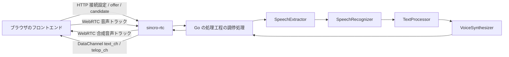

# Sincromisor 全体構成

## 要約

- Sincromisor は、ブラウザ上の 3D キャラクターと音声対話するためのサービス基盤である。
- ローカル／オンプレミスに閉じた環境でのサービス提供を前提とし、外部サービスのAPIを採用前提にしない。Difyと接続先LLMも管理下の環境へ配置する。
- フロントエンドは Vite MPA + Reactによるアプリの共通枠組み + Three.js / VRM 1.0 で画面とキャラクターを描画する。
- サーバーはPion実装の `sincro-rtc` を入口に、Goパイプライン調停器経由でPythonの音声区間抽出、音声認識、テキスト処理、音声合成を疎結合に接続する。
- 通信契約の正本は `documents/design/contracts/` に置き、サービス設計は契約文書へリンクする。

## 対象範囲

- 対象:
    - 全体アーキテクチャ
    - フロントエンド、RTC サーバー、音声処理サービス、サービス発見、ストレージの責務境界
- 非対象:
    - 個別エンドポイント / 送受信データの詳細
    - 個別 UI コンポーネントや VRM 動作の変換の詳細

## 責務

| 領域             | 責務                                                            | 正本文書                         |
| ---------------- | --------------------------------------------------------------- | -------------------------------- |
| フロントエンド   | UIの共通枠組み、WebRTC 接続、3D キャラクター描画、設定・診断 UI | `frontend/`                      |
| RTCサーバー      | Pion WebRTC シグナリング、セッション、パイプライン調停器接続    | `backend/services/sincro-rtc.md` |
| 音声パイプライン | 音声フレームからテキスト / テロップ / 音声フレームへの変換      | `backend/services/sincro-rtc.md` |
| 契約             | WebRTC、DataChannel、WebSocket、辞書仕様                        | `contracts/`                     |
| インフラ         | Docker Compose、Consul、Redis、SeaweedFS                        | `infrastructure/`                |

## システムの処理の流れ

## 変更時の確認

- フロント/サーバー間のエンドポイント、JSON、DataChannel を変える場合は `contracts/frontend-rtc.md` を先に更新する。
- Goパイプライン調停器と下流サービスの msgpack モデルやパスを変える場合は `contracts/audio-pipeline-websocket.md` を先に更新する。
- Docker Compose / 環境変数 / サービス発見を変える場合は `infrastructure/compose.md` と `infrastructure/consul.md` を同時確認する。
- UI や 3D 表示の変更は `frontend/app-shell.md` と `frontend/character/*` の該当文書を確認する。

## 参照

- `documents/design/architecture/runtime-flow.md`
- `documents/design/contracts/frontend-rtc.md`
- `documents/design/contracts/audio-pipeline-websocket.md`
