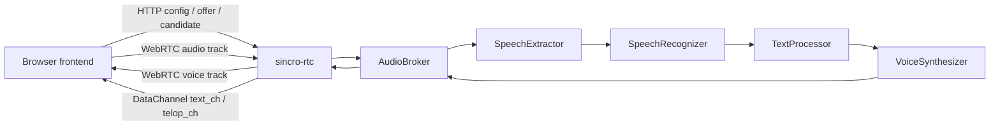

# Sincromisor Architecture Overview

## Summary

- Sincromisor は、ブラウザ上の 3D キャラクターと音声対話するためのサービス基盤である。
- フロントエンドは Vite MPA + React app shell + Three.js / VRM 1.0 で画面とキャラクターを描画する。
- サーバーは `sincro-rtc` を入口に、AudioBroker 経由で音声区間抽出、音声認識、テキスト処理、音声合成を疎結合に接続する。
- 通信契約の正本は `documents/design/contracts/` に置き、サービス設計は契約文書へリンクする。

## Scope

- 対象:
    - 全体アーキテクチャ
    - フロントエンド、RTC サーバー、音声処理サービス、サービス発見、ストレージの責務境界
- 非対象:
    - 個別 endpoint / payload の詳細
    - 個別 UI コンポーネントや VRM retarget の詳細

## Responsibilities

| 領域           | 責務                                                      | 正本文書                           |
| -------------- | --------------------------------------------------------- | ---------------------------------- |
| Frontend       | UI shell、WebRTC 接続、3D キャラクター描画、設定・診断 UI | `frontend/`                        |
| RTC Server     | WebRTC signaling、session process、AudioBroker 接続       | `backend/services/sincro-rtc.md`   |
| Audio Pipeline | audio frame から text / telop / voice frame への変換      | `backend/services/audio-broker.md` |
| Contracts      | WebRTC、DataChannel、WebSocket、辞書仕様                  | `contracts/`                       |
| Infrastructure | compose、Consul、Redis、SeaweedFS                         | `infrastructure/`                  |

## System Flow

## Change Checklist

- フロント/サーバー間の endpoint、JSON、DataChannel を変える場合は `contracts/frontend-rtc.md` を先に更新する。
- AudioBroker と下流サービスの msgpack model や path を変える場合は `contracts/audio-pipeline-websocket.md` を先に更新する。
- compose / env / service discovery を変える場合は `infrastructure/compose.md` と `infrastructure/consul.md` を同時確認する。
- UI や 3D 表示の変更は `frontend/app-shell.md` と `frontend/character/*` の該当文書を確認する。

## References

- `documents/design/architecture/runtime-flow.md`
- `documents/design/contracts/frontend-rtc.md`
- `documents/design/contracts/audio-pipeline-websocket.md`
