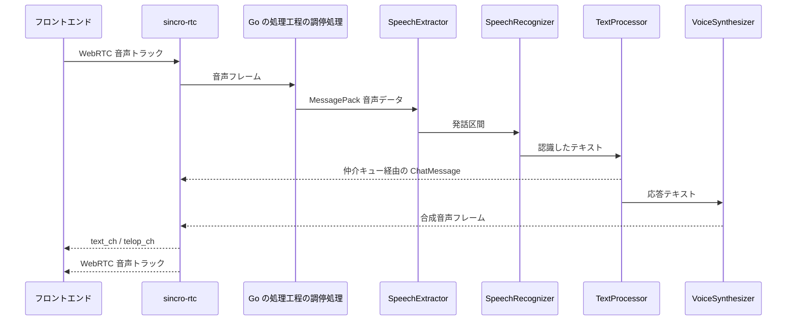

# 実行時の処理の流れ

## 要約

- 起動時、フロントエンドは RTC 設定を取得し、WebRTC Offer を送信する。
- WebRTC 確立後、ユーザー音声は音声トラックでPion実装の `sincro-rtc` に入り、Goパイプライン調停器が下流サービスへ中継する。
- 応答テキストは `text_ch`、テロップ・口形同期情報は `telop_ch`、合成音声は返却音声トラックでフロントへ戻る。

## 対象範囲

- 対象:
    - 起動から会話成立までの代表フロー
    - 正常系と主要な失敗箇所
- 非対象:
    - 送受信データの全フィールド定義
    - 各推論サービスの内部アルゴリズム

## 起動時の処理の流れ

1. フロントエンドが `GET /api/v1/RTCSignalingServer/config.json` を取得する。
2. ユーザーが起動前ダイアログでマイク、Gaze カメラ、VRM、会話モードを選ぶ。
3. `SincroController` / `SincroAppController` が UserMedia と WebRTC 接続を開始する。
4. `RTCTalkClient` が音声トラックと `text_ch` / `telop_ch` を持つ PeerConnection を作る。
5. フロントエンドが `/offer` へ SDP と `talk_mode` を送信する。
6. `sincro-rtc` がPion セッションを生成または更新し、Answer と `session_id` を返す。
7. ICE 候補は `/candidate` へ後送される。

## 会話処理の流れ

## 失敗箇所

- `config.json` 取得失敗:
    - フロントの接続先設定、リバースプロキシ、`sincro-rtc` 起動状態を確認する。
- `offer` 失敗:
    - セッション上限、ICE 設定、`RTCSessionOffer` の互換性を確認する。
- ICE 失敗:
    - フロントの再接続ログ、候補送信、公開ホスト / ポートを確認する。
- 下流サービス接続失敗:
    - パイプライン調停器の処理担当解決、Consul、代替処理ホスト / ポートを確認する。
- `text_ch` / `telop_ch` 未受信:
    - DataChannel 名、開く状態、TextProcessor / Synthesizer の出力キューを確認する。

## 参照

- `documents/design/contracts/frontend-rtc.md`
- `documents/design/contracts/audio-pipeline-websocket.md`
