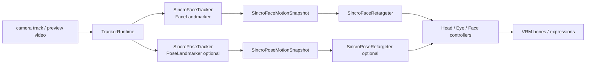

# Frontend Character / VRM描画設計

SincromisorフロントエンドのVRMキャラクター描画層（シーン、骨制御、表情制御、顔追従）の設計文書。

## 1. 文書情報

- ドキュメントパス: `documents/design/frontend_character.md`
- 作成日: 2026-02-15
- 最終更新日: 2026-05-16
- ステータス: Active

## 2. 目的とスコープ

- 目的: VRMキャラクターの読み込み・描画・表情制御・視線制御の責務とデータフローを明確化する
- 対象範囲:
  - `SincroVRMInitializer` 以降のVRM描画パス
  - `VRMScene` / `VRMCharacterManager` / 各Bone/Face controller
  - `CharacterGaze` と自動ミュート連動
- 非対象範囲:
  - 削除済みの Babylon.js legacy 実装
  - サーバー側音声合成・テロップ生成ロジック
- LLM向け要約（3-5行）:
  - Start後、`VRMScene` が Three.js renderer/camera/light を初期化し、`VRMCharacterManager` がVRMをロードする。
  - `FaceMorphController` は `CharacterBehaviorSnapshot.aiSpeech` の mora ID / 母音 / 長さを参照して母音ごとの口形を駆動する。
  - `FaceEmotionController` は `CharacterBehaviorSnapshot.aiSpeech.expressionCode` と `lastTextMessage` を参照し、VRM感情プリセットを render loop 内で駆動する。
  - `HeadBoneController` は `CharacterGaze` の鼻座標から首向きを更新し、未検出時はカメラ追従にフォールバックする。
  - `CharacterBehaviorState` は VAD、顔検出、text/telop、感情コード、media/gaze/RTC エラーを集約し、後続モーションが同じ snapshot を参照できるようにする。
  - `CharacterMotionOrchestrator` は呼吸・上半身の重心感・肩周りの idle motion を毎フレーム適用し、腕/脚 controller は同じ motion config の時間係数を使って低振幅の手首・肘・足先揺れを足す。hips/root は全身移動に見えやすいため位置揺れの対象にしない。上半身 motion の強度はキャラクター表示設定から即時調整できる。
  - AI発話中は `telop_ch` から抽出した speech beat と `expression_code` を `CharacterBehaviorSnapshot.aiSpeech` に集約し、首・目線・上半身・腕の小さな gesture を同期する。
  - `chat` は相手を見る対話モード、`sincro` はユーザーの顔・姿勢をまねる同期モードとして扱う。`CharacterGaze` は `chat` 向け注視入力と AutoMute を担当し、`SincroFaceTracker` / `SincroPoseTracker` へ同期責務を足さない。
  - `sincro` の顔同期は MediaPipe `FaceLandmarker` を本流とし、head pose / blink / mouth blendshape を正規化した `faceMotion` snapshot から VRM retarget を行う。`PoseLandmarker` は上半身同期の optional pipeline とし、性能ゲートを通った場合だけ `poseMotion` snapshot として取り込む。
  - `SincroPoseTracker` は optional pipeline として Lite model を 12fps 目安で実行し、推論遅延または連続検出失敗が続く場合は pose だけを停止して face-only に降格する。Pose ON/OFF と retarget 強度は Settings から実行時変更できる。
  - MediaPipe の生ランドマーク、正規化 motion snapshot、VRM retarget、最終的なボーン・expression 適用は別責務に分ける。VRM controller は MediaPipe の戻り値を直接読まない。
  - モーション強度は `CharacterMotionConfig` で抑制し、首/目線/上半身/腕が同時に最大化しないよう、AI発話 posture と beat gesture を低振幅・長めの easing で重ねる。
  - neck、eye、arm、leg、mouth expression はVRM個体差で欠損する可能性があるため任意要素として扱い、表現できない部位は例外停止ではなく無効化または近いボーンへフォールバックする。look expression は左右/上下の軸別に判定し、不足軸だけ eye bone へ fallback する。
  - `CharacterGaze` は MediaPipe FaceDetector を `public/mediapipe-wasm` から読み込み、検出状態で自動ミュート連動も行う。FirefoxではMediaPipe GPU delegateのwasm/WebGL相性を避けるためCPU delegateを使う。

## 3. 背景

- 解決したい課題:
  - 低遅延で「話しているように見える」VRMキャラクター表示
  - ユーザーの顔向きに追従した自然なインタラクション
  - `chat` の注視と `sincro` のものまね同期を混同しないモーション基盤
- 現状の問題点:
  - 表情は母音中心で、感情表現や全身モーションは限定的
  - VRMごとに感情プリセットが口形morphを含む場合、口パクとの干渉が起こり得る
  - Pose retarget は低振幅の上半身・腕同期として成立しているが、手首や肘の到達位置へ合わせる簡易 IK は後続タスクで扱う
- 採用理由:
  - `@pixiv/three-vrm` により VRM 1.0 との互換性が高い
- 制約条件:
  - ブラウザ性能とGPU依存が大きい
  - FaceDetector用のwasm/modelアセット配置が必須

## 4. 用語・略語

| 用語 | 定義 |
| --- | --- |
| VRM | 3D humanoid avatar format。ここでは主に VRM 1.0 を指す |
| Mora | テロップ由来の短い音素単位。口形同期の最小単位として扱う |
| FaceDetector | MediaPipe Tasks Vision の顔検出モデル |
| FaceLandmarker | MediaPipe Tasks Vision の顔ランドマーク推定モデル。`sincro` の顔同期本流として head pose / blendshape / landmarks を取得する |
| PoseLandmarker | MediaPipe Tasks Vision の姿勢推定モデル。`sincro` の上半身同期で任意に有効化できる optional module |
| `chat` | 対話相手を注視し、AI発話 gesture や聞き姿勢で会話感を出す talk mode |
| `sincro` | ユーザーの顔・姿勢をVRMへretargetし、同じ動きをする talk mode |
| `faceMotion` | `SincroFaceTracker` が出力する正規化済み顔同期 snapshot。MediaPipe 生結果ではなく、retarget 可能な内部表現 |
| `poseMotion` | `SincroPoseTracker` が出力する正規化済み姿勢同期 snapshot。初期段階では optional |
| Retargeter | 正規化 motion snapshot をVRMボーン・expressionへ変換する層。neutral calibration、clamp、deadband、smoothing、confidence gate を持つ |

## 5. 要件

### 5.1 機能要件

- 要件一覧:
  - VRM 1.0 ファイルを読み込み、シーン上に表示できる
  - `telop_ch` 由来の母音情報で口形を時間同期できる
  - 顔検出結果で首の向きを制御できる
  - 顔検出の有無で自動ミュートを切替可能
  - `chat` では `CharacterGaze` の顔位置を注視対象として扱い、`sincro` では `SincroFaceTracker` の `faceMotion` を同期対象として扱える
  - `sincro` face-only では FaceLandmarker 由来の head pose、まばたき、口形を段階的にVRMへ反映できる
  - `SincroPoseTracker` は optional とし、Settings で有効化された場合に肩・上半身・腕の `poseMotion` を追加できる
- 優先度（Must/Should/Could）:
  - Must: VRM読込、描画、口形同期
  - Should: 顔追従、まばたき、`chat` / `sincro` の motion priority 分離、face-only sincro
  - Could: VR/XRモード、PoseLandmarkerによる上半身同期、全身モーション拡張

### 5.2 非機能要件

- 性能: 連続アニメーションは `requestAnimationFrame` / renderer loop で更新。FaceLandmarker / PoseLandmarker は描画fpsから独立した推論fpsで動かし、重い場合は推論fps低下、face-only降格、または同期停止へfallbackする。初期実装では FaceLandmarker 15fps、PoseLandmarker 12fps を既定とし、Pose 推論が 38ms 以上で4回続くか、姿勢検出失敗が18回続いた場合は face-only fallback を発火する。PoseLandmarker は `enableSincroPoseTracking` で実行時ON/OFFでき、OFF時も face-only 同期を継続する。
- 可用性: モデル未検出時はニュートラル姿勢へ戻す
- スケーラビリティ: クライアント側計算中心でサーバー負荷に依存しない
- セキュリティ: ローカルVRMアップロードを扱うためファイル種別の最低限検証を実施
- 運用性/保守性: 表情・骨制御をクラス分離
- 監視性: DebugConsoleで顔検出座標や状態を可視化

## 6. アーキテクチャ概要

- コンポーネント一覧:
  - シーン: `VRMScene`, `VRMCamera`, `VRMLight`
  - キャラクター: `VRMCharacterManager`
  - 骨制御: `HeadBoneController`, `ArmBoneController`, `LegBoneController`
  - 表情制御: `FaceMorphController`, `EyeBehaviorController`
  - 感情表情制御: `FaceEmotionController`
  - 対話状態集約: `CharacterBehaviorState`
  - chat注視入力: `CharacterGaze`
  - tracker runtime: `TrackerRuntime` または同等の共有 camera / video / 推論 loop 管理層
  - sincro顔同期入力: `SincroFaceTracker`
  - sincro姿勢同期入力: `SincroPoseTracker`（optional）
  - VRM同期変換: `SincroFaceRetargeter` / `SincroPoseRetargeter` または部位別 retargeter
- 責務分割:
  - 読込/更新ループ: `VRMScene` + `VRMCharacterManager`
  - ボーン更新: BoneController群
  - 口形同期: FaceMorphController + CharacterBehaviorSnapshot
  - 目線/まばたき: EyeBehaviorController + CharacterBehaviorSnapshot
  - 感情表情同期: FaceEmotionController + CharacterBehaviorSnapshot
  - 対話状態集約: CharacterBehaviorState + TalkManager/UserMediaManager/CharacterGaze
  - chat入力検出: CharacterGaze
  - sincro入力検出: TrackerRuntime + SincroFaceTracker / SincroPoseTracker
  - sincro retarget: SincroFaceRetargeter / SincroPoseRetargeter + 各 controller
- 外部依存:
  - `three`, `@pixiv/three-vrm`, `@mediapipe/tasks-vision`
- 全体図（必要なら図リンク）:
  - TODO: `documents/design/assets/frontend_character_flow.drawio` を後続追加

### 6.1 `chat` と `sincro` のモーション責務境界

`chat` と `sincro` は同じカメラ入力を使う場合があるが、入力解釈が異なる。

| 観点 | `chat` | `sincro` |
| --- | --- | --- |
| 目的 | 対話相手を見て、会話中の存在感を出す | ユーザーの顔・姿勢と同じ動きをする |
| 主入力 | `CharacterGaze` の顔位置・検出有無 | `faceMotion`、任意で `poseMotion` |
| MediaPipe model | `FaceDetector` | `FaceLandmarker`、optional `PoseLandmarker` |
| 状態 | gaze、VAD、AI speech、thinking、error | faceMotion、poseMotion、tracking quality、fallback state |
| 首・目 | 相手を見る方向へ追従。AI発話 gesture や視線外しを重ねる | ユーザーの head pose / eye / blink retarget を優先 |
| 口 | `telop_ch` の母音口パクを優先 | ユーザー口形を優先。AI発話口パクは抑制または無効 |
| idle / gesture | 呼吸、聞き姿勢、相槌、AI speech gesture を有効 | 同期を邪魔しない低強度の呼吸程度に抑制 |
| fallback | 顔未検出時は camera追従または neutral | 低confidence時は smoothing しながら neutral。重い場合は face-only または同期停止 |
| AutoMute | `CharacterGaze` の arrive / leave を利用 | 同期入力とは分離。必要なら `CharacterGaze` または同等の在席検出だけを共有 |

Motion priority は mode ごとに上位 orchestration で決める。各 controller が独自に `talkMode` を解釈し続けると責務が散るため、`CharacterBehaviorSnapshot` または `CharacterMotionOrchestrator` が「今どの入力を優先するか」を明示する。

### 6.2 Sincro Motion パイプライン

`sincro` の同期入力は、MediaPipe 生データをVRM controllerへ直接渡さず、次の境界で分ける。

- `TrackerRuntime`: camera track の取得・差し替え・解放、video element 接続、推論 loop の開始/停止、推論fps制限、runtime error の通知を担当する。`sincro` では原則として `createImageBitmap(video)` で切り出した frame を module Worker へ転送し、FaceLandmarker と optional PoseLandmarker の初期化・同期推論・snapshot 正規化を main thread から分離する。Worker 未対応、初期化失敗、転送失敗時は main-thread tracker へ fallback し、DOM / UI 更新、DebugConsole更新、VRM適用は runtime 外へ出す。カメラ、talk mode、Pose ON/OFF の切替で tracker を再起動する場合は、既存 loop と Worker を破棄してから現在の設定で再初期化する。
- `SincroFaceTracker`: FaceLandmarker を初期化し、head pose、face blendshape、必要最小限の landmarks を `SincroFaceMotionSnapshot` へ正規化する。`CharacterGaze` のAutoMuteや注視計算は持たない。
- `SincroPoseTracker`: PoseLandmarker を使う optional tracker。肩、上半身、腕の姿勢候補を `SincroPoseMotionSnapshot` へ正規化する。肩・肘・手首・腰の normalized landmarks から肩傾き、胴体傾き、上腕リフト、上腕開き、前腕屈曲、手首上げを低振幅 retarget 用に算出し、さらに左右腕の shoulder / elbow / wrist target を camera normalized 座標と肩中心・肩幅基準の local 座標へ正規化する。`enableSincroPoseTracking` が false の場合は PoseLandmarker を起動せず、`poseMotion.trackingEnabled=false` として扱う。
- Retargeter: neutral calibration、軸変換、左右ミラー、clamp、deadband、smoothing、confidence gate を持つ。MediaPipe の category 名や行列を controller へ漏らさない。`CharacterBehaviorSnapshot.motionPolicy.allowPoseRetarget=false`、`poseMotion.degradedToFaceOnly=true`、confidence 不足、または Pose OFF の場合は neutral frame へ戻す。
- Controller: retarget 済みのVRM向け値だけを受け取り、存在するボーン・expressionへ適用する。欠損部位は例外停止ではなく無効化または近い要素へfallbackする。

## 7. 詳細設計

### 7.1 コンポーネント設計

- コンポーネントごとの責務:
  - `VRMScene`: renderer/camera/light初期化、リサイズ追従、描画ループ管理
  - `VRMCharacterManager`: GLTFLoader+VRMLoaderPluginでVRM読込、コントローラ初期化
  - `HeadBoneController`: `CharacterBehaviorSnapshot.gaze` またはCamera方向に首回転を更新。`neck` を優先して頭部回転を適用し、欠損時は `head` / `upperChest` / `chest` / `spine` の順で近い正規化ボーンへフォールバックする。目線が先行するよう顔検出座標へ遅めに追従し、AI発話中は感情別の小さな nod/yaw/roll offset を重ねる。該当ボーンが無い場合は頭部制御だけ無効化する
  - `FaceMorphController`: `CharacterBehaviorSnapshot.aiSpeech.currentMoraId` で mora 切替を検出し、`aa/ih/ou/ee/oh` のExpression制御を `VRMCharacterManager.update()` の時刻で進める。存在する mouth expression だけをリセット/駆動し、未実装プリセットでは口形制御を安全にスキップする。`sincro` ではユーザー口形 retarget を優先し、telop口パクは抑制または無効化する
  - `FaceEmotionController`: `ChatMessage.expression_code` を `relaxed/happy/sad/angry/surprised` にマップし、`CharacterBehaviorSnapshot` を入力に短時間アニメーションを進める。`expression_code` 未到着の新規発話は neutral として扱い、前発話の表情残留を避ける
  - `EyeBehaviorController`: VRM標準 `lookLeft/lookRight/lookUp/lookDown` expression を軸別に優先して目線を制御し、左右または上下の不足軸だけ `leftEye/rightEye` ボーンへフォールバックする。MediaPipe の画像Y座標は下向き正なので、VRMへの上下適用段で反転する。対話状態に応じたblink schedule、考え中の短い視線外し、低振幅microsaccade、AI発話中の感情別視線offset、`surprised` 中のblink抑制を扱う。顔位置追跡の強度はキャラクター表示設定から即時調整できる
  - `CharacterBehaviorState`: VAD、顔検出、text/telop、感情コード、media/gaze/RTC エラーを `idle/attending/user_speaking/thinking/ai_speaking/face_lost/error_or_disconnected` の対話状態 snapshot へ集約。VAD onset debounce、発話 hold、発話時間を持ち、短いノイズを聞き姿勢・相槌 trigger へ直結させない。AI発話は `speech_id` ごとの感情コード cache を参照し、text 未到着または `expression_code` なしの発話は neutral として扱う。Gaze callback が止まった場合は stale として `face_lost` へ遷移させる。AI発話は `new_text`、`speech_id`、句読点、mora長、一定間隔から `speech_start/cadence/phrase/punctuation` の beat に間引く。`talkMode`、同期用 `faceMotion`、optional `poseMotion`、tracker fallback state を追加できる構造にし、`chat` の注視 snapshot と `sincro` の同期 snapshot を同じフィールドへ混ぜない
  - `CharacterMotionOrchestrator`: `CharacterBehaviorSnapshot` と共通 motion config を参照し、hips/root を基準位置へ固定したうえで、呼吸・spine/chest/shoulder の idle offset、VAD連動の聞き姿勢、発話終了後の小さな相槌 nod、AI発話中の感情別姿勢と beat gesture を適用。上半身 motion はキャラクター表示設定の `characterMotionScale` で一括スケールする。`chat` では既存の対話演出を優先し、`sincro` では retarget 済み face / pose motion を優先してAI発話gestureやthinking aversionを抑制する。Pose retarget は `motionPolicy.allowPoseRetarget` をVRM適用前の明示 gate として通過した場合だけ加算する
  - `ArmBoneController`: idleの腕・肘・手首揺れに、`CharacterBehaviorSnapshot.aiSpeech.beatId` 由来の短い片腕gestureを重ねる。左右を交互に主役化し、発話開始・文節・句読点で強度を変える。Pose retarget が有効な場合のみ上腕・前腕・手首へ低振幅の additive offset を加える
  - `CharacterMotionConfig`: idle/listening/AI発話 motion の周期・振幅・easing を集約し、腕/脚/胴体 controller の `performance.now()` 直参照を避ける。AI発話中は posture blend を控えめにし、beat duration を長めにして首・肩・腕の同時ピークを避ける
  - `CharacterGaze`: `chat` 向けの顔キーポイント追跡、視線角推定、arrive/leaveイベント通知、AutoMute連動を担当する。`detectForVideo()` へ渡す前にvideo frameのreadyStateとdecode済み寸法を確認し、MediaPipe実行時例外では検出ループを停止して上位controllerへ通知する。`sincro` の head pose / blendshape / pose 同期責務は持たない
  - `TrackerRuntime`: `SincroFaceTracker` と optional `SincroPoseTracker` の共有実行基盤。camera track / video element / 推論 loop を所有し、二重 `getUserMedia` と二重推論 loop を避ける。Worker 経路では `SincroTrackerWorkerClient` を介して `sincro-tracker.worker.ts` へ `ImageBitmap` を転送し、snapshot と load / transfer / round-trip / dropped frame / fallback reason だけを受け取る。Pose OFF の場合は Worker 内でも PoseLandmarker を初期化しない。UI更新、DebugConsole更新、VRM適用はruntime coreへ持ち込まない
  - `SincroFaceTracker`: FaceLandmarker の `outputFaceBlendshapes` と `outputFacialTransformationMatrixes` を有効化し、検出有無、confidence相当、head pose、blendshape map、推論時間、推論fps、`lastUpdatedAtMs` を `SincroFaceMotionSnapshot` に正規化する
  - `SincroPoseTracker`: PoseLandmarker の結果から肩・胴体・腕の大まかな姿勢を `SincroPoseMotionSnapshot` に正規化する optional module。腕 target は MediaPipe 生ランドマークを外へ出さず、部位ごとに `tracked`、`confidence`、`visibility`、`presence`、`staleReason`、camera normalized 座標、肩幅基準 local 座標を持つ。推論fpsは face より低くし、性能ゲート超過時は `degradedToFaceOnly` を立てて face-only に戻す
  - `SincroFaceRetargeter`: `SincroFaceMotionSnapshot` を VRM の head / eye / blink / mouth expression 向け値へ変換する。neutral calibration、clamp、deadband、smoothing、confidence gate、左右ミラー補正をこの層で扱う
  - `SincroPoseRetargeter`: optional `SincroPoseMotionSnapshot` を spine/chest/shoulder/arm向け値へ変換する。初期段階では低振幅・強い smoothing をかけ、腕が画面外に出た場合は部位単位で neutral へ戻す。`intensityScale` は設定の `sincroPoseRetargetScale` と Debug Console の Pose retarget 調整から変更でき、`minConfidence` / `smoothingMs` / `returnToNeutralMs` は Debug Console で調整できる
- 主要クラス/モジュールと対応ファイル:
  - `sincromisor-frontend/src/ts/SincroVRM/VRMScene/VRMScene.ts`
  - `sincromisor-frontend/src/ts/SincroVRM/VRMCharacter/VRMCharacterManager.ts`
  - `sincromisor-frontend/src/ts/SincroVRM/VRMCharacter/CharacterBehaviorState.ts`
  - `sincromisor-frontend/src/ts/SincroVRM/VRMCharacter/HeadBoneController.ts`
  - `sincromisor-frontend/src/ts/SincroVRM/VRMCharacter/FaceMorphController.ts`
  - `sincromisor-frontend/src/ts/SincroVRM/VRMCharacter/FaceEmotionController.ts`
  - `sincromisor-frontend/src/ts/SincroVRM/VRMCharacter/EyeBehaviorController.ts`
  - `sincromisor-frontend/src/ts/SincroVRM/VRMCharacter/CharacterMotionOrchestrator.ts`
  - `sincromisor-frontend/src/ts/SincroVRM/VRMCharacter/CharacterMotionConfig.ts`
  - `sincromisor-frontend/src/ts/CharacterGaze/CharacterGaze.ts`
  - `sincromisor-frontend/src/ts/FaceTracking/TrackerRuntime.ts` または同等の新規ファイル
  - `sincromisor-frontend/src/ts/FaceTracking/SincroFaceTracker.ts` または同等の新規ファイル
  - `sincromisor-frontend/src/ts/FaceTracking/SincroPoseTracker.ts` または同等の新規ファイル（optional）
  - `sincromisor-frontend/src/ts/SincroVRM/VRMCharacter/SincroFaceRetargeter.ts` または同等の新規ファイル
  - `sincromisor-frontend/src/ts/SincroVRM/VRMCharacter/SincroPoseRetargeter.ts` または同等の新規ファイル（optional）
- 変更時に同時確認が必要なファイル:
  - 口形ロジック変更: `FaceMorphController.ts` と `CharacterBehaviorState.ts` / `TalkManager.ts`
  - 感情表情ロジック変更: `FaceEmotionController.ts` と `CharacterBehaviorState.ts` / `TalkManager.ts` / `RTCMessage.ts`
  - 顔認識ロジック変更: `CharacterGaze.ts` と `SincroController.ts`（自動ミュート連動）
  - sincro顔同期変更: `SincroFaceTracker.ts` / `SincroFaceRetargeter.ts` と `CharacterBehaviorState.ts` / `HeadBoneController.ts` / `EyeBehaviorController.ts` / `FaceMorphController.ts`
  - sincro姿勢同期変更: `SincroPoseTracker.ts` / `SincroPoseRetargeter.ts` と `CharacterMotionOrchestrator.ts` / `ArmBoneController.ts`
  - talk mode 別motion変更: `SincroController.ts` / `SincroCharacterGazeController.ts` / `CharacterBehaviorState.ts` / `CharacterMotionOrchestrator.ts`
  - シーン初期化変更: `VRMScene.ts` と `SincroVRMInitializer.ts`

### 7.2 データ設計

- 主要データ構造:
  - `CurrentMora`（TalkManagerが現在発話中の母音区間を保持し、CharacterBehaviorState が snapshot へ転写する）
  - `ChatMessage.expression_code`（text_ch先頭 `^N` 由来の感情コード。任意項目）
  - `characterMotionScale` / `sincroPoseRetargetScale` / `characterEyeTrackingScale`（キャラクター表示設定から変更する runtime tuning 値。既定は 0.72 / 0.68 / 0.68）
  - `enableSincroPoseTracking`（`sincro` で PoseLandmarker を実行するかの runtime toggle。OFF時は face-only を維持する）
  - CharacterGazeの `movingAverage[6]`（右目/左目/鼻/口/右耳/左耳）
  - `CharacterBehaviorSnapshot`（VAD envelope、発話開始/終了時刻、直近発話時間、顔検出・顔位置・正面度、AI発話中speech_id/mora ID/母音/感情コード、AI speech beat、対話状態、source別エラーを集約した代表エラーを保持）
  - `SincroFaceMotionSnapshot`（`detected`、`confidence`、`headPose`、`blendshapes`、`inferenceTimeMs`、`inferenceFps`、`lastUpdatedAtMs`、`fallbackReason` を保持。MediaPipe生ランドマークは原則保持しない）
  - `SincroPoseMotionSnapshot`（`trackingEnabled`、`detected`、`confidence`、肩・胴体・腕の正規化姿勢、左右腕の shoulder / elbow / wrist target、`inferenceTimeMs`、`inferenceFps`、`consecutiveFailures`、`lastUpdatedAtMs`、`degradedToFaceOnly`、`fallbackReason` を保持。optional）
  - `SincroFaceRetargetSnapshot`（head / eye / blink / mouth のVRM向け正規化値。controller はこの形式を読んでボーン・expressionへ適用する）
- 永続化対象:
  - VRMモデルURL（`DialogManager.vrmUrl`）と、ローカル保存済みVRM（DialogManager経由）
- スキーマ/モデル:
  - `sincromisor-frontend/src/ts/RTC/RTCMessage.ts` の `TelopChannelMessage`, `ChatMessage`
- バージョニング方針:
  - `vowel` の表現変更時は `FaceMorphController` 側で後方互換を維持

### 7.3 インターフェース設計

- エンドポイント/チャネル:
  - 直接参照はしないが、`telop_ch` の `TelopChannelMessage` と `text_ch` の `ChatMessage.expression_code` を入力として利用
  - FaceDetectorアセット:
    - `/mediapipe-wasm`
    - `/3rd_party/blaze_face_short_range.tflite`
  - FaceLandmarkerアセット（sincro face）:
    - `/mediapipe-wasm`
    - `/3rd_party/face_landmarker.task` または同等の配置名
  - PoseLandmarkerアセット（optional sincro pose）:
    - `/mediapipe-wasm`
    - `/3rd_party/pose_landmarker_*.task` または同等の配置名
- リクエスト仕様:
  - なし（フロント内処理）
- レスポンス仕様:
  - なし
- エラー仕様:
  - VRMロード失敗はError throw
  - FaceDetector未ロード時は検出処理をスキップ
  - FaceDetector実行時例外はCharacterGazeで捕捉し、検出ループ停止、DebugConsole表示、`CharacterBehaviorState` のgaze errorへ反映する
  - FaceLandmarker model 未配置、初期化失敗、推論例外は `faceMotion.fallbackReason` と DebugConsole へ反映し、`sincro` は neutral または `chat` gaze fallback へ降格する
  - PoseLandmarker model 未配置、初期化失敗、推論例外は `poseMotion` を無効化し、face-only を継続する
- タイムアウト/リトライ方針:
  - CharacterGazeモデルロード完了まで1秒間隔で起動待ち

### 7.4 状態遷移・シーケンス

- 正常系フロー:
  - Start -> `VRMScene.start()` -> animate loop
  - telop受信 -> `TalkManager.currentMora()` 更新 -> `CharacterBehaviorState` が mora ID / 母音 / speech_id を snapshot へ反映 -> `FaceMorphController` が口形適用
  - text受信（chat mode） -> `TalkManager` イベント通知 -> `CharacterBehaviorState` が speech_id ごとの `expression_code` を保持 -> `FaceEmotionController` が snapshot 経由で感情表情を適用
  - VAD/顔検出/text/telop受信 -> `CharacterBehaviorState` に集約 -> `VRMCharacterManager.update()` が毎フレーム snapshot 更新
  - `CharacterBehaviorState` は telop受信時に `speech_id` 変更、句読点、長めのmora、一定時間経過を speech beat として採用し、`beatId` と強度を更新
  - `VRMCharacterManager.update()` -> `ArmBoneController` / `LegBoneController` が基準姿勢へ微小 idle offset を適用 -> `CharacterMotionOrchestrator` が hips/root を基準位置へ戻し、spine/chest/shoulder の呼吸・上半身 offset、VAD 連動の聞き姿勢・相槌 nod、AI発話中の姿勢/gesture を適用
  - 顔検出 -> `CharacterGaze` 更新 -> `CharacterBehaviorState` / `HeadBoneController` に反映。video frame が一定時間進まない場合は stale として `leave` と空 detection を通知し、`face_lost` へ戻す
  - `sincro` 開始 -> `TrackerRuntime` が camera track / video element を用意 -> `SincroFaceTracker` が FaceLandmarker を実行 -> `CharacterBehaviorState.faceMotion` 更新 -> `SincroFaceRetargeter` が head / eye / blink / mouth 値へ変換 -> 各 controller がVRMへ適用
  - `PoseLandmarker` 採用時 -> `SincroPoseTracker` が低頻度で `poseMotion` 更新 -> `SincroPoseRetargeter` が上半身値へ変換 -> `CharacterMotionOrchestrator` / arm系 controller が低強度で適用
  - `chat` / `sincro` 切替 -> `CharacterBehaviorState.talkMode` と tracker起動方針を更新。RTC の `talk_mode` を変える切替は再接続を必要条件とし、local motion preview だけの切替を作る場合は `talkMode` とは別状態として扱う
- 異常系フロー:
  - VRMロード失敗 -> 例外出力（表示不可）
  - 顔未検出継続 -> ニュートラル位置に漸近
  - MediaPipe実行時例外 -> 顔検出ループ停止、DebugConsoleに検出エラー表示、Gaze OFF/ONで再起動可能
  - media/gaze/RTC エラーまたは切断 -> `CharacterBehaviorState.setErrorSource()` へ記録し、`error_or_disconnected` の控えめな motion へ遷移
  - FaceLandmarker高負荷 -> 推論fpsを下げる。一定時間回復しない場合は face-only 内で低頻度化し、それでも重い場合は sincro face を停止して neutral へ戻す
  - PoseLandmarker高負荷 -> pose pipeline を停止し、face-only を継続する。pose は optional のため face 同期を巻き込んで停止しない
- 状態遷移図/シーケンス図（必要なら図リンク）:
  - TODO: `networking_rtc.md` の telop フロー図と統合予定

## 8. 設定・デプロイ

- 環境変数:
  - 特になし（静的アセット配置に依存）
- 設定ファイル:
  - `sincromisor-frontend/vite.config.js`
  - `sincromisor-frontend/public/3rd_party/README.md`（FaceLandmarker / PoseLandmarker model 配置とライセンス情報）
- 起動方法:
  - `cd sincromisor-frontend && npm run dev`
- デプロイ/ローカル実行手順:
  - `npm run build`
  - `public/characters/default.vrm` を既定モデルとして配置
  - `public/mediapipe-wasm` と face model を配置
  - `sincro` face を有効化する場合は FaceLandmarker model を `public/3rd_party` に配置
  - pose 同期を検証する場合は PoseLandmarker model を `public/3rd_party` に配置し、性能ゲートの計測結果を残す
- 互換性に影響する設定変更:
  - VRM表情プリセット名の差異は `FaceMorphController` のマッピングに影響
  - 感情表情はVRM標準プリセット前提。LLM先頭 `^N` 出力ルール未設定時は表情連動しない
  - WebRTC endpoint / JSON 契約はこの設計変更では変更しない。`talk_mode` の意味を変える場合や新payloadを追加する場合は別途明示する

## 9. 監視・運用

- ログ設計:
  - VRMロード進捗/エラーをconsole出力
  - DebugConsoleで `faceX/faceY/facing/status` を表示
  - DebugConsole の `Sincro` tab で `faceMotion.detected`、head pose、主要 blendshape、推論時間、推論fps、fallback reason を表示する。Status tab には `Sincro Face` の概要も出す
  - Pose採用時は DebugConsole の `Sincro` tab で `poseMotion.detected`、肩・上半身・左右腕の主要値、推論時間、推論fps、連続失敗数、fallback reason を表示する。性能ゲート発火時は `face-only` として切り分ける
  - DebugConsole `text_ch` ログに `expression_code` 受信・感情プリセット適用・口パク重複bind除去数を出力（切り分け用）
- メトリクス:
  - 未導入
- 障害時の切り分け手順:
  - 1. `default.vrm` またはアップロードVRMが読み込めるか
  - 2. `characterGazeVideo` に映像が来ているか
  - 3. `faceX/faceY` が更新されるか
  - 4. `telop_ch` 受信時に口形が変化するか
  - 5. backend 未起動・カメラ/マイクOFFでも、胸/肩/腕/手首の idle motion が継続するか
  - 6. `sincro` で FaceLandmarker snapshot が更新され、頭部・まばたき・口形の値が変化するか
  - 7. FaceLandmarker が重い端末で推論fps低下または fallback が発動し、UI全体が固まらないか
- よくある失敗と対処:
  - wasm未配置で顔認識不可
  - VRM表情キー未対応で口形が動かない
  - Dify/LLM側の `^N` 出力未設定で感情表情が動かない
  - FaceLandmarker model 未配置で `sincro` face が開始できない
  - PoseLandmarker が重く、上半身同期で描画fpsが落ちる。この場合は pose を無効化し face-only を継続する
  - 感情表情と口パクが干渉するVRMでは、重複morph bind除去ログを確認し、必要に応じて強度を下げる
  - 低スペック端末で描画FPS低下

## 10. セキュリティ/コンプライアンス

- 認証/認可:
  - なし（描画層）
- 秘密情報の扱い:
  - なし
- 入力検証:
  - `.vrm` 拡張子チェック
- 脅威と対策:
  - 任意ファイル取扱いに対しては、実行コードではなくデータとしてのみ読込
- 監査ログ（必要な場合のみ）:
  - 未実装

## 11. テスト方針

- テスト観点:
  - VRM表示、首追従、口形同期、まばたき、自動ミュート
  - 待機、ユーザー発話、考え中、AI発話の各状態で首・目線・上半身・腕・表情が競合して破綻しないこと
  - neck/eye/mouth/arm/leg の一部ボーンまたは expression がないVRMでも例外停止しないこと
  - simple-vrm desktop/mobile でキャラクター motion が Debug Console / Settings / chat / telop の操作と視認性を妨げないこと
  - `chat` では相手を見る動き、`sincro` では同じ動きになることが目視で区別できること
  - `sincro` face-only で head pose、blink、mouth が過敏すぎず、低confidence時に震え続けないこと
  - PoseLandmarker 採用時は pose 無効化で face-only に戻り、顔同期と描画fpsを巻き込まないこと
- 単体テスト:
  - 現状は未整備
- 結合テスト:
  - `simple-vrm/` でRTC接続し、telopに応じた口形変化を確認
- E2Eテスト:
  - 手動でカメラON/OFF・顔入退出・VRM差し替えを確認
  - `chat` / `sincro` 切替後に前モードの表情・姿勢・推論loopが残らないことを確認
- 負荷テスト（必要な場合のみ）:
  - 長時間（30分以上）描画でメモリ増加とFPS劣化を観察
  - FaceLandmarker / PoseLandmarker の推論時間、推論fps、main thread負荷を計測し、fallback条件を確認
- 受け入れ条件:
  - Start後にVRM描画が継続し、顔検出と口形同期が目視確認できる
  - backend 未起動、カメラOFF、マイクOFFでも idle motion が継続し、UI操作を阻害しない
  - `sincro` では FaceLandmarker 由来の `faceMotion` を参照して、頭部・まばたき・口形の同期ができる
  - PoseLandmarker は性能ゲートを満たすまで optional として無効化でき、face-only で成立する

## 12. 既知課題・リスク

- 既知課題:
  - 口形は母音中心で感情表現が不足（感情表情は追加済みだがVRM個体差により見え方の差が大きい）
  - 顔未検出時のニュートラル復帰は鼻中心で不自然な場合がある
  - idle motion はモデルごとの骨の向き・肩幅・衣装形状で見え方が変わるため、複数VRMで振幅調整が必要になる可能性がある
  - Looking Glass (`looking-glass-vrm`) では、`@lookingglass/webxr` の再開後セッションで mouse/wheel 操作が失効する環境がある（2026-02-23時点）
- 技術的負債:
  - Bone制御パラメータが経験則で、モデル差異に弱い
  - Looking Glass 再開時入力不具合に対して `LookingGlassXRController` へ段階的回復策（canvas参照再通知 / focus / fallback mouse controls）を実装しており、暫定コードが増えている
- リスク一覧:
  - VRM個体差による表情キー不一致
  - 感情プリセットに口形morphが含まれるVRMで、口パクと干渉する可能性
  - AI発話中gestureは汎用ボーン制御のため、VRM個体差により腕・肩・首の見え方が変わる可能性
  - カメラ環境差による検出不安定
  - FaceLandmarker / PoseLandmarker の推論負荷により描画fpsやUI応答が低下する可能性
  - `chat` のAI発話gestureと `sincro` の同期retargetが同じ部位を取り合う可能性
- 軽減策:
  - neck 欠損時は head/chest 系正規化ボーンへフォールバックし、mouth/eye/arm/leg は存在するボーン・expression だけを駆動する
  - 感情プリセットと viseme の重複morph bind を起動時に除去し、口パク優先で競合を軽減
  - `CharacterMotionConfig` で AI発話中の首・上半身・腕 gesture を控えめにし、attack/release と beat duration を長めにして唐突さを抑える
  - Looking Glass は再開後入力失効の回避として `LookingGlassConfig` を直接更新する fallback 操作を再開時のみ有効化（初回セッションは vendor 実装を優先）
  - `sincro` では retarget 済み face / pose motion を優先し、AI発話gesture、thinking aversion、telop口パクを抑制する
  - PoseLandmarker は optional にし、性能ゲートを満たさない場合は face-only を正規fallbackとする

### 12.1 Looking Glass 運用メモ（2026-02-23）

- 背景:
  - `looking-glass-vrm` は `VRM360Scene` 流用を外し、`LookingGlassVRMScene`（通常VRM + LG起動導線）へ分離した
  - その過程で、renderer設定互換・終了後レイアウト復旧・再開時入力復旧の調整が `LookingGlassXRController` に集約された
- 現在の実装方針:
  - vendor (`@lookingglass/webxr`) の入力実装を基本とし、再開時にのみ回復策を追加する
  - runtime config 変更がない通常の停止/再開では polyfill を再生成しない
  - 再開後入力が失効する環境では fallback mouse controls を `lkgCanvas` に注入して `LookingGlassConfig.trackball* / target*` を直接更新する
- 将来のリファクタリング時に優先して確認する点:
  - `@lookingglass/webxr` の更新版で再開後 input 問題が解消していないか（解消済みなら fallback controls を削除）
  - `LookingGlassXRController` の「入力回復」と「XRセッション管理」を分離できるか
  - `LookingGlassVRMScene.bindLookingGlassStateRecovery()` の責務（レイアウト復旧 / camera interaction refresh）を Scene基底や専用Recoveryクラスへ分離できるか
- 手動回帰確認（最低限）:
  - `looking-glass-vrm` で `開始 -> 停止 -> 再開` 後に `wheel`, 左ドラッグ, 右ドラッグ（または `Shift+左ドラッグ`）が効く
  - LG終了後に通常画面のレンダリングエリアが崩れない

## 13. 代替案と設計判断

- 検討した代替案:
  - 表情を音量ベースで単純駆動
  - 首追従を完全にカメラ追従に固定
  - `CharacterGaze` に FaceLandmarker と同期retarget責務を追加する
  - PoseLandmarker を最初から `sincro` の必須入力にする
- 採用しなかった理由:
  - telop由来の母音同期のほうが視覚的な納得感が高い
  - 顔向き追従を切ると対話感が低下する
  - `CharacterGaze` は `chat` の注視・AutoMuteと強く結びついており、同期責務を足すと入力解釈とfallbackが混ざる
  - PoseLandmarker は有望だが推論負荷のリスクが高く、face-only の中核体験を先に安定させる必要がある
- 最終判断:
  - 母音同期 + 顔追従のハイブリッド方式を採用
  - `chat` は `CharacterGaze`、`sincro` は `SincroFaceTracker` + retargeter を主系統として分離する
  - PoseLandmarker は optional `SincroPoseTracker` とし、Settings の ON/OFF と性能ゲートで上半身同期へ使う

## 14. 変更履歴

| 日付 | 変更内容 |
| --- | --- |
| 2026-02-15 | 初版作成 |
| 2026-02-23 | chatモード感情表情（`FaceEmotionController`）と `^N`/`expression_code` 連動、口パク競合軽減方針を追記 |
| 2026-02-23 | Looking Glass 専用シーン化、展示向け床テクスチャ/視点補正、終了後レイアウト復旧と再開時入力回復の暫定方針を追記 |
| 2026-05-08 | `CharacterBehaviorState` によるVAD/顔検出/text/telop/感情コードの集約と snapshot API を追記 |
| 2026-05-08 | `CharacterMotionOrchestrator` / `CharacterMotionConfig` による呼吸・重心移動・上半身 idle motion と、腕/脚 controller の低振幅 offset 化を追記 |
| 2026-05-08 | VAD onset debounce、発話終了 timing、聞き姿勢 blend、発話終了後の相槌 nod を追記 |
| 2026-05-09 | AI発話中の telop beat 抽出、`expression_code` による姿勢・首・目線・腕 gesture 差分を追記 |
| 2026-05-09 | TASK-3054 として AI発話 gesture の強度/easing を抑制し、neck/mouth expression 欠損VRMの fallback と自然さ確認観点を追記 |
| 2026-05-11 | TASK-3101 として `chat` 注視と `sincro` 同期の責務境界、`SincroFaceTracker` / optional `SincroPoseTracker`、retarget、性能ゲート、face-only fallback 方針を追記 |
| 2026-05-11 | TASK-3104 として `CharacterBehaviorSnapshot.motionPolicy` を実装し、`chat` の対話 gesture と `sincro` の face retarget 優先を controller 共通方針として分離 |
| 2026-05-16 | Pose tracking の実行時 ON/OFF、Worker tracker 再起動時の破棄、低振幅 pose retarget と後続 IK タスクの境界を現行実装に同期 |
| 2026-05-16 | TASK-3113 として左右腕の shoulder / elbow / wrist target を camera normalized と肩幅基準 local 座標へ正規化する snapshot 契約を追記 |

## 15. 参照資料

- 関連ドキュメント:
  - `documents/design/frontend_ui.md`
  - `documents/design/networking_rtc.md`
  - `documents/tasks/character_sincro_motion/open/TASK-3100-sincro-motion-foundation-epic.md`
  - `documents/tasks/character_sincro_motion/open/TASK-3102-face-tracking-runtime-and-sincro-face-tracker.md`
  - `documents/tasks/character_sincro_motion/done/TASK-3103-sincro-face-retargeting-head-eye-mouth.md`
  - `documents/tasks/character_sincro_motion/done/TASK-3104-talk-mode-aware-character-motion-orchestration.md`
  - `documents/tasks/character_sincro_motion/done/TASK-3111-sincro-pose-retarget-formalization-and-tuning.md`
  - `documents/tasks/character_sincro_motion/done/TASK-3112-sincro-tracker-workerization-and-load-isolation.md`
  - `documents/tasks/character_sincro_motion/done/TASK-3113-sincro-pose-camera-space-arm-targets.md`
- 参照実装:
  - `sincromisor-frontend/src/ts/SincroVRM/VRMScene/VRMScene.ts`
  - `sincromisor-frontend/src/ts/SincroVRM/VRMCharacter/CharacterBehaviorState.ts`
  - `sincromisor-frontend/src/ts/SincroVRM/VRMCharacter/CharacterMotionOrchestrator.ts`
  - `sincromisor-frontend/src/ts/SincroVRM/VRMCharacter/CharacterMotionConfig.ts`
  - `sincromisor-frontend/src/ts/SincroVRM/VRMCharacter/FaceMorphController.ts`
  - `sincromisor-frontend/src/ts/SincroVRM/VRMCharacter/FaceEmotionController.ts`
  - `sincromisor-frontend/src/ts/CharacterGaze/CharacterGaze.ts`
  - `sincromisor-frontend/src/ts/App/SincroCharacterGazeController.ts`
- 外部リンク:
  - https://github.com/pixiv/three-vrm
  - https://developers.google.com/mediapipe
