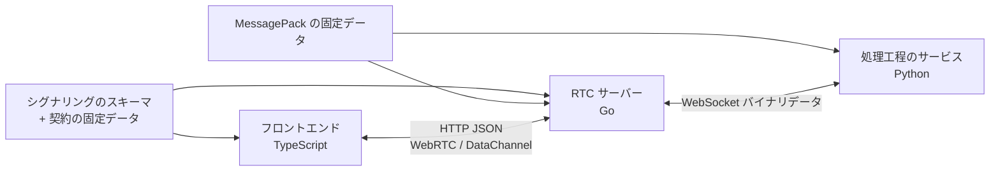
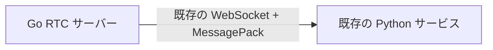
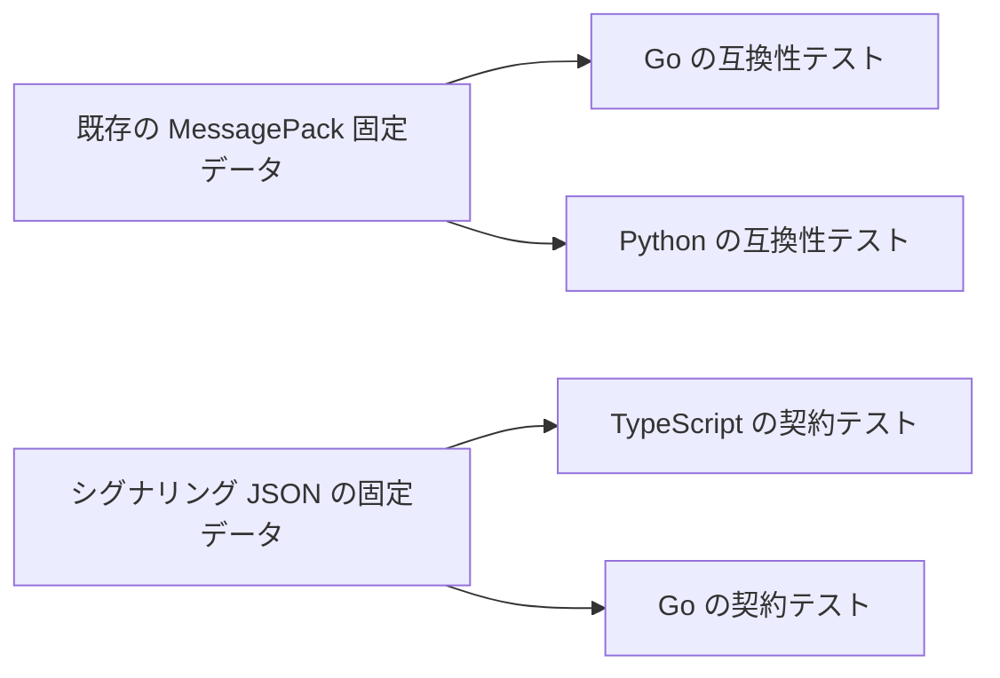

# 通信契約と型共有

## 要約

- フロントエンド / Go シグナリングは既存契約との差分を手書きスキーマと契約テストで固定する。
- Go RTC サーバーは下流Python サービスへ直接接続し、Python アダプター専用通信規約は設けない。
- 初期統合では既存WebSocket + MessagePack契約を維持し、Protocol Buffers移行は別取り組み計画とする。
- フロントエンド向けDataChannel 送受信データはGoで可能な限り内容を解釈しないに扱い、3言語で全モデルを重複定義しない。

## 契約境界



同じモデルを3言語へ無条件に複製しない。各境界の生成側と利用側だけが型を持ち、境界を跨ぐ固定データで互換性を確認する。

## フロントエンド / Go シグナリング

対象は次のHTTP APIとする。

- `GET /api/v1/RTCSignalingServer/config.json`
- `POST /api/v1/RTCSignalingServer/offer`
- `POST /api/v1/RTCSignalingServer/candidate`
- `GET /api/v1/RTCSignalingServer/statuses`
- 後始末エンドポイントを維持する場合の管理API

エンドポイントと既存フィールドは[フロントエンドのRTC契約](../../design/contracts/frontend-rtc.md)を維持し、初回Offerの冪等性を識別する `offer_request_id` と、ICE 世代を識別する `offer_revision` を追加する。

- 初回Offerは `session_id` なし、フロントエンドが生成したUUIDの `offer_request_id`、`offer_revision: 1` を送る。HTTP 時間切れ後に同じOfferを再送する場合は同じ要求IDを使い、SDPを再生成する場合は新しい要求IDを発行する。
- バックエンドはセッション作成前に `offer_request_id` とOffer SDP ハッシュを処理中のもの登録簿へ登録する。同じ要求ID / SDPの並行要求は同じ処理結果を待ち、異なるSDPの並行要求はHTTP 409で拒否する。
- バックエンドは `offer_request_id`、Offer SDP ハッシュ、発行したセッション ID、完成済みAnswerを、フロントエンドの最大再試行期間より長い有限TTLで保持する。同じ要求IDと同じSDPの再送には同じAnswerを返し、同じ要求IDを異なるSDPへ再利用した場合はHTTP 409で拒否する。セッション終了後もTTL中は終了を示す記録を保持し、再送を新規セッションとして扱わずHTTP 410を返す。キャッシュはセッション受け入れと独立した件数上限を持ち、期限切れ項目以外を黙って追い出しせず、上限時は新規初回OfferをHTTP 429で拒否する。
- Pion 段階 3では完了済み Answerと終了を示す記録のTTLを2分、処理中のものを含む登録簿上限を1000件、有効セッションと作成予約の合計を100件とする。HTTP 本文は1 MiB、復号済みの SDPは256 KiBを上限とし、登録簿の期限切れ項目は要求受付時と30秒周期で回収する。
- バックエンドはULIDのセッション IDを発行し、Answerへ同じ改訂番号を返す。
- ICE 再接続付き更新Offerは同じセッション IDと、直前より1大きい改訂番号で送る。
- 候補要求はセッション IDと改訂番号を持つ。通常候補と候補収集の完了通知の両方を同じ世代へ関連付ける。
- バックエンドはセッションごとに現在改訂番号を保持し、相手側 Offerの適用とAnswer生成が成功した時点で改訂番号を進める。受理済み Offerの改訂番号と一致する候補だけを適用し、旧改訂番号、未来改訂番号、不明セッションは拒否して別セッションへ代替処理しない。
- 更新Offerは同じ改訂番号と同じOffer SDPの再送に保存済みAnswerを返す。同じ改訂番号で異なるSDPを受けた場合はHTTP 409で拒否する。
- フロントエンドからPionへはTrickle ICEを使う。Pionからフロントエンドには候補通知経路を追加せず、`GatheringCompletePromise` を `SetLocalDescription(answer)` 前に取得し、設定後に収集完了を有限時間切れまで待つ。候補を含む `LocalDescription` をAnswerとして返すhalf-trickleとし、時間切れ時はセッションを終了してHTTP 504を返す。冪等再試行用に保存するAnswerも候補収集完了後の値とする。
- フロントエンドは更新Offerの応答を受けるまで、その改訂番号で収集した候補をキューする。Offer失敗時は対応候補を破棄する。
- 更新Offerが成功する限り、PeerConnection、DataChannel、処理工程、セッション IDを維持する。
- バックエンドからセッション消失が明示された場合だけフロントエンドが新規セッションを作る。その初回Offerへ `previous_session_id` を任意で付け、バックエンドは旧・新セッション IDの対応を構造化ログへ記録する。
- `usernameFragment` は診断フィールドとして透過するが、候補収集の完了通知を含めて一貫して判定するため、世代の正本にはしない。
- Offer適用と候補追加はセッション単位のロックまたはイベントループで直列化する。1 セッションの更新Offerは同時に1つだけの実行とし、適用中の別OfferをHTTP 409で拒否する。

新フィールドはaiortcのPydantic モデルが未知フィールドとして無視できる任意フィールドとして先にフロントエンドへ追加する。フロントエンドは移行中の診断用aiortc Answerに `offer_revision` がないことを許容し、aiortcで同一セッションのICE 再接続と改訂番号競合解決は行わない。Pion切替後にaiortcの新規セッション成立を運用要件とせず、旧バックエンドへPion用状態機械を移植しない。

OpenAPI生成はPion移行の完了条件にしない。初期実装はフロントエンド / Goの手書きスキーマと共有JSON 固定データによる契約テストを使い、型乖離が実害になった場合に別タスクで導入する。

### エラーの扱い

- JSON 構文、フィールド型、UUID / ULIDの形式、SDP / 候補構文の不正は要求単体をHTTP 400で拒否する。すでにPeerConnectionへ一部適用されて安全な継続を保証できない場合だけ、同じ終了処理を一度だけ実行する経路でセッションを終了する。
- HTTP 要求本文、SDP、候補文字列のバイト上限超過はHTTP 413で拒否する。
- 不明セッションはHTTP 404、終了済みセッションまたは初回Offer 終了を示す記録はHTTP 410を返す。
- 要求ID / 改訂番号競合と同一セッションへの並行OfferはHTTP 409を返す。
- セッション上限と1 改訂番号当たり候補件数の上限超過はHTTP 429を返す。フロントエンド待機中候補キューの上限超過は当該ICE 世代をローカル失敗として終了する。
- 候補再送は同じセッション / 改訂番号 / 候補の組み合わせで冪等に扱い、重複追加しない。

HTTP 本文、SDP、候補文字列、改訂番号当たり候補件数、フロントエンド待機中候補キューの上限は段階 1で通常のChrome / Firefox実測値に余裕を加えて固定し、Gate 1以降は設定による無制限化を許可しない。

### 時間切れ・再試行

- Offerと候補のHTTP 要求は `AbortController` で有限時間切れを持つ。
- 同じHTTP操作内の再試行は同じ送受信データを使い、回数と総経過時間を上限付きのにする。429、5xx、ネットワークエラーは `Retry-After` を尊重しつつ指数再試行間隔 + 揺らぎで再送する。
- 404 / 410はセッション消失として現在の候補キューを破棄し、新しいPeerConnection / セッションへ移行する。
- 409は条件を確認しない再試行せず、対象改訂番号、シグナリング状態、保存済みOfferを再評価する。同一送受信データの冪等再送で解消できない場合は現在の接続交渉を中止する。
- 候補送信失敗は順序を保って再試行し、キュー上限または総再試行期限を超えた場合は当該ICE 世代を失敗させる。
- フロントエンドのOffer生成、送信、候補書き出しはPeerConnectionごとに同時に1つだけの実行とする。

## Go / Python 処理工程契約

Go RTC サーバーは次の下流サービスへ直接接続する。

- SpeechExtractor
- SpeechRecognizer
- TextProcessor
- VoiceSynthesizer

### 既存MessagePack契約

PionとAudioBroker相当のGo実装を先に評価するため、初期統合では[音声パイプラインのWebSocket契約](../../design/contracts/audio-pipeline-websocket.md)を維持する。



Go側には通信に必要なDTOと直列化処理を実装する。ただし、PythonのPydantic クラスやメソッド構造を逐語的に移植しない。

制約は次のとおり。

- フィールド名、必須フィールド、バイナリ表現を現行固定データと一致させる。
- Python 符号化 / Go 復号とGo 符号化 / Python 復号の期待結果との比較テストを持つ。
- DTOは処理工程クライアントパッケージの外へ公開しない。
- MessagePack モデルの追加変更はGoとPythonを同時に確認する。
- MessagePackを将来変更する場合は、Pion移行完了後に独立した取り組み計画で必要性を再評価する。

## 型所有

| モデル                              | TypeScript | Go                                 | Python               |
| ----------------------------------- | ---------- | ---------------------------------- | -------------------- |
| シグナリング要求 / 応答             | 手書き型   | 手書き型                           | 診断期間は既存モデル |
| 音声区間抽出処理 / 音声認識処理契約 | 不要       | 限定DTO                            | 既存Pydantic モデル  |
| 処理器 / 音声合成処理契約           | 不要       | 限定DTO                            | 既存Pydantic モデル  |
| ChatMessage JSON                    | 利用側型   | 内容を解釈しないまたは最小包む形式 | 生成側型             |
| テロップ / モーラ JSON              | 利用側型   | 時刻情報用最小フィールド           | 生成側型             |
| 内部要素 RTC 状態                   | 不要       | Go固有                             | 不要                 |

Goが音声同期に必要な `speech_id`、サンプル位置、音声形式は型付けする。チャット本文や表情など、経路選択に不要なフィールドは `json.RawMessage` または `bytes` として転送できる契約にする。

## 音声形式

Go内部のRTC向けの形式は固定する。

| 用途          | 形式      | サンプリング周波数 | チャネル                       | フレームの継続時間 |
| ------------- | --------- | ------------------ | ------------------------------ | ------------------ |
| Extractor入力 | PCM s16le | 16 kHz             | モノラル                       | 20 ms相当          |
| Browser出力   | PCM s16le | 48 kHz             | PoCでモノラル / ステレオを確定 | 20 ms              |

VoiceSynthesizerは現行どおり符号化済みの音声と `audio_format` を返せる。Goの出力音声処理が復号、再サンプリング、フレーム分割を行う。

現行の要求許容値とVoiceSynthesizer実装の応答は次のとおりである。`audio/ogg` は要求モデルでは許容されるが、現行符号化器に専用分岐がないためWAVへ代替処理する。

| 要求 `audio_format`     | 応答 `audio_format`     | コンテナ / コーデック |
| ----------------------- | ----------------------- | --------------------- |
| `audio/wav`             | `audio/wav`             | WAV / PCM             |
| `audio/aac`             | `audio/aac`             | AAC                   |
| `audio/ogg`             | `audio/wav`             | WAV / PCM             |
| `audio/ogg;codecs=opus` | `audio/ogg;codecs=opus` | Ogg / Opus            |

したがって、ブラウザ入力のRTP Opus コーデックと、下流符号化済みの音声のコンテナ多重化の分離 / 復号は別のインターフェースとテスト行列で扱う。後者は応答に現れるWAV、AAC、Ogg Opusを必須対応とし、要求全許容値について応答形式を検証する。

将来、VoiceSynthesizerがPCMを直接返す方が有利と判明した場合は、処理工程契約の破壊的変更として別に判断する。Pion移行と同時には変更しない。

## 音声とテロップの同期

現行 `VoiceSynthesizerResultFrame` はPython AudioBroker内でPCM フレームとモーラ情報を結合している。Go化後はVoiceSynthesizerの音声とモーラ時刻情報から、Goが次を生成する。

- 固定長PCM フレーム
- 発話 ID
- 発話開始からのサンプル位置
- 時刻付きモーラ / テロップイベント

浮動小数点の秒数を送信時計の正本にせず、サンプル位置の整数を第一候補とする。Goはサンプル位置をRTP 時刻と送信間隔制御へ対応付ける。

## DataChannel 送受信データ

DataChannelの転送契約は[フロントエンドのRTC契約](../../design/contracts/frontend-rtc.md)を維持する。

| チャネル   | 開始側         | 順序保証         | 信頼性              | 通信規約 | メッセージ          |
| ---------- | -------------- | ---------------- | ------------------- | -------- | ------------------- |
| `text_ch`  | フロントエンド | 順序付き         | 信頼性を保証する    | `""`     | UTF-8 JSON テキスト |
| `telop_ch` | フロントエンド | 順序を保証しない | `maxRetransmits: 0` | `""`     | UTF-8 JSON テキスト |

ICE 再接続付き更新Offerでは既存PeerConnectionとDataChannelを再利用する。Pion側は `telop_ch` の欠落、重複、順序逆転を許容し、チャネルの受信順序を適用上の順序として扱わない。

Goはチャネル経路選択と音声同期に必要な最小包む形式だけを理解する。

```go
type OutboundEvent struct {
    Channel  Channel
    SpeechID int64
    Sample   uint64
    Payload  json.RawMessage
}
```

これは概念例であり、確定APIではない。Goが行う検証は次に限定する。

- チャネルが既知であること
- 送受信データ大きさが上限以下であること
- UTF-8 JSONとして送信可能であること
- 対象DataChannelが開くであること
- 時刻情報フィールドが対象発話の範囲内であること

ChatMessageやテロップ / モーラの適用フィールドはPython 生成側とフロントエンド利用側の契約とする。

現行フロントエンドのテロップ送受信データには `speech_id` と発話内 `timestamp` があるが、重複排除や古くなったイベント破棄は実装されていない。これらのフィールドによる無害化を移行要件にする場合はフロントエンド契約変更として扱う。DataChannel メッセージ大きさ上限は段階 1でブラウザ / Pion双方の実測を取得し、段階 3実装前に適用上限を確定する。

## 流量制御

- 入力音声は低遅延を優先し、上限到達時は古い未処理フレームを破棄できる。
- 音声区間と認識済みテキストは音声フレームと同じ破棄方針を使わない。
- 合成済みの音声は発話順序を維持する。
- `text_ch` は送信順序を維持する。
- `telop_ch` は低遅延を優先し、欠落、重複、順序逆転を許容する。未送信キューでは古いイベントを後送しない。
- キュー容量超過はセッション指標と構造化ログへ記録する。
- DataChannelの送信待ちデータ量が上限を超えた場合は送信を抑制し、時間切れ後にセッションエラーとする。

## 互換性ルール

- 期待結果の MessagePack 固定データを正本として言語間のテストする。
- 整数幅、バイナリ、null、列挙値、map キーの差を明示的に検証する。
- Go DTOを手書きする場合も固定データテストなしでフィールドを追加しない。
- Pion移行中は処理工程通信規約を変更せず、変更が必要になった場合は別取り組み計画として扱う。

## 契約テスト



MessagePack互換テストはPion移行完了後も、処理工程通信規約を変更する別取り組み計画が置き換えテストと削除条件を定義するまで削除しない。
