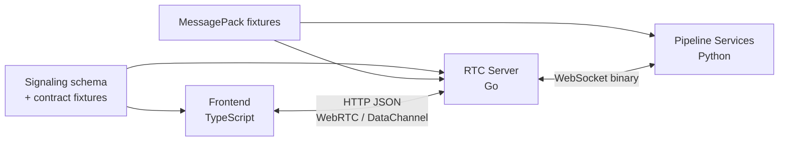
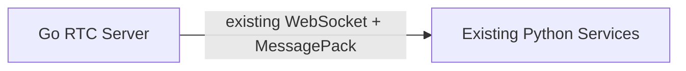
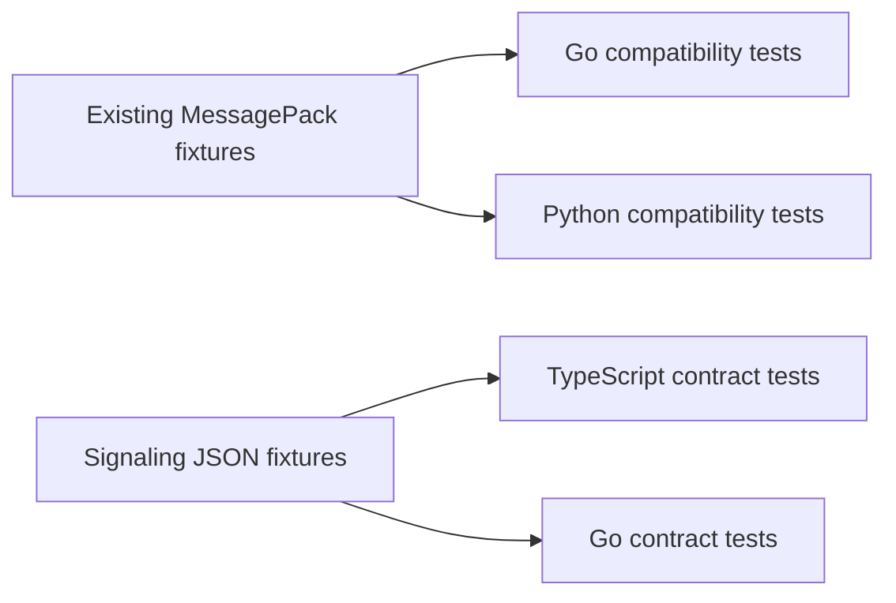

# 通信契約と型共有

## Summary

- frontend / Go signalingは既存契約との差分を手書きschemaとcontract testで固定する。
- Go RTC serverは下流Python serviceへ直接接続し、Python adapter専用protocolは設けない。
- 初期統合では既存WebSocket + MessagePack契約を維持し、Protocol Buffers移行は別initiativeとする。
- frontend向けDataChannel payloadはGoで可能な限りopaqueに扱い、3言語で全modelを重複定義しない。

## 契約境界



同じmodelを3言語へ無条件に複製しない。各境界のproducerとconsumerだけが型を持ち、境界を跨ぐfixtureで互換性を確認する。

## Frontend / Go signaling

対象は次のHTTP APIとする。

- `GET /api/v1/RTCSignalingServer/config.json`
- `POST /api/v1/RTCSignalingServer/offer`
- `POST /api/v1/RTCSignalingServer/candidate`
- `GET /api/v1/RTCSignalingServer/statuses`
- cleanup endpointを維持する場合の管理API

endpointと既存fieldは[Frontend RTC契約](../../design/contracts/frontend-rtc.md)を維持し、initial Offerの冪等性を識別する `offer_request_id` と、ICE generationを識別する `offer_revision` を追加する。

- initial Offerは `session_id` なし、Frontendが生成したUUIDの `offer_request_id`、`offer_revision: 1` を送る。HTTP timeout後に同じOfferを再送する場合は同じrequest IDを使い、SDPを再生成する場合は新しいrequest IDを発行する。
- backendはsession作成前に `offer_request_id` とOffer SDP hashをin-flight registryへ登録する。同じrequest ID / SDPの並行requestは同じ処理結果を待ち、異なるSDPの並行requestはHTTP 409で拒否する。
- backendは `offer_request_id`、Offer SDP hash、発行したsession ID、完成済みAnswerを、Frontendの最大retry期間より長い有限TTLで保持する。同じrequest IDと同じSDPの再送には同じAnswerを返し、同じrequest IDを異なるSDPへ再利用した場合はHTTP 409で拒否する。session終了後もTTL中はtombstoneを保持し、再送を新規sessionとして扱わずHTTP 410を返す。cacheはsession admissionと独立した件数上限を持ち、expired entry以外を黙ってevictせず、上限時は新規initial OfferをHTTP 429で拒否する。
- Pion Phase 3ではcompleted AnswerとtombstoneのTTLを2分、in-flightを含むregistry上限を1000件、active sessionと作成予約の合計を100件とする。HTTP bodyは1 MiB、decoded SDPは256 KiBを上限とし、registryのexpired entryはrequest受付時と30秒周期で回収する。
- backendはULIDのsession IDを発行し、Answerへ同じrevisionを返す。
- ICE restart付きupdate Offerは同じsession IDと、直前より1大きいrevisionで送る。
- candidate requestはsession IDとrevisionを持つ。通常candidateとend-of-candidatesの両方を同じgenerationへ関連付ける。
- backendはsessionごとに現在revisionを保持し、remote Offerの適用とAnswer生成が成功した時点でrevisionを進める。accepted Offerのrevisionと一致するcandidateだけを適用し、旧revision、未来revision、不明sessionは拒否して別sessionへfallbackしない。
- update Offerは同じrevisionと同じOffer SDPの再送に保存済みAnswerを返す。同じrevisionで異なるSDPを受けた場合はHTTP 409で拒否する。
- FrontendからPionへはTrickle ICEを使う。PionからFrontendにはcandidate通知経路を追加せず、`GatheringCompletePromise` を `SetLocalDescription(answer)` 前に取得し、設定後に収集完了を有限timeoutまで待つ。candidateを含む `LocalDescription` をAnswerとして返すhalf-trickleとし、timeout時はsessionをcloseしてHTTP 504を返す。冪等retry用に保存するAnswerもcandidate収集完了後の値とする。
- Frontendはupdate Offerのresponseを受けるまで、そのrevisionで収集したcandidateをqueueする。Offer失敗時は対応candidateを破棄する。
- update Offerが成功する限り、PeerConnection、DataChannel、pipeline、session IDを維持する。
- backendからsession消失が明示された場合だけFrontendが新規sessionを作る。そのinitial Offerへ `previous_session_id` を任意で付け、backendは旧・新session IDの対応を構造化ログへ記録する。
- `usernameFragment` は診断fieldとして透過するが、end-of-candidatesを含めて一貫して判定するため、generationの正本にはしない。
- Offer適用とcandidate追加はsession単位のlockまたはevent loopで直列化する。1 sessionのupdate Offerはsingle-flightとし、適用中の別OfferをHTTP 409で拒否する。

新fieldはaiortcのPydantic modelが未知fieldとして無視できるoptional fieldとして先にFrontendへ追加する。Frontendは移行中の診断用aiortc Answerに `offer_revision` がないことを許容し、aiortcで同一sessionのICE restartとrevision競合解決は行わない。Pion切替後にaiortcの新規session成立を運用要件とせず、旧backendへPion用状態機械を移植しない。

OpenAPI生成はPion移行の完了条件にしない。初期実装はFrontend / Goの手書きschemaと共有JSON fixtureによるcontract testを使い、型乖離が実害になった場合に別taskで導入する。

### Error semantics

- JSON syntax、field type、UUID / ULID format、SDP / candidate構文の不正はrequest単体をHTTP 400で拒否する。すでにPeerConnectionへ一部適用されて安全な継続を保証できない場合だけ、同じclose-once経路でsessionを終了する。
- HTTP request body、SDP、candidate文字列のbyte上限超過はHTTP 413で拒否する。
- 不明sessionはHTTP 404、終了済みsessionまたはinitial Offer tombstoneはHTTP 410を返す。
- request ID / revision競合と同一sessionへの並行OfferはHTTP 409を返す。
- session上限と1 revision当たりcandidate件数の上限超過はHTTP 429を返す。Frontend pending candidate queueの上限超過は当該ICE generationをlocal failureとして終了する。
- candidate再送は同じsession / revision / candidateの組み合わせで冪等に扱い、重複追加しない。

HTTP body、SDP、candidate文字列、revision当たりcandidate件数、Frontend pending candidate queueの上限はPhase 1で通常のChrome / Firefox実測値に余裕を加えて固定し、Gate 1以降は設定による無制限化を許可しない。

### Timeout / retry

- OfferとcandidateのHTTP requestは `AbortController` で有限timeoutを持つ。
- 同じHTTP操作内のretryは同じpayloadを使い、回数と総経過時間をboundedにする。429、5xx、network errorは `Retry-After` を尊重しつつ指数backoff + jitterで再送する。
- 404 / 410はsession消失として現在のcandidate queueを破棄し、新しいPeerConnection / sessionへ移行する。
- 409はblind retryせず、対象revision、signaling state、保存済みOfferを再評価する。同一payloadの冪等再送で解消できない場合は現在のnegotiationを中止する。
- candidate送信失敗は順序を保ってretryし、queue上限または総retry期限を超えた場合は当該ICE generationを失敗させる。
- FrontendのOffer生成、送信、candidate flushはPeerConnectionごとにsingle-flightとする。

## Go / Python pipeline契約

Go RTC serverは次の下流serviceへ直接接続する。

- SpeechExtractor
- SpeechRecognizer
- TextProcessor
- VoiceSynthesizer

### 既存MessagePack契約

PionとAudioBroker相当のGo実装を先に評価するため、初期統合では[Audio Pipeline WebSocket契約](../../design/contracts/audio-pipeline-websocket.md)を維持する。



Go側には通信に必要なDTOとserializerを実装する。ただし、PythonのPydantic classやmethod構造を逐語的に移植しない。

制約は次のとおり。

- field名、必須field、binary表現を現行fixtureと一致させる。
- Python encode / Go decodeとGo encode / Python decodeのgolden testを持つ。
- DTOはpipeline client packageの外へ公開しない。
- MessagePack modelの追加変更はGoとPythonを同時に確認する。
- MessagePackを将来変更する場合は、Pion移行完了後に独立したinitiativeで必要性を再評価する。

## 型所有

| Model                            | TypeScript | Go                       | Python              |
| -------------------------------- | ---------- | ------------------------ | ------------------- |
| signaling request / response     | 手書き型   | 手書き型                 | 診断期間は既存model |
| extractor / recognizer contract  | 不要       | 限定DTO                  | 既存Pydantic model  |
| processor / synthesizer contract | 不要       | 限定DTO                  | 既存Pydantic model  |
| ChatMessage JSON                 | consumer型 | opaqueまたは最小envelope | producer型          |
| telop / mora JSON                | consumer型 | timing用最小field        | producer型          |
| internal RTC state               | 不要       | Go固有                   | 不要                |

Goが音声同期に必要な `speech_id`、sample position、audio formatは型付けする。chat本文や表情など、routingに不要なfieldは `json.RawMessage` または `bytes` として転送できる契約にする。

## 音声format

Go内部のRTC-facing formatは固定する。

| 用途          | format    | sample rate | channel                  | frame duration |
| ------------- | --------- | ----------- | ------------------------ | -------------- |
| Extractor入力 | PCM s16le | 16 kHz      | mono                     | 20 ms相当      |
| Browser出力   | PCM s16le | 48 kHz      | PoCでmono / stereoを確定 | 20 ms          |

VoiceSynthesizerは現行どおりencoded voiceと `audio_format` を返せる。GoのAudio Output Processorがdecode、resample、frame分割を行う。

現行のrequest許容値とVoiceSynthesizer実装のresponseは次のとおりである。`audio/ogg` はrequest modelでは許容されるが、現行encoderに専用分岐がないためWAVへfallbackする。

| request `audio_format`  | response `audio_format` | container / codec |
| ----------------------- | ----------------------- | ----------------- |
| `audio/wav`             | `audio/wav`             | WAV / PCM         |
| `audio/aac`             | `audio/aac`             | AAC               |
| `audio/ogg`             | `audio/wav`             | WAV / PCM         |
| `audio/ogg;codecs=opus` | `audio/ogg;codecs=opus` | Ogg / Opus        |

したがって、browser入力のRTP Opus codecと、下流encoded voiceのcontainer demux / decodeは別のinterfaceとtest matrixで扱う。後者はresponseに現れるWAV、AAC、Ogg Opusを必須対応とし、request全許容値についてresponse形式を検証する。

将来、VoiceSynthesizerがPCMを直接返す方が有利と判明した場合は、pipeline contractの破壊的変更として別に判断する。Pion移行と同時には変更しない。

## 音声とtelopの同期

現行 `VoiceSynthesizerResultFrame` はPython AudioBroker内でPCM frameとmora情報を結合している。Go化後はVoiceSynthesizerの音声とmora timingから、Goが次を生成する。

- 固定長PCM frame
- speech ID
- 発話開始からのsample position
- timestamp付きmora / telop event

float秒をoutbound clockの正本にせず、sample位置の整数を第一候補とする。Goはsample位置をRTP timestampとpacingへ対応付ける。

## DataChannel payload

DataChannelのtransport契約は[Frontend RTC契約](../../design/contracts/frontend-rtc.md)を維持する。

| channel    | initiator | ordering  | reliability         | protocol | message         |
| ---------- | --------- | --------- | ------------------- | -------- | --------------- |
| `text_ch`  | Frontend  | ordered   | reliable            | `""`     | UTF-8 JSON text |
| `telop_ch` | Frontend  | unordered | `maxRetransmits: 0` | `""`     | UTF-8 JSON text |

ICE restart付きupdate Offerでは既存PeerConnectionとDataChannelを再利用する。Pion側は `telop_ch` の欠落、重複、順序逆転を許容し、channelの受信順序をapplication上の順序として扱わない。

Goはchannel routingとaudio同期に必要な最小envelopeだけを理解する。

```go
type OutboundEvent struct {
    Channel  Channel
    SpeechID int64
    Sample   uint64
    Payload  json.RawMessage
}
```

これは概念例であり、確定APIではない。Goが行うvalidationは次に限定する。

- channelが既知であること
- payload sizeが上限以下であること
- UTF-8 JSONとして送信可能であること
- 対象DataChannelがopenであること
- timing fieldが対象speechの範囲内であること

ChatMessageやtelop / moraのapplication fieldはPython producerとfrontend consumerの契約とする。

現行frontendのtelop payloadには `speech_id` と発話内 `timestamp` があるが、重複排除やstale event破棄は実装されていない。これらのfieldによる無害化を移行要件にする場合はfrontend契約変更として扱う。DataChannel message size上限はPhase 1でbrowser / Pion双方の実測を取得し、Phase 3実装前にapplication上限を確定する。

## Backpressure

- input audioは低遅延を優先し、上限到達時は古い未処理frameを破棄できる。
- speech segmentとrecognized textはaudio frameと同じdrop policyを使わない。
- synthesized audioは発話順序を維持する。
- `text_ch` は送信順序を維持する。
- `telop_ch` は低遅延を優先し、欠落、重複、順序逆転を許容する。未送信queueでは古いeventを後送しない。
- queue overflowはsession metricと構造化ログへ記録する。
- DataChannelのbuffered amountが上限を超えた場合は送信を抑制し、timeout後にsession errorとする。

## 互換性ルール

- golden MessagePack fixtureを正本としてcross-language testする。
- integer幅、binary、null、enum、map keyの差を明示的に検証する。
- Go DTOを手書きする場合もfixture testなしでfieldを追加しない。
- Pion移行中はpipeline protocolを変更せず、変更が必要になった場合は別initiativeとして扱う。

## Contract test



MessagePack互換testはPion移行完了後も、pipeline protocolを変更する別initiativeがreplacement testと削除条件を定義するまで削除しない。
