# 実装フェーズ

## Summary

- 移行はPion / codec最小PoC、Go pipeline client、統合、切替リハーサル、運用切り替え、旧実装削除の順で進める。
- 詳細aiortc baselineは移行の前提から外し、Phase 4はproduction相当環境のPion smoke testに絞る。
- 下流Protocol Buffers移行とOpenAPI生成は別initiativeとし、Pion移行の完了条件へ含めない。
- Python adapterはPoCで必要な場合だけ一時利用し、本番統合前に除去する。
- 各phaseにexit gateを設け、後続phaseへ自動的に進まない。
- Gate条件は[検証計画](validation-plan.md)の判定規則に従う。移行必須条件の未達だけをFAILとし、観測不能なら
  必要な観測点と解除条件を記録してGate taskを`blocked`にする。

## 全体フロー

```mermaid
flowchart LR
    P1["Phase 1\nPion / codec最小PoC"]
    P1 --> G1{"Gate 1"}
    G1 --> P2["Phase 2\nGo pipeline clients"]
    P2 --> G2{"Gate 2"}
    G2 --> P3["Phase 3\nGo RTC integration"]
    P3 --> G3{"Gate 3"}
    G3 --> P4["Phase 4\nCutover rehearsal"]
    P4 --> G4{"Gate 4"}
    G4 --> P5["Phase 5\nMaintenance cutover"]
    P5 --> G5{"Gate 5"}
    G5 --> P6["Phase 6\nRemove Python RTC stack"]

    G1 -. "不合格" .-> P1
    G2 -. "互換不合格" .-> P2
    G3 -. "不合格" .-> P3
    G4 -. "forward-fix" .-> P4
    G5 -. "forward-fix" .-> P5
```

## Phase 0: 詳細baseline（前提外）

### 作業

- 先行baseline taskの成果は参考にするが、validation harnessのmerge、修正、実行をPhase 1の前提にしない。
- 詳細resource、latency、impairment、soak比較は、移行後に実害が確認された場合だけ独立taskで扱う。

### Gate 0

Gate 0は設定しない。Phase 1は独立して着手できる。

## Phase 1: Pion / codec PoC

### 作業

- Pion `v4.2.17`、pure Go decoder `github.com/pion/opus v0.1.0`、
  mediadevices encoder `v0.10.0` を独立Go moduleへ固定する。
- 現行Offerを受理し、PionでAnswerを生成する。Frontend→PionはTrickle、Pion→Frontendは `GatheringCompletePromise` を有限timeoutまで待つhalf-trickleとする。
- Trickle ICEとend-of-candidatesを処理し、local host candidateの収集完了後にAnswerを返す。
- 現行schemaを変更せず、initial Offerだけを扱う。update Offerは501とする。
- browserからOpus RTPを受信する。
- Opusをpure Goで48 kHz monoまたはstereo PCMへdecodeする。
- test PCMをOpusへencodeしてbrowserへ返す。
- browser入力とは独立した20 ms outbound clockで1秒のtest PCMを送信する。
- outgoing senderのRTCPをsession contextでdrainする。
- `text_ch` と `telop_ch` にtest JSONを送信する。
- 通常closeを10回行い、codec、ticker、goroutine、PeerConnectionをclose-onceへ収束させる。
- malformed JSON / SDP / candidate、candidate収集timeout、codec error、SIGTERMをunit / integration testする。

Python adapterを使う場合はtest PCMまたは既存AudioBrokerへの一時bridgeに限定する。Phase 2のGo pipeline clientが成立した時点で削除する。

### Gate 1

- Chromeとlocal host candidateで双方向音声が成立する。
- candidateを含む完成済みAnswerが返り、PionからFrontendへの追加signaling経路なしで接続できる。
- 100 packet以上を48 kHz non-silent PCMへdecodeし、1秒toneをChromeで再生できる。
- 2 DataChannelで固定JSONをFrontend parserへ渡せる。
- 10回の通常close後にregistryが0、goroutineが開始前+5以下へ戻る。
- unknown / closed candidateを新規sessionへfallbackせず200 + `status:false` で拒否する。
- race test、SIGTERM、codec errorでclose-onceが成立する。

Gate 1を満たせない場合、失敗したcodec adapterまたはsignaling方式だけを後続taskで再評価する。
NATと対応browserはPhase 4へ送る。ICE restartとVoiceSynthesizer形式は既存repository testで確認し、
impairment、soak、性能比較は必須Gateに含めない。

## Phase 2: Go pipeline clients

### 作業

- 現行MessagePack payloadのgolden fixtureをPythonで生成する。
- extractor、recognizer、processor、synthesizerごとに限定DTOを定義する。
- Goで既存WebSocket endpointへ接続するclientを実装する。
- Go encode / Python decodeとPython encode / Go decodeをtestする。
- Consul lookup、fallback、timeoutを実装する。
- 1 client障害時に4 clientを一括closeし、pipeline generationを更新して全接続を再作成する。
- generation更新時に全queueとin-flight stateを破棄し、旧generationのcallbackを拒否する。
- session contextによるcloseと再接続停止を実装する。
- synthesized voiceとmora timingのdecodeを実装する。

実装packageは `sincromisor-server/sincro-rtc/internal/pipeline`、Python生成の互換fixtureは
同packageの `protocol/testdata/` を正本とする。固定Gate command、実行環境、stage観測、reset / close結果は
`tasks/sincro-rtc/task-260726211012-pion-phase-2-pipeline-reset-gate-2/artifacts/gate-2-result.md`
に記録する。

### Gate 2

- 既存Python下流serviceを変更せずGo clientから各処理を実行できる。
- MessagePack fixtureが双方向に一致する。
- pipeline reset中のbrowser入力をbufferせず、全queueが空になる。
- in-flight requestをgeneration跨ぎで再送せず、旧generationのresultがaudio、TTS、DataChannelへ到達しない。
- 1秒開始、最大30秒の指数backoff + full jitterで4 clientが全て復旧するまで再試行し、復旧後の新しい発話処理を再開する。
- 確定済みchat historyはreset後も維持し、partial recognitionと処理中発話は破棄する。
- close後にWebSocketとgoroutineが残らない。

fake 4-stage integrationの成功だけではGate 2を完了しない。4つの既存Python serviceと必要backendを起動できず、
固定commandを完走できない環境はFAILとして上記artifactに記録する。

## Phase 3: Go RTC統合

### 結果

- Go RTC serverのsession registryを実装する。
- Audio Input Processorを実装する。
- Conversation Coordinatorを実装し、4つのpipeline clientを接続する。
- Audio Output Processorと独立outbound media clockを実装する。
- DataChannel Dispatcherとaudio / telop同期を実装する。
- 用途別queueとbackpressureを実装する。
- timeout、close-once、late candidateを実装する。
- pre-connect、ICE / DTLS、track / DataChannel readiness、restartのdeadlineとpipeline client遅延作成を実装する。
- `/statuses`、health check、metricsを実装する。
- 現行endpointのintegration testをPion版へ適用する。
- FrontendとPionへ `offer_request_id` / `offer_revision` を追加し、同一session IDのICE restart、stale candidate拒否、HTTP timeout / retry / error分岐を実装する。
- Frontendの `disconnected` grace period、`failed` 後のsingle-flight restart、bounded candidate queueを実装する。
- aiortcは移行中の診断用backendとして新fieldを未知fieldとして無視し、FrontendはrevisionなしAnswerを許容する。aiortcへrevision状態機械は実装しない。
- HTTP / SDP / candidate上限と、session goroutine / callbackのpanic recovery境界を実装する。
- RTC serverからsessionが消失した場合だけFrontendが新規sessionを作り、`previous_session_id` で旧・新IDをログ上関連付ける。
- PoC専用Python adapterを削除する。

### Gate 3

- 移行必須: 下流4サービスの実装変更なしに会話が成立し、本番経路にPython RTC adapterが存在しない。
- 既存testの証拠: repository test、abnormal close、readiness failure、session上限、停止時のsession損失、切替時の
  session終了、revision互換、aiortc診断用の互換を既存確認で満たす。
- 独立した運用強化: 追加のharness、metric、障害注入、性能比較は別taskで扱う。

## Phase 4: 切替リハーサル

### 作業

- compose profileまたは別projectでaiortc版とPion版を排他的に起動できるようにする。
- 運用環境と同じ固定UDP mux port、public IPv4、NAT、firewall設定を検証する。
- Pion版でGate 3と同じChromeのsmoke testを1回実行する。
- aiortc停止、Pion起動、smoke testの手順と所要時間を検証する。aiortc起動は必要時の診断に留める。

### Gate 4

- 移行必須: Pion版で現行Frontendから接続し、1 turnの会話、text、telop、非無音音声が成立する。session終了後に
  active sessionと下流接続が収束し、切替でFrontendと下流serviceをrebuildしない。
- 既存testの証拠: 既存repository testはPhase 3で確認済みの契約・異常系の証拠として再利用する。
- 独立した運用強化: Pion process crash自動復帰、soak、性能比較、障害注入、browser matrixの拡張はGate 4へ含めない。
- public UDP / NAT / firewallとaiortc / Pionの排他起動は、上記の移行必須条件を観測するための環境前提として確認する。

実下流の可変応答は固定文字列と比較せず、browser UIでtext、telop、音声を確認する。Firefox、Docker crash、環境の網羅監査、
新しいharnessは、browser固有の実害があり、aiortcで同じ経路が成立している場合だけ独立して扱う。

この条件は試行4から適用する。過去artifactと判定履歴は保持し、Pionの移行必須条件を観測できるproduction相当smoke手順で
runbookを最初から実行する。

## Phase 5: メンテナンス切り替え

### 作業

- `full` / `rtc` profileでPion版をstable endpointの通常serviceとして起動し、smoke test後に利用を再開する。
- aiortc版のimageと設定は `aiortc` 診断profileに残すが、動作確認も運用rollbackも行わない。
- 運用文書、compose、env sample、current designを更新する。
- 移行後の実測値を評価taskへ残す。
- Python AudioBrokerへの新規機能追加を停止する。

### Gate 5

- Pion通常構成への切替後、観測期間中にPion問題時の対応条件へ該当しない。
- 未解決のPion固有critical issueがない。
- 現在設計と実装が一致している。

Pion安定化後もpipeline Protocol Buffers移行は自動的に開始しない。MessagePack DTOの負債や互換性問題が実害になった場合だけ、独立initiativeとして起票する。

## Phase 6: Python RTC stackの削除

### 作業

- aiortc service、dependency、testを削除した。
- Python `RTCSessionProcess`、`VoiceTransformTrack`、`AudioBroker` を削除した。
- aiortc診断用設定を削除した。
- Pionが使用するMessagePack互換層とgolden fixtureは維持する。
- 本ディレクトリの確定事項をcurrent design、contract、ADRへ反映する。
- 移行計画を縮退またはarchiveする。

### 完了結果

- production相当composeにaiortc dependencyとPython RTC adapterはない。
- Go RTC serverがpipeline orchestrationを直接所有する。
- Pythonには推論・音声生成を行う下流serviceだけが残る。
- frontendとPython下流serviceがPion経路だけで動作する。
- 設計文書、契約、task indexが更新されている。
