# 実装フェーズ

## Summary

- 移行はbaseline、Pion / codec PoC、Go pipeline client、統合、切替リハーサル、運用切り替え、旧実装削除の順で進める。
- 下流Protocol Buffers移行とOpenAPI生成は別initiativeとし、Pion移行の完了条件へ含めない。
- Python adapterはPoCで必要な場合だけ一時利用し、本番統合前に除去する。
- 各phaseにexit gateを設け、後続phaseへ自動的に進まない。

## 全体フロー

```mermaid
flowchart LR
    P0["Phase 0\nBaseline"] --> G0{"Gate 0"}
    G0 --> P1["Phase 1\nPion / codec PoC"]
    P1 --> G1{"Gate 1"}
    G1 --> P2["Phase 2\nGo pipeline clients"]
    P2 --> G2{"Gate 2"}
    G2 --> P3["Phase 3\nGo RTC integration"]
    P3 --> G3{"Gate 3"}
    G3 --> P4["Phase 4\nCutover rehearsal"]
    P4 --> G4{"Gate 4"}
    G4 --> P5["Phase 5\nMaintenance cutover"]
    P5 --> G5{"Gate 5"}
    G5 --> P6["Phase 6\nRemove Python RTC stack"]

    G0 -. "baseline不足" .-> P0
    G1 -. "不合格" .-> P1
    G2 -. "互換不合格" .-> P2
    G3 -. "不合格" .-> P3
    G4 -. "rollback" .-> P4
    G5 -. "rollback" .-> P5
```

## Phase 0: 現行baseline

### 作業

- aiortc `1.14.0` の依存を固定して測定条件を記録する。
- idle、通話中、再接続中、終了後のCPU、RSS、thread、process、file descriptorを測る。
- 10、50、100回の接続・切断loopを実行する。
- 30分以上の連続通話を実行する。
- Chrome、Firefox、host candidate、STUNの結果を分ける。
- 入力からpipeline、合成結果からbrowserまでのlatencyを測る。
- AudioBrokerのWebSocket数、queue depth、reconnect、close時間を測る。

### Gate 0

- Pion版と同じscenarioで再実行可能な手順がtaskへ記録されている。
- memory、resource、latencyの基準値が取得できている。
- 既知の現行不具合と移行で直す問題が区別されている。

## Phase 1: Pion / codec PoC

### 作業

- PoCは `SetICEAddressRewriteRules` を利用できるPion `v4.2.17` を `go.mod` へ固定して開始し、version変更はcompatibility testを通す明示的な依存更新として扱う。
- 現行Offerを受理し、PionでAnswerを生成する。Frontend→PionはTrickle、Pion→Frontendは `GatheringCompletePromise` を有限timeoutまで待つhalf-trickleとする。
- Trickle ICEとend-of-candidatesを処理し、candidate収集完了後のAnswerだけを冪等retry用に保存する。
- initial Offerへ `offer_request_id` を追加し、同一SDPのresponse消失retryでsessionを重複作成しない。
- 1つの固定UDP mux portと `SetICEAddressRewriteRules` のhost置換で明示public IPv4を生成し、container / private host candidateをadvertiseしない。
- UDP4、interface filter、STUN、public IPv4 rewriteを組み合わせ、`turn:` / `turns:` 設定と不正なbind / IP / port設定をstartup時に拒否する。
- Docker 1:1 UDP mappingで直接接続する。
- single-port ICE-TCPはChrome / Firefoxと展示相当networkでUDP失敗時の改善が確認できるか任意評価し、必須Gateにはしない。
- browserからOpus RTPを受信する。
- Opusをdecodeし、16 kHz mono PCMへ変換する。
- test PCMをOpusへencodeしてbrowserへ返す。
- bounded reorder window、RTP sequence / timestamp wraparound、late / duplicate packet破棄、SSRC変更を処理する。
- browser入力とは独立した20 ms outbound clockでPCMを送信し、ticker遅延後もburst送信しない。
- Sender / Receiver Reportを明示設定し、outgoing senderのRTCPを継続してdrainする。
- NACK有無とOpus PLCをloss / latency条件で比較し、採用値とpacket history上限を固定する。
- RTP timestampとtimestamp付きmora eventの同期を確認する。
- `text_ch` と `telop_ch` にtest JSONを送信する。
- `offer_revision` 付きICE restart / update Offerを同じsession IDへ適用する。
- session close後のgoroutine、socket、codec stateを観測する。
- Answer生成、ICE / DTLS確立、track / DataChannel readinessのdeadline超過で同じclose-once経路へ収束することを確認する。
- HTTP body、SDP、candidate文字列、revision当たりcandidate件数、Frontend pending candidate queueの上限を実測から固定する。
- libopus bindingとGStreamerのcodec経路を比較する。
- browser入力のRTP Opus codecとVoiceSynthesizer返却音声のcontainer demux / decodeを分離して検証する。
- VoiceSynthesizerの全許容 `audio_format` について、対応可否、最大byte数、最大再生時間、malformed input、decoder timeoutを比較する。

Python adapterを使う場合はtest PCMまたは既存AudioBrokerへの一時bridgeに限定する。Phase 2のGo pipeline clientが成立した時点で削除する。

### Gate 1

- ChromeとFirefoxで双方向音声が成立する。
- 固定UDP mux portの直接接続が成立する。
- candidateを含む完成済みAnswerが返り、PionからFrontendへの追加signaling経路なしで接続できる。
- initial Offer response消失時に同じ `offer_request_id` で同じsession / Answerを取得し、異なるSDPでのrequest ID再利用を409で拒否する。
- 音声速度、channel、sample rate、timestampが正しい。
- RTP / RTCP loop、wraparound、reorder、pacingがloss / jitter / scheduler遅延下で継続する。
- NACKの採否とbounded historyが決定されている。
- 100回接続・切断後にresourceが許容範囲へ戻る。
- 接続未成立、track欠落、DataChannel欠落、browser abrupt closeでもdeadline後にresourceが回収される。
- ICE restart後も同じsession IDでDataChannelとaudioが復旧する。
- 旧 `offer_revision` のcandidateと未知session IDを別の新規sessionへfallbackさせず拒否する。
- codec実装と配布方式を選択できる測定結果がある。
- VoiceSynthesizer返却形式ごとのdecode可否とresource上限が確定している。

Gate 1を満たせない場合、GStreamer `webrtcbin` または現行aiortc継続を再評価する。

## Phase 2: Go pipeline clients

### 作業

- 現行MessagePack payloadのgolden fixtureをPythonで生成する。
- extractor、recognizer、processor、synthesizerごとに限定DTOを定義する。
- Goで既存WebSocket endpointへ接続するclientを実装する。
- Go encode / Python decodeとPython encode / Go decodeをtestする。
- Consul lookup、fallback、timeoutを実装する。
- 1 client障害時に4 clientを一括closeし、pipeline generationを更新して全接続を再作成する。
- generation更新時に全queueとin-flight stateを破棄し、旧generationのcallbackを拒否する。
- session contextによるcloseと再接続停止を実装する。
- synthesized voiceとmora timingのdecodeを実装する。

### Gate 2

- 既存Python下流serviceを変更せずGo clientから各処理を実行できる。
- MessagePack fixtureが双方向に一致する。
- pipeline reset中のbrowser入力をbufferせず、全queueが空になる。
- in-flight requestをgeneration跨ぎで再送せず、旧generationのresultがaudio、TTS、DataChannelへ到達しない。
- 1秒開始、最大30秒の指数backoff + full jitterで4 clientが全て復旧するまで再試行し、復旧後の新しい発話処理を再開する。
- 確定済みchat historyはreset後も維持し、partial recognitionと処理中発話は破棄する。
- close後にWebSocketとgoroutineが残らない。

## Phase 3: Go RTC統合

### 作業

- Go RTC serverのsession registryを実装する。
- Audio Input Processorを実装する。
- Conversation Coordinatorを実装し、4つのpipeline clientを接続する。
- Audio Output Processorと独立outbound media clockを実装する。
- DataChannel Dispatcherとaudio / telop同期を実装する。
- 用途別queueとbackpressureを実装する。
- timeout、close-once、late candidateを実装する。
- pre-connect、ICE / DTLS、track / DataChannel readiness、restartのdeadlineとpipeline client遅延作成を実装する。
- `/statuses`、health check、metricsを実装する。
- 現行endpointのintegration testをPion版へ適用する。
- FrontendとPionへ `offer_request_id` / `offer_revision` を追加し、同一session IDのICE restart、stale candidate拒否、HTTP timeout / retry / error分岐を実装する。
- Frontendの `disconnected` grace period、`failed` 後のsingle-flight restart、bounded candidate queueを実装する。
- aiortcは新fieldを未知fieldとして無視し、Frontendはrollback期間だけrevisionなしAnswerを許容する。aiortcへrevision状態機械は実装しない。
- HTTP / SDP / candidate上限と、session goroutine / callbackのpanic recovery境界を実装する。
- RTC serverからsessionが消失した場合だけFrontendが新規sessionを作り、`previous_session_id` で旧・新IDをログ上関連付ける。
- PoC専用Python adapterを削除する。

### Gate 3

- [検証計画](validation-plan.md)の必須functional testが通る。
- 下流4サービスの実装変更なしに会話が成立する。
- abnormal closeで全pipeline client、codec、PeerConnectionが一度だけcloseされる。
- pre-connect deadlineとmedia readiness deadlineの全失敗経路で、下流WebSocketを残さずsessionがcloseされる。
- session数、goroutine、queue、WebSocket、codec errorを観測できる。
- RTP / RTCP loop終了、packet loss、reorder drop、NACK / PLC、pacing lagを観測できる。
- process crash後にsupervisorが再起動し、readiness復旧後に新規sessionを受理できる。
- 1 instance当たりのsession上限と、process停止時に失われる最大session数が明記されている。
- 切替時に新規sessionを停止し、close timeout後にactive sessionを終了できる。
- 本番経路にPython RTC adapterが存在しない。
- Pionで旧revision / 未知session IDのOffer / candidateが新規sessionへfallbackしない。
- rollback時のaiortcはページreload後の新規sessionが成立し、Pion固有revisionを解釈しなくても動作する。

## Phase 4: 切替リハーサル

### 作業

- compose profileまたは別projectでaiortc版とPion版を排他的に起動できるようにする。
- 運用環境と同じ固定UDP mux port、public IPv4、NAT、firewall設定を検証する。
- browser / network test matrixを両backendへ逐次実行する。
- 長時間soak testと障害注入を行う。
- aiortc停止、Pion起動、smoke test、Pion停止、aiortc復旧の手順と所要時間を検証する。

### Gate 4

- Pion版がbaselineと同等以上の接続成功率を持つ。
- latencyと音質に重大な退行がない。
- resource増加が定義したbudget内である。
- 直接接続が成立し、TURNを合否判定へ含めていない。
- rollbackがfrontend / pipeline serviceのbuild変更なしで実行できる。
- 運用環境でaiortcとPionが同時起動しないことをcompose設定で確認できる。

## Phase 5: メンテナンス切り替え

### 作業

- 利用停止を告知し、aiortc版を停止する。
- Pion版をstable endpointで起動し、smoke test後に利用を再開する。
- aiortc版のimageと設定をrollback専用として期限付きで残すが、serviceは起動しない。
- 運用文書、compose、env sample、current designを更新する。
- 移行後の実測値を評価taskへ残す。
- Python AudioBrokerへの新規機能追加を停止する。

### Gate 5

- 切替後の観測期間中にrollback条件へ該当しない。
- 未解決のPion固有critical issueがない。
- 現在設計と実装が一致している。

Pion安定化後もpipeline Protocol Buffers移行は自動的に開始しない。MessagePack DTOの負債や互換性問題が実害になった場合だけ、独立initiativeとして起票する。

## Phase 6: Python RTC stackの削除

### 作業

- aiortc service、dependency、test fixtureを削除する。
- Python `RTCSessionProcess`、`VoiceTransformTrack`、`AudioBroker` を削除する。
- rollback期限付き設定を削除する。
- Pionが使用するMessagePack互換層とgolden fixtureは維持する。
- 本ディレクトリの確定事項をcurrent design、contract、ADRへ反映する。
- 移行計画を縮退またはarchiveする。

### 完了条件

- production相当composeにaiortc dependencyとPython RTC adapterがない。
- Go RTC serverがpipeline orchestrationを直接所有する。
- Pythonには推論・音声生成を行う下流serviceだけが残る。
- frontendとPython下流serviceがPion経路だけで動作する。
- 設計文書、契約、task indexが更新されている。
