# 実装フェーズ

## 要約

- 移行はPion / コーデック最小PoC、Go 処理工程クライアント、統合、切替リハーサル、運用切り替え、旧実装削除の順で進める。
- 詳細aiortc 基準は移行の前提から外し、段階 4は本番相当環境のPion 動作確認に絞る。
- 下流Protocol Buffers移行とOpenAPI生成は別取り組み計画とし、Pion移行の完了条件へ含めない。
- Python アダプターはPoCで必要な場合だけ一時利用し、本番統合前に除去する。
- 各段階にexit 検査を設け、後続段階へ自動的に進まない。
- Gate条件は[検証計画](validation-plan.md)の判定規則に従う。移行必須条件の未達だけをFAILとし、観測不能なら
  必要な観測点と解除条件を記録してGate タスクを`blocked`にする。

## 全体フロー

```mermaid
flowchart LR
    P1["段階 1\nPion / コーデック最小PoC"]
    P1 --> G1{"Gate 1"}
    G1 --> P2["段階 2\nGo の処理工程用クライアント"]
    P2 --> G2{"Gate 2"}
    G2 --> P3["段階 3\nGo RTC の統合"]
    P3 --> G3{"Gate 3"}
    G3 --> P4["段階 4\n切替リハーサル"]
    P4 --> G4{"Gate 4"}
    G4 --> P5["段階 5\nメンテナンス時の切替"]
    P5 --> G5{"Gate 5"}
    G5 --> P6["段階 6\nPython RTC 構成の削除"]

    G1 -. "不合格" .-> P1
    G2 -. "互換不合格" .-> P2
    G3 -. "不合格" .-> P3
    G4 -. "新構成のまま修正" .-> P4
    G5 -. "新構成のまま修正" .-> P5
```

## 段階 0: 詳細基準（前提外）

### 作業

- 先行基準タスクの成果は参考にするが、検証検証基盤の統合、修正、実行を段階 1の前提にしない。
- 詳細リソース、遅延、障害注入、長時間連続稼働比較は、移行後に実害が確認された場合だけ独立タスクで扱う。

### Gate 0

Gate 0は設定しない。段階 1は独立して着手できる。

## 段階 1: Pion / コーデック PoC

### 作業

- Pion `v4.2.17`、Goだけで実装された復号器 `github.com/pion/opus v0.1.0`、
  mediadevices 符号化器 `v0.10.0` を独立Go モジュールへ固定する。
- 現行Offerを受理し、PionでAnswerを生成する。フロントエンド→PionはTrickle、Pion→フロントエンドは `GatheringCompletePromise` を有限時間切れまで待つhalf-trickleとする。
- Trickle ICEと候補収集の完了通知を処理し、ローカルホスト候補の収集完了後にAnswerを返す。
- 現行スキーマを変更せず、初回Offerだけを扱う。更新Offerは501とする。
- ブラウザからOpus RTPを受信する。
- OpusをGoだけで実装されたで48 kHz モノラルまたはステレオ PCMへ復号する。
- テスト PCMをOpusへ符号化してブラウザへ返す。
- ブラウザ入力とは独立した20 ms 送信時計で1秒のテスト PCMを送信する。
- 送信側の送信処理のRTCPをセッションコンテキストで排出する。
- `text_ch` と `telop_ch` にテスト JSONを送信する。
- 通常終了を10回行い、コーデック、周期タイマー、goroutine、PeerConnectionを終了処理を一度だけ実行するへ収束させる。
- 不正な JSON / SDP / 候補、候補収集時間切れ、コーデックエラー、SIGTERMを単体・結合テストする。

Python アダプターを使う場合はテスト PCMまたは既存AudioBrokerへの一時橋渡しに限定する。段階 2のGo 処理工程クライアントが成立した時点で削除する。

### Gate 1

- Chromeとローカルホスト候補で双方向音声が成立する。
- 候補を含む完成済みAnswerが返り、Pionからフロントエンドへの追加シグナリング経路なしで接続できる。
- 100 パケット以上を48 kHz 非無音 PCMへ復号し、1秒のテスト音をChromeで再生できる。
- 2 DataChannelで固定JSONをフロントエンド解析処理へ渡せる。
- 10回の通常終了後に登録簿が0、goroutineが開始前+5以下へ戻る。
- 未知 / 閉じた候補を新規セッションへ代替処理せず200 + `status:false` で拒否する。
- 競合テスト、SIGTERM、コーデックエラーで終了処理を一度だけ実行するが成立する。

Gate 1を満たせない場合、失敗したコーデックアダプターまたはシグナリング方式だけを後続タスクで再評価する。
NATと対応ブラウザは段階 4へ送る。ICE 再接続とVoiceSynthesizer形式は既存リポジトリテストで確認し、
障害注入、長時間連続稼働、性能比較は必須Gateに含めない。

## 段階 2: Goパイプラインのクライアント

### 作業

- 現行MessagePack 送受信データの期待結果を固定した検証データをPythonで生成する。
- 音声区間抽出処理、音声認識処理、処理器、音声合成処理ごとに限定DTOを定義する。
- Goで既存WebSocket エンドポイントへ接続するクライアントを実装する。
- Go 符号化 / Python 復号とPython 符号化 / Go 復号をテストする。
- Consul 探索、代替処理、時間切れを実装する。
- 1 クライアント障害時に4 クライアントを一括終了し、処理工程世代を更新して全接続を再作成する。
- 世代更新時に全キューと処理中の状態を破棄し、旧世代のコールバックを拒否する。
- セッションコンテキストによる終了と再接続停止を実装する。
- 合成済みの音声とモーラ時刻情報の復号を実装する。

実装パッケージは `sincromisor-server/sincro-rtc/internal/pipeline`、Python生成の互換固定データは
同パッケージの `protocol/testdata/` を正本とする。固定Gate コマンド、実行環境、段階観測、再初期化 / 終了結果は
`tasks/sincro-rtc/task-260726211012-pion-phase-2-pipeline-reset-gate-2/artifacts/gate-2-result.md`
に記録する。

### Gate 2

- 既存Python下流サービスを変更せずGo クライアントから各処理を実行できる。
- MessagePack 固定データが双方向に一致する。
- 処理工程再初期化中のブラウザ入力をバッファせず、全キューが空になる。
- 処理中のもの要求を世代跨ぎで再送せず、旧世代の結果が音声、TTS、DataChannelへ到達しない。
- 1秒開始、最大30秒の指数再試行間隔 + 全待機範囲でのランダムな揺らぎで4 クライアントが全て復旧するまで再試行し、復旧後の新しい発話処理を再開する。
- 確定済みチャット履歴は再初期化後も維持し、暫定認識と処理中発話は破棄する。
- 終了後にWebSocketとgoroutineが残らない。

模擬 4-stage 結合の成功だけではGate 2を完了しない。4つの既存Python サービスと必要バックエンドを起動できず、
固定コマンドを完走できない環境はFAILとして上記成果物に記録する。

## 段階 3: Go RTC統合

### 結果

- Go RTC サーバーのセッション登録簿を実装する。
- 入力音声処理を実装する。
- 会話調停処理を実装し、4つの処理工程クライアントを接続する。
- 出力音声処理と独立送信メディア時計を実装する。
- DataChannel振り分け処理と音声 / テロップ同期を実装する。
- 用途別キューと流量制御を実装する。
- 時間切れ、終了処理を一度だけ実行する、遅延した候補を実装する。
- 接続前、ICE / DTLS、トラック / DataChannel 準備状態、再接続の期限と処理工程クライアント遅延作成を実装する。
- `/statuses`、死活確認、指標を実装する。
- 現行エンドポイントの結合テストをPion版へ適用する。
- フロントエンドとPionへ `offer_request_id` / `offer_revision` を追加し、同一セッション IDのICE 再接続、古くなった候補拒否、HTTP 時間切れ / 再試行 / エラー分岐を実装する。
- フロントエンドの `disconnected` 猶予期間、`failed` 後の同時に1つだけの実行再接続、上限付きの候補キューを実装する。
- aiortcは移行中の診断用バックエンドとして新フィールドを未知フィールドとして無視し、フロントエンドは改訂番号なしAnswerを許容する。aiortcへ改訂番号状態機械は実装しない。
- HTTP / SDP / 候補上限と、セッション goroutine / コールバックのpanic 回復境界を実装する。
- RTC サーバーからセッションが消失した場合だけフロントエンドが新規セッションを作り、`previous_session_id` で旧・新IDをログ上関連付ける。
- PoC専用Python アダプターを削除する。

### Gate 3

- 移行必須: 下流4サービスの実装変更なしに会話が成立し、本番経路にPython RTC アダプターが存在しない。
- 既存テストの証拠: リポジトリテスト、異常終了、準備状態失敗、セッション上限、停止時のセッション損失、切替時の
  セッション終了、改訂番号互換、aiortc診断用の互換を既存確認で満たす。
- 独立した運用強化: 追加の検証基盤、指標、障害注入、性能比較は別タスクで扱う。

## 段階 4: 切替リハーサル

### 作業

- Docker Compose プロファイルまたは別プロジェクトでaiortc版とPion版を排他的に起動できるようにする。
- 運用環境と同じ固定UDP mux ポート、公開IPv4、NAT、ファイアウォール設定を検証する。
- Pion版でGate 3と同じChromeの動作確認を1回実行する。
- aiortc停止、Pion起動、動作確認の手順と所要時間を検証する。aiortc起動は必要時の診断に留める。

### Gate 4

- 移行必須: Pion版で現行フロントエンドから接続し、1 往復の会話、テキスト、テロップ、非無音音声が成立する。セッション終了後に
  有効セッションと下流接続が収束し、切替でフロントエンドと下流サービスを再ビルドしない。
- 既存テストの証拠: 既存リポジトリテストは段階 3で確認済みの契約・異常系の証拠として再利用する。
- 独立した運用強化: Pion プロセス異常終了自動復帰、長時間連続稼働、性能比較、障害注入、ブラウザの組み合わせの拡張はGate 4へ含めない。
- 公開UDP / NAT / ファイアウォールとaiortc / Pionの排他起動は、上記の移行必須条件を観測するための環境前提として確認する。

実下流の可変応答は固定文字列と比較せず、ブラウザ UIでテキスト、テロップ、音声を確認する。Firefox、Docker 異常終了、環境の網羅監査、
新しい検証基盤は、ブラウザ固有の実害があり、aiortcで同じ経路が成立している場合だけ独立して扱う。

この条件は試行4から適用する。過去成果物と判定履歴は保持し、Pionの移行必須条件を観測できる本番相当動作確認手順で
手順書を最初から実行する。

## 段階 5: メンテナンス切り替え

### 作業

- `full` / `rtc` プロファイルでPion版を固定エンドポイントの通常サービスとして起動し、動作確認後に利用を再開する。
- aiortc版の画像と設定は `aiortc` 診断プロファイルに残すが、動作確認も運用切り戻しも行わない。
- 運用文書、Docker Compose、環境変数の設定例、現在設計を更新する。
- 移行後の実測値を評価タスクへ残す。
- Python AudioBrokerへの新規機能追加を停止する。

### Gate 5

- Pion通常構成への切替後、観測期間中にPion問題時の対応条件へ該当しない。
- 未解決のPion固有重大な問題がない。
- 現在設計と実装が一致している。

Pion安定化後も処理工程 Protocol Buffers移行は自動的に開始しない。MessagePack DTOの負債や互換性問題が実害になった場合だけ、独立取り組み計画として起票する。

## 段階 6: Python RTC 構成一式の削除

### 作業

- aiortc サービス、依存関係、テストを削除した。
- Python `RTCSessionProcess`、`VoiceTransformTrack`、`AudioBroker` を削除した。
- aiortc診断用設定を削除した。
- Pionが使用するMessagePack互換層と期待結果を固定した検証データは維持する。
- 本ディレクトリの確定事項を現在設計、契約、ADRへ反映する。
- 移行計画を縮退またはアーカイブする。

### 完了結果

- 本番相当Docker Composeにaiortc 依存関係とPython RTC アダプターはない。
- Go RTC サーバーが処理工程処理の組み立てを直接所有する。
- Pythonには推論・音声生成を行う下流サービスだけが残る。
- フロントエンドとPython下流サービスがPion経路だけで動作する。
- 設計文書、契約、タスク索引が更新されている。
