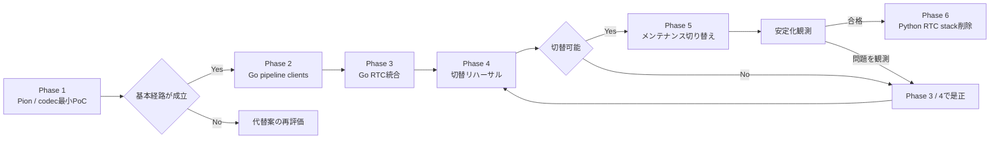

# Pion WebRTC 移行ロードマップ

## Summary

- aiortcからPionへの移行を、最小codec PoCから旧Python RTC stack削除までの時系列で示す。
- 詳細なaiortc baselineは移行の前提にせず、production相当環境でのPion smoke testを切替判定に使う。
- PoCでPion採用可否とcodec方式を判断した後、既存Python下流serviceとの互換を保ったままGo RTC serverへ統合する。
- 運用切り替えはaiortcとPionを同時稼働させず、メンテナンス時間の停止切替とする。
- 詳細な作業とgateは[実装フェーズ](implementation-phases.md)、評価項目は[検証計画](validation-plan.md)を正本とする。

## 位置づけ

本書は移行全体の順序、各phaseで確定する事項、後続phaseへの引き渡しを俯瞰するための文書である。
個別の実装手順、合否閾値、実測値は重複記載せず、対応するtaskの `task.md`、`impl.md`、`eval.md` に残す。

着手日や所要期間は固定しない。技術的不確実性が大きいPhase 1を通過する前に、運用切替日や旧実装削除日を確定しない。

## 全体ロードマップ

| 時系列 | Phase                   | このphaseで確定すること               | 主な出口                                 |
| ------ | ----------------------- | ------------------------------------- | ---------------------------------------- |
| 1      | 1: Pion / codec最小PoC  | Pion採用可否、local media / ICE成立性 | 採用判断とGo統合に使えるcodec方式        |
| 2      | 2: Go pipeline clients  | 既存MessagePack契約と再接続semantics  | Python下流serviceと互換なGo client群     |
| 3      | 3: Go RTC統合           | session全体の責務、Frontendとの統合   | 本番候補となるGo RTC server              |
| 4      | 4: 切替リハーサル       | production相当環境でのPion切替可否    | smoke test済みrunbookと切替判断          |
| 5      | 5: メンテナンス切り替え | stable endpointのPion移行と安定性     | Pion運用とforward-fix                    |
| 6      | 6: 旧RTC stack削除      | aiortc経路の撤去と移行完了            | Pionのみの構成、更新済みの現在設計と契約 |

## Phase 0: 詳細baselineの扱い

### 目的

詳細baseline harnessは移行の前提にしない。先行taskの成果は参考資料として残すが、
Linux network namespace、network impairment、長時間soak、詳細resource / latency比較は、
実運用で問題が観測された場合だけ独立taskで行う。

### 主な成果

- Phase 4では実際のcompose、NAT、firewallでPion接続を確認する。
- Gate 3で成立済みのChromeを1回smoke testし、browser範囲を拡張する比較harnessは作らない。

### 次phaseへの条件

Phase 1は本節の測定完了を待たず着手できる。

## Phase 1: Pion / codec PoC

### 目的

現行Frontendを無変更で使う最小の縦切りをローカルChromeで検証し、Pionを後続実装の出発点にできるか判断する。

### 主な成果

- 現行signaling endpointと互換なhalf-trickle Answer
- local host candidate とChromeで成立する双方向音声とDataChannel
- pure Go Opus decodeとmediadevices同梱static libopus encode
- 48 kHz PCM、独立20 ms outbound clock、1秒test tone
- initial Offer、Trickle ICE、end-of-candidates、candidate収集済みAnswer
- 通常close 10回、codec error、SIGTERM、race testでのregistry / goroutine回収

### 判断

Gate 1を満たす場合は、Pionと選定したcodec方式をADR化してPhase 2へ進む。
満たせない場合は失敗したcodec adapterまたはsignaling境界だけを小さな後続taskで再評価する。
NATと対応browserはPhase 4で確認する。ICE restartはPhase 3の既存試験を再利用し、
impairment、soak、性能比較は移行後に実害が確認された場合だけ扱う。

## Phase 2: Go pipeline clients

### 目的

RTC統合より先に、Goから既存Python下流serviceを利用できることを確立し、障害原因をtransportとpipelineに分離する。

### 主な成果

- extractor、recognizer、processor、synthesizer用の限定DTO
- Python / Go間の双方向MessagePack golden fixture
- Consul lookup、timeout、fallbackを備えたGo WebSocket client
- 4 clientの一括reset、generation更新、旧callback拒否
- synthesized voiceとmora timingの互換decode
- `sincromisor-server/sincro-rtc-pion-poc/internal/pipeline` のsession coordinator、bounded queue、
  confirmed historyとgeneration単位のtransient state

互換fixtureは
`sincromisor-server/sincro-rtc-pion-poc/internal/pipeline/protocol/testdata/`、
Gate 2の環境と結果は
`tasks/sincro-rtc/task-260726211012-pion-phase-2-pipeline-reset-gate-2/artifacts/gate-2-result.md`
を参照する。

### 次phaseへの条件

Python下流serviceを変更せず会話pipelineを実行でき、resetやclose後に古い結果、WebSocket、goroutineが残らなければPhase 3へ進む。
実4-service環境でGate 2がPASSするまでは、この条件を満たしたとは扱わない。

## Phase 3: Go RTC統合

### 目的

Phase 1のRTC / codec経路とPhase 2のpipeline clientを統合し、本番候補となるGo RTC serverを完成させる。

### 主な成果

- session registryとsession単位のclose-once lifecycle
- audio input / output、conversation coordinator、DataChannel dispatcher
- bounded queue、backpressure、deadline、panic recovery、observability
- FrontendとPionの `offer_request_id` / `offer_revision` 対応
- 同一session IDでのICE restartとstale candidate拒否
- aiortc診断期間中のFrontend互換
- PoC専用Python adapterを含まないend-to-end経路

### 次phaseへの条件

[検証計画](validation-plan.md)の既存repository testと、現行Frontendから会話する1回のend-to-end smoke testを通過し、
正常終了と代表的な異常終了で資源が回収される状態になったらPhase 4へ進む。

[Gate 3実行結果](../../../tasks/sincro-rtc/task-260802033044-pion-phase-3-production-candidate-gate-3/artifacts/gate-3-result.md)は
`gate_3_result: PASS`である。既存repository testと現行Frontendの1 turn smokeが通過したため、
Phase 4へ進める。

## Phase 4: 切替リハーサル

### 目的

production相当環境で、Pion版への停止切替とPion経路の成立を検証する。

ここで判定するのは移行可能性であり、Pionの網羅的な品質評価ではない。既存のrepository testを前提に、
実際のimage、compose、network、runbookを使った1回のリハーサルだけをGate 4の追加評価とする。

Gate 4は2026-08-21にPASSした。Pionの1 turn、通常終了後の収束、Frontendと下流serviceをrebuildしない停止切替を確認した。
aiortcの起動確認は診断情報に留め、rollback後の会話成立はGateの対象外とする。Pion process crash自動復帰も移行Gateの対象外である。
詳細と解除条件は[Gate 4結果](../../../tasks/sincro-rtc/task-260809020145-pion-phase-4-cutover-rehearsal/artifacts/gate-4-result.md)を正本とする。

### 次のタスク群

| 順序 | タスク                                                                                                    | 責務                                             |
| ---- | --------------------------------------------------------------------------------------------------------- | ------------------------------------------------ |
| 1a   | [production network](../../../tasks/sincro-rtc/task-260809020144-pion-phase-4-production-network/task.md) | 固定UDP mux、public IPv4、UDP4のprocess境界      |
| 1b   | [container image](../../../tasks/sincro-rtc/task-260809020144-pion-phase-4-container-image/task.md)       | Go binary、Frontend、Opus、FFmpegを含む実行image |
| 2    | [排他的compose](../../../tasks/sincro-rtc/task-260809020144-pion-phase-4-exclusive-compose/task.md)       | aiortc / Pionの明示選択とproduction設定の配線    |
| 3    | [cutover runbook](../../../tasks/sincro-rtc/task-260809020145-pion-phase-4-cutover-runbook/task.md)       | 停止切替、Pion smoke、forward-fixの実行手順      |
| 4    | [cutover rehearsal](../../../tasks/sincro-rtc/task-260809020145-pion-phase-4-cutover-rehearsal/task.md)   | production相当環境での1回の実行とGate 4判定      |

`1a`と`1b`は並行可能である。Gate 4はPASSしたため、Phase 5は
[メンテナンス切替と安定化観測](../../../tasks/sincro-rtc/task-260822233904-pion-phase-5-maintenance-cutover/task.md)で扱う。

### 主な成果

- aiortc版とPion版を排他的に起動するcompose構成
- production相当のNAT、firewall、public IPv4、固定UDP mux portの検証結果
- Gate 3で成立済みのChromeでPion版を1回実行するbrowser smoke test
- Pion版の接続、会話、音声、DataChannelと、停止後の資源回収結果
- 切替とsmoke testの所要時間を含むrunbook

### 次phaseへの条件

production相当環境でPion版の接続と会話が成立し、重大な品質退行がなく、
FrontendやPython下流serviceの再deployなしでPionへ切り替えられる場合だけPhase 5へ進む。

詳細な性能比較、反復接続、長時間soak、network impairment、Gate専用harnessは行わない。
接続不能、明確な音声異常、resource増加が観測された場合だけ、原因を再現する小さな是正taskを追加する。

## Phase 5: メンテナンス切り替え

### 目的

メンテナンス切替により、stable endpointのbackendはPionへ移行済みである。Phase 5では利用再開後の安定性を観測する。

### 時系列

1. `full` / `rtc` profileでPion `sincro-rtc` を通常起動する。
2. signaling、音声、DataChannel、下流pipelineのsmoke testを実行する。
3. 利用を再開し、定義済みの観測期間とPion問題時の対応条件で監視する。
4. 問題がなければPhase 6へ進み、問題があれば証拠を保存してPionをforward-fixする。

### 観測期間中の扱い

aiortcはPion切替後の運用rollback先にせず、Pionと同時稼働させない。構成だけを `aiortc` profileへ残し、動作確認はしない。
Pionの問題時の証拠保存とforward-fix手順は[運用移行とforward-fix](rollout-and-operations.md)を正本とする。
Phase 5の実行とGate 5判定は
[メンテナンス切替と安定化観測task](../../../tasks/sincro-rtc/task-260822233904-pion-phase-5-maintenance-cutover/task.md)で記録する。

## Phase 6: Python RTC stackの削除

### 目的

Pionの安定化を確認した後にaiortc経路を削除し、二重保守を解消して移行を完了する。
実装と完了確認は
[Python RTC stack削除task](../../../tasks/sincro-rtc/task-260823061841-pion-phase-6-python-rtc-removal/task.md)で扱う。

### 主な成果

- aiortc service、dependency、RTC固有test fixtureの削除
- `RTCSessionProcess`、`VoiceTransformTrack`、Python `AudioBroker` の削除
- aiortc image、設定、compose経路の削除
- Go RTC serverを正本とする現在設計、契約、ADRへの更新
- 移行文書の縮退またはarchive

### 完了状態

- production相当composeでRTC backendはPionだけである。
- Go RTC serverがWebRTC transportとpipeline orchestrationを直接所有する。
- Pythonには音声認識、テキスト処理、音声合成などの下流serviceだけが残る。
- MessagePack互換層とgolden fixtureは、別initiativeが置換条件を定義するまで維持される。

## フェーズ横断の管理

### 検証と記録

- 各phaseの実測値、コマンド、環境、失敗内容は対応taskの `eval.md` に記録する。
- gateを満たさない場合は未解決事項を次phaseへ持ち越さず、同じphaseで再評価する。
- Phase 1は基本経路の成立だけを判定し、Phase 3 / 4は実運用経路のsmoke testで切替可否を判断する。

### 文書更新

- 契約変更は[Frontend RTC契約](../../design/contracts/frontend-rtc.md)と[Audio Pipeline WebSocket契約](../../design/contracts/audio-pipeline-websocket.md)へ反映する。
- 採用理由と棄却理由は対応phaseの完了後に `documents/design/decisions/` のADRへ残す。
- 運用切替時はcompose、env sample、service設計、architecture、design indexを同時に更新する。

### 非対象

Pipeline Protocol Buffers移行、OpenAPI生成、TURN、IPv6、複数Pion instance、active session移送はこのロードマップに含めない。
必要性が確認された場合も、Pion移行のphaseへ追加せず独立initiativeとして扱う。
