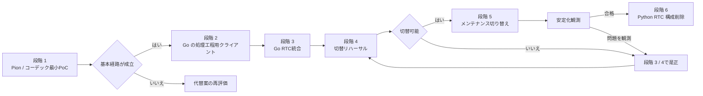

# Pion WebRTC 移行ロードマップ

## 要約

- aiortcからPionへの移行を、最小コーデック PoCから旧Python RTC 構成一式削除までの時系列で示す。
- 詳細なaiortc 基準は移行の前提にせず、本番相当環境でのPion 動作確認を切替判定に使う。
- PoCでPion採用可否とコーデック方式を判断した後、既存Python下流サービスとの互換を保ったままGo RTC サーバーへ統合する。
- 運用切り替えはaiortcとPionを同時稼働させず、メンテナンス時間の停止切替とする。
- 詳細な作業と検査は[実装フェーズ](implementation-phases.md)、評価項目は[検証計画](validation-plan.md)を正本とする。

## 位置づけ

本書は移行全体の順序、各段階で確定する事項、後続段階への引き渡しを俯瞰するための文書である。
個別の実装手順、合否閾値、実測値は重複記載せず、対応するタスクの `task.md`、`impl.md`、`eval.md` に残す。

着手日や所要期間は固定しない。技術的不確実性が大きい段階 1を通過する前に、運用切替日や旧実装削除日を確定しない。

## 全体ロードマップ

| 時系列 | 段階                            | この段階で確定すること                       | 主な出口                                    |
| ------ | ------------------------------- | -------------------------------------------- | ------------------------------------------- |
| 1      | 1: Pion / コーデック最小PoC     | Pion採用可否、ローカルメディア / ICE成立性   | 採用判断とGo統合に使えるコーデック方式      |
| 2      | 2: Goパイプラインのクライアント | 既存MessagePack契約と再接続意味と挙動        | Python下流サービスと互換なGo クライアント群 |
| 3      | 3: Go RTC統合                   | セッション全体の責務、フロントエンドとの統合 | 本番候補となるGo RTC サーバー               |
| 4      | 4: 切替リハーサル               | 本番相当環境でのPion切替可否                 | 動作確認済み手順書と切替判断                |
| 5      | 5: メンテナンス切り替え         | 固定エンドポイントのPion移行と安定性         | Pion運用と現行版の修正で対応                |
| 6      | 6: 旧RTC 構成一式削除           | aiortc経路の撤去と移行完了                   | Pionのみの構成、更新済みの現在設計と契約    |

## 段階 0: 詳細基準の扱い

### 目的

詳細基準検証基盤は移行の前提にしない。先行タスクの成果は参考資料として残すが、
Linux ネットワーク名前空間、ネットワーク障害、長時間長時間連続稼働、詳細リソース / 遅延比較は、
実運用で問題が観測された場合だけ独立タスクで行う。

### 主な成果

- 段階 4では実際のDocker Compose、NAT、ファイアウォールでPion接続を確認する。
- Gate 3で成立済みのChromeを1回動作確認し、ブラウザ範囲を拡張する比較検証基盤は作らない。

### 次段階への条件

段階 1は本節の測定完了を待たず着手できる。

## 段階 1: Pion / コーデック PoC

### 目的

現行フロントエンドを無変更で使う最小の縦切りをローカルChromeで検証し、Pionを後続実装の出発点にできるか判断する。

### 主な成果

- 現行シグナリングエンドポイントと互換なhalf-trickle Answer
- ローカルホスト候補とChromeで成立する双方向音声とDataChannel
- Goだけで実装された Opus 復号とmediadevices同梱静的な libopus 符号化
- 48 kHz PCM、独立20 ms 送信時計、1秒テスト音
- 初回Offer、Trickle ICE、候補収集の完了通知、候補収集済みAnswer
- 通常終了 10回、コーデックエラー、SIGTERM、競合テストでの登録簿 / goroutine回収

### 判断

Gate 1を満たす場合は、Pionと選定したコーデック方式をADR化して段階 2へ進む。
満たせない場合は失敗したコーデックアダプターまたはシグナリング境界だけを小さな後続タスクで再評価する。
NATと対応ブラウザは段階 4で確認する。ICE 再接続は段階 3の既存試験を再利用し、
障害注入、長時間連続稼働、性能比較は移行後に実害が確認された場合だけ扱う。

## 段階 2: Goパイプラインのクライアント

### 目的

RTC統合より先に、Goから既存Python下流サービスを利用できることを確立し、障害原因を転送と処理工程に分離する。

### 主な成果

- 音声区間抽出処理、音声認識処理、処理器、音声合成処理用の限定DTO
- Python / Go間の双方向MessagePack 期待結果を固定した検証データ
- Consul 探索、時間切れ、代替処理を備えたGo WebSocket クライアント
- 4 クライアントの一括再初期化、世代更新、旧コールバック拒否
- 合成済みの音声とモーラ時刻情報の互換復号
- `sincromisor-server/sincro-rtc/internal/pipeline` のセッション調停器、上限付きのキュー、
  確定履歴と世代単位の一時的な状態

互換固定データは
`sincromisor-server/sincro-rtc/internal/pipeline/protocol/testdata/`、
Gate 2の環境と結果は
`tasks/sincro-rtc/task-260726211012-pion-phase-2-pipeline-reset-gate-2/artifacts/gate-2-result.md`
を参照する。

### 次段階への条件

Python下流サービスを変更せず会話処理工程を実行でき、再初期化や終了後に古い結果、WebSocket、goroutineが残らなければ段階 3へ進む。
実4-service環境でGate 2がPASSするまでは、この条件を満たしたとは扱わない。

## 段階 3: Go RTC統合

### 結果

段階 1のRTC / コーデック経路と段階 2の処理工程クライアントを統合し、本番候補となるGo RTC サーバーを完成させる。

### 主な成果

- セッション登録簿とセッション単位の終了処理を一度だけ実行する生存期間
- 音声入力 / 出力、会話調停器、DataChannel 振り分け処理
- 上限付きのキュー、流量制御、期限、panic 回復、観測
- フロントエンドとPionの `offer_request_id` / `offer_revision` 対応
- 同一セッション IDでのICE 再接続と古くなった候補拒否
- aiortc診断期間中のフロントエンド互換
- PoC専用Python アダプターを含まない端から端までの経路

### 次段階への条件

[検証計画](validation-plan.md)の既存リポジトリテストと、現行フロントエンドから会話する1回の端から端までの動作確認を通過し、
正常終了と代表的な異常終了で資源が回収される状態になったら段階 4へ進む。

[Gate 3実行結果](../../../tasks/sincro-rtc/task-260802033044-pion-phase-3-production-candidate-gate-3/artifacts/gate-3-result.md)は
`gate_3_result: PASS`である。既存リポジトリテストと現行フロントエンドの1 往復動作確認が通過したため、
段階 4へ進める。

## 段階 4: 切替リハーサル

### 目的

本番相当環境で、Pion版への停止切替とPion経路の成立を検証する。

ここで判定するのは移行可能性であり、Pionの網羅的な品質評価ではない。既存のリポジトリテストを前提に、
実際の画像、Docker Compose、ネットワーク、手順書を使った1回のリハーサルだけをGate 4の追加評価とする。

Gate 4は2026-08-21にPASSした。Pionの1 往復、通常終了後の収束、フロントエンドと下流サービスを再ビルドしない停止切替を確認した。
aiortcの起動確認は診断情報に留め、切り戻し後の会話成立はGateの対象外とする。Pion プロセス異常終了自動復帰も移行Gateの対象外である。
詳細と解除条件は[Gate 4結果](../../../tasks/sincro-rtc/task-260809020145-pion-phase-4-cutover-rehearsal/artifacts/gate-4-result.md)を正本とする。

### 次のタスク群

| 順序 | タスク                                                                                                     | 責務                                                          |
| ---- | ---------------------------------------------------------------------------------------------------------- | ------------------------------------------------------------- |
| 1a   | [本番ネットワーク](../../../tasks/sincro-rtc/task-260809020144-pion-phase-4-production-network/task.md)    | 固定UDP mux、公開IPv4、UDP4のプロセス境界                     |
| 1b   | [コンテナイメージ](../../../tasks/sincro-rtc/task-260809020144-pion-phase-4-container-image/task.md)       | Go バイナリ、フロントエンド、Opus、FFmpegを含む実行用イメージ |
| 2    | [排他的Docker Compose](../../../tasks/sincro-rtc/task-260809020144-pion-phase-4-exclusive-compose/task.md) | aiortc / Pionの明示選択と本番設定の配線                       |
| 3    | [切替手順書](../../../tasks/sincro-rtc/task-260809020145-pion-phase-4-cutover-runbook/task.md)             | 停止切替、Pion 動作確認、現行版の修正で対応の実行手順         |
| 4    | [切替リハーサル](../../../tasks/sincro-rtc/task-260809020145-pion-phase-4-cutover-rehearsal/task.md)       | 本番相当環境での1回の実行とGate 4判定                         |

`1a`と`1b`は並行可能である。Gate 4はPASSしたため、段階 5は
[メンテナンス切替と安定化観測](../../../tasks/sincro-rtc/task-260822233904-pion-phase-5-maintenance-cutover/task.md)で扱う。

### 主な成果

- aiortc版とPion版を排他的に起動するDocker Compose構成
- 本番相当のNAT、ファイアウォール、公開IPv4、固定UDP mux ポートの検証結果
- Gate 3で成立済みのChromeでPion版を1回実行するブラウザ動作確認
- Pion版の接続、会話、音声、DataChannelと、停止後の資源回収結果
- 切替と動作確認の所要時間を含む手順書

### 次段階への条件

本番相当環境でPion版の接続と会話が成立し、重大な品質退行がなく、
フロントエンドやPython下流サービスの再配備なしでPionへ切り替えられる場合だけ段階 5へ進む。

詳細な性能比較、反復接続、長時間長時間連続稼働、ネットワーク障害、Gate専用検証基盤は行わない。
接続不能、明確な音声異常、リソース増加が観測された場合だけ、原因を再現する小さな是正タスクを追加する。

## 段階 5: メンテナンス切り替え

### 目的

メンテナンス切替により、固定エンドポイントのバックエンドはPionへ移行済みである。段階 5では利用再開後の安定性を観測する。

### 時系列

1. `full` / `rtc` プロファイルでPion `sincro-rtc` を通常起動する。
2. シグナリング、音声、DataChannel、下流処理工程の動作確認を実行する。
3. 利用を再開し、定義済みの観測期間とPion問題時の対応条件で監視する。
4. 問題がなければ段階 6へ進み、問題があれば証拠を保存してPionを現行版の修正で対応する。

### 観測期間中の扱い

aiortcはPion切替後の運用切り戻し先にせず、Pionと同時稼働させない。構成だけを `aiortc` プロファイルへ残し、動作確認はしない。
Pionの問題時の証拠保存と現行版を修正する手順は[運用移行と現行版の修正で対応](rollout-and-operations.md)を正本とする。
段階 5の実行とGate 5判定は
[メンテナンス切替と安定化観測タスク](../../../tasks/sincro-rtc/task-260822233904-pion-phase-5-maintenance-cutover/task.md)で記録する。

## 段階 6: Python RTC 構成一式の削除

### 目的

Pionの安定化確認後、aiortc経路を削除して二重保守を解消し、移行を完了した。
実装と完了確認は
[Python RTC 構成一式削除タスク](../../../tasks/sincro-rtc/task-260823061841-pion-phase-6-python-rtc-removal/task.md)に記録する。

### 主な成果

- aiortc サービス、依存関係、RTC固有テストの削除
- `RTCSessionProcess`、`VoiceTransformTrack`、Python `AudioBroker` の削除
- aiortc 画像、設定、Docker Compose経路の削除
- Go RTC サーバーを正本とする現在設計、契約、ADRへの更新
- 移行文書を完了記録として維持

### 完了状態

- 本番相当Docker ComposeでRTC バックエンドはPionだけである。
- Go RTC サーバーがWebRTC 転送と処理工程処理の組み立てを直接所有する。
- Pythonには音声認識、テキスト処理、音声合成などの下流サービスだけが残る。
- MessagePack互換層と期待結果を固定した検証データは、別取り組み計画が置換条件を定義するまで維持される。

## フェーズ横断の管理

### 検証と記録

- 各段階の実測値、コマンド、環境、失敗内容は対応タスクの `eval.md` に記録する。
- 検査を満たさない場合は未解決事項を次段階へ持ち越さず、同じ段階で再評価する。
- 段階 1は基本経路の成立だけを判定し、段階 3 / 4は実運用経路の動作確認で切替可否を判断する。

### 文書更新

- 契約変更は[フロントエンドのRTC契約](../../design/contracts/frontend-rtc.md)と[音声パイプラインのWebSocket契約](../../design/contracts/audio-pipeline-websocket.md)へ反映する。
- 採用理由と棄却理由は対応段階の完了後に `documents/design/decisions/` のADRへ残す。
- 運用切替時はDocker Compose、環境変数の設定例、サービス設計、アーキテクチャ、設計索引を同時に更新する。

### 非対象

パイプラインのProtocol Buffers移行、OpenAPI生成、TURN、IPv6、複数Pion インスタンス、有効セッション移送はこのロードマップに含めない。
必要性が確認された場合も、Pion移行の段階へ追加せず独立取り組み計画として扱う。
