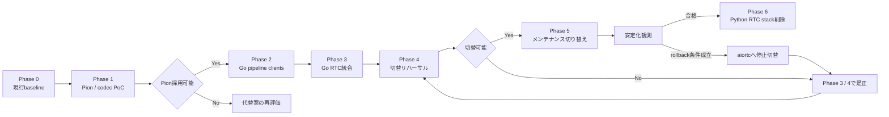

# Pion WebRTC 移行ロードマップ

## Summary

- aiortcからPionへの移行を、baseline取得から旧Python RTC stack削除までの時系列で示す。
- 各phaseは直前phaseのexit gateを満たした場合だけ開始し、日付ではなく検証結果を基準に進行する。
- PoCでPion採用可否とcodec方式を判断した後、既存Python下流serviceとの互換を保ったままGo RTC serverへ統合する。
- 運用切り替えはaiortcとPionを同時稼働させず、メンテナンス時間の停止切替とする。
- 詳細な作業とgateは[実装フェーズ](implementation-phases.md)、評価項目は[検証計画](validation-plan.md)を正本とする。

## 位置づけ

本書は移行全体の順序、各phaseで確定する事項、後続phaseへの引き渡しを俯瞰するための文書である。
個別の実装手順、合否閾値、実測値は重複記載せず、対応するtaskの `task.md`、`impl.md`、`eval.md` に残す。

着手日や所要期間は固定しない。技術的不確実性が大きいPhase 1を通過する前に、運用切替日や旧実装削除日を確定しない。

## 全体ロードマップ

| 時系列 | Phase                   | このphaseで確定すること                  | 主な出口                                 |
| ------ | ----------------------- | ---------------------------------------- | ---------------------------------------- |
| 1      | 0: 現行baseline         | 比較方法と現行性能・資源使用量           | 再現可能なbaselineと合否判定の根拠       |
| 2      | 1: Pion / codec PoC     | Pion採用可否、codec、media / ICE成立性   | 採用判断とGo統合に使える技術方式         |
| 3      | 2: Go pipeline clients  | 既存MessagePack契約と再接続semantics     | Python下流serviceと互換なGo client群     |
| 4      | 3: Go RTC統合           | session全体の責務、Frontendとの統合      | 本番候補となるGo RTC server              |
| 5      | 4: 切替リハーサル       | production相当環境での切替・rollback可否 | 検証済みrunbookと切替判断                |
| 6      | 5: メンテナンス切り替え | stable endpointのPion移行と安定性        | Pion運用、またはaiortcへのrollback       |
| 7      | 6: 旧RTC stack削除      | rollback期間終了と移行完了               | Pionのみの構成、更新済みの現在設計と契約 |

## Phase 0: 現行baseline

### 目的

Pion版を同じ条件で比較できるよう、aiortc版の機能、性能、資源使用量、既知不具合を記録する。

### 主な成果

- Chrome / Firefox、host candidate / STUNを含む再現可能なtest scenario
- 接続・切断loop、長時間通話、再接続、異常終了の測定結果
- CPU、RSS、thread、process、file descriptor、socket、queue、latencyの基準値
- 現行不具合と、Pion移行で解決すべき問題の区別

### 次phaseへの条件

同じscenarioをPion版へ適用でき、性能退行とresource leakを比較できる状態になったらPhase 1へ進む。

## Phase 1: Pion / codec PoC

### 目的

移行の主要リスクを実装規模が小さい段階で検証し、Pionを本採用できるか判断する。

### 主な成果

- 現行signaling endpointと互換なhalf-trickle Answer
- 固定UDP mux port、public IPv4 rewrite、UDP4 / Full ICEによる直接接続
- Chrome / Firefoxで成立する双方向音声とDataChannel
- Opus decode / encode、resample、独立outbound clock、RTP / RTCP処理
- 冪等なinitial Offerと同一session IDでのICE restart
- codec候補の比較結果と配布・運用方式
- session close後のgoroutine、socket、queue、codec stateの回収結果

### 判断

Gate 1を満たす場合は、Pionと選定したcodec方式をADR化してPhase 2へ進む。
満たせない場合は、本番実装へ進まずGStreamer `webrtcbin` またはaiortc継続を再評価する。

## Phase 2: Go pipeline clients

### 目的

RTC統合より先に、Goから既存Python下流serviceを利用できることを確立し、障害原因をtransportとpipelineに分離する。

### 主な成果

- extractor、recognizer、processor、synthesizer用の限定DTO
- Python / Go間の双方向MessagePack golden fixture
- Consul lookup、timeout、fallbackを備えたGo WebSocket client
- 4 clientの一括reset、generation更新、旧callback拒否
- synthesized voiceとmora timingの互換decode

### 次phaseへの条件

Python下流serviceを変更せず会話pipelineを実行でき、resetやclose後に古い結果、WebSocket、goroutineが残らなければPhase 3へ進む。

## Phase 3: Go RTC統合

### 目的

Phase 1のRTC / codec経路とPhase 2のpipeline clientを統合し、本番候補となるGo RTC serverを完成させる。

### 主な成果

- session registryとsession単位のclose-once lifecycle
- audio input / output、conversation coordinator、DataChannel dispatcher
- bounded queue、backpressure、deadline、panic recovery、observability
- FrontendとPionの `offer_request_id` / `offer_revision` 対応
- 同一session IDでのICE restartとstale candidate拒否
- aiortc rollback期間中のFrontend互換
- PoC専用Python adapterを含まないend-to-end経路

### 次phaseへの条件

[検証計画](validation-plan.md)の必須functional testとfailure injectionを通過し、異常終了を含めて資源が回収される状態になったらPhase 4へ進む。

## Phase 4: 切替リハーサル

### 目的

production相当環境で、Pion版の品質だけでなく停止切替とaiortc復旧を一連の運用として検証する。

### 主な成果

- aiortc版とPion版を排他的に起動するcompose構成
- production相当のNAT、firewall、public IPv4、固定UDP mux portの検証結果
- 両backendへ逐次適用したbrowser / network test matrix
- soak test、障害注入、接続成功率、latency、音質、resource比較
- 切替、smoke test、rollbackの所要時間を含むrunbook

### 次phaseへの条件

Pion版がbaselineと同等以上の接続成功率を持ち、重大な品質退行がなく、FrontendやPython下流serviceの再deployなしでrollbackできる場合だけPhase 5へ進む。

## Phase 5: メンテナンス切り替え

### 目的

メンテナンス時間にstable endpointのbackendをaiortcからPionへ切り替え、実運用で安定性を確認する。

### 時系列

1. 利用停止を告知し、新規sessionを停止する。
2. close timeout後にactive aiortc sessionを終了し、aiortc serviceを停止する。
3. Pion serviceを同じstable endpointで起動する。
4. signaling、音声、DataChannel、下流pipelineのsmoke testを実行する。
5. 利用を再開し、定義済みの観測期間とrollback条件で監視する。
6. 問題がなければPhase 6へ進み、問題があればPionを停止してaiortcへ戻す。

### 観測期間中の扱い

aiortcのimageと設定はrollback専用として保持するが、Pionと同時稼働させない。
rollback条件と具体的な手順は[運用移行とロールバック](rollout-and-operations.md)を正本とする。

## Phase 6: Python RTC stackの削除

### 目的

Pionの安定化を確認した後にrollback期間を終了し、二重保守を解消して移行を完了する。

### 主な成果

- aiortc service、dependency、RTC固有test fixtureの削除
- `RTCSessionProcess`、`VoiceTransformTrack`、Python `AudioBroker` の削除
- rollback専用image、設定、compose経路の削除
- Go RTC serverを正本とする現在設計、契約、ADRへの更新
- 移行文書の縮退またはarchive

### 完了状態

- production相当composeでRTC backendはPionだけである。
- Go RTC serverがWebRTC transportとpipeline orchestrationを直接所有する。
- Pythonには音声認識、テキスト処理、音声合成などの下流serviceだけが残る。
- MessagePack互換層とgolden fixtureは、別initiativeが置換条件を定義するまで維持される。

## フェーズ横断の管理

### 検証と記録

- 各phaseの実測値、コマンド、環境、失敗内容は対応taskの `eval.md` に記録する。
- gateを満たさない場合は未解決事項を次phaseへ持ち越さず、同じphaseで再評価する。
- 合否閾値はPhase 0とPhase 1の実測を基にtaskで確定する。

### 文書更新

- 契約変更は[Frontend RTC契約](../../design/contracts/frontend-rtc.md)と[Audio Pipeline WebSocket契約](../../design/contracts/audio-pipeline-websocket.md)へ反映する。
- 採用理由と棄却理由は対応phaseの完了後に `documents/design/decisions/` のADRへ残す。
- 運用切替時はcompose、env sample、service設計、architecture、design indexを同時に更新する。

### 非対象

Pipeline Protocol Buffers移行、OpenAPI生成、TURN、IPv6、複数Pion instance、active session移送はこのロードマップに含めない。
必要性が確認された場合も、Pion移行のphaseへ追加せず独立initiativeとして扱う。
