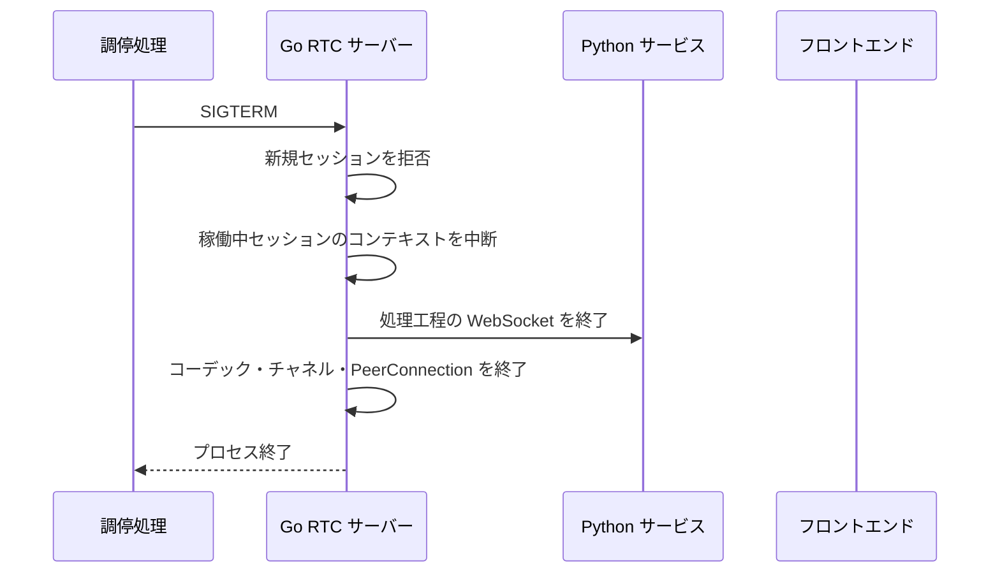

# 運用移行と現行版の修正で対応

## 要約

- Pion版だけを起動し、Python RTC アダプターを運用コンポーネントとして置かない。
- 運用切替はメンテナンス時間にサービスを停止して行い、有効セッションの継続を保証しない。Pion切替後の障害は現行版の修正で対応する。
- Pionは1 インスタンス、固定UDP mux ポート、明示的な公開IPv4、UDP4 / Full ICEから開始する。TURNは設定時点で拒否する。

## 排他的なバックエンド配置


運用環境では固定エンドポイントとポート対応の接続先をPionだけ起動する。割合振り分けやバックエンド間セッション登録簿は実装しない。

Pion版の経路には追加アダプターを挟まない。

### 判断のメリット・デメリット

| 判断                             | メリット                                                                         | デメリット                                             |
| -------------------------------- | -------------------------------------------------------------------------------- | ------------------------------------------------------ |
| 運用環境は1 バックエンドだけ起動 | 接続先固定振り分け処理、共有登録簿、バックエンド固有セッション ID 振り分けが不要 | 切替とPion修正配備で停止時間が発生する                 |
| 有効セッションを移送しない       | セッション状態移送と二重処理を排除できる                                         | 切替時の通話は切断され、利用者が再接続する必要がある   |
| 評価は逐次実行                   | Docker Composeと自動テストを共用できる                                           | 同時一部の通信による試験運用による実通信比較はできない |

## WebRTC メディアネットワーク

初期運用のメディアネットワークは次へ固定する。

- Pionは1 インスタンスだけ起動する。
- セッション別UDP ポート範囲ではなく、全PeerConnectionで1つの固定UDP mux ポートを共有する。
- Dockerはホスト側とコンテナ側で同じUDP ポートを1:1 対応付けする。割り当てるポート番号はDocker Compose / 環境変数 / ファイアウォールで1つの値を正本化する。
- シグナリングは現行どおりTCP エンドポイントを公開し、メディア用UDP ポートを別に公開する。
- SDPへ載せる公開IPv4を `--public-ipv4` で明示し、Pionの`SetNAT1To1IPs`によるホスト候補置換でコンテナ / 非公開 IPを通知しない。NAT配下では公開IPv4と`--media-udp-port`のUDP ポートをPion ホストへ静的前方する。
- ネットワーク型はUDP4へ限定し、インターフェースフィルターはコンテナ内の実通信インターフェースを許可リストし、ループバックや意図しないホスト仮想インターフェースを除外する。STUNは公開IP 書き換えと併用し、実際のserver-reflexive経路を診断できるようにする。
- ICE エージェントはFull ICEとする。ICE LiteとIPv6は初期移行の対象外とする。
- TURN 中継はaiortc版と同様に初期移行の対応対象外とする。`turn:` / `turns:` URLは黙って無視せず、設定エラーとして起動を失敗させる。
- 直接接続ではPion ホストのメディア UDP ポートへの受信と返答通信を許可する。
- 単一ポートの ICE-TCPはPoCで接続改善が実測できた場合だけ追加する。採用しない場合は初期運用へTCP メディアポートを公開しない。
- 複数Pion インスタンスは初期運用で禁止する。将来追加する場合はインスタンスごとに異なるUDP mux ポートと通知される対応付けを割り当て、L4で同一ポートを負荷分散しない。

### 判断のメリット・デメリット

| 判断               | メリット                                                                            | デメリット                                                           |
| ------------------ | ----------------------------------------------------------------------------------- | -------------------------------------------------------------------- |
| 固定UDP mux ポート | ファイアウォールとDocker 対応付けが1 ポートで済み、セッション増加でポートを開けない | 1 インスタンス内でポートを共有し、インスタンス追加時は別ポートが必要 |
| 明示公開IPv4       | コンテナ / NAT配下でも到達可能な候補を一意に生成できる                              | 公開IP変更時に設定更新が必要                                         |
| Full ICE           | ブラウザとSTUNを含む通常のICE 接続交渉を維持できる                                  | ICE Liteより状態と通信量が増える                                     |
| IPv4のみ           | 検証行列と運用設定を小さくできる                                                    | IPv6-only環境をサポートしない                                        |
| TURN非対応         | TURN サービス、認証情報、中継試験を移行対象範囲から外せる                           | 制限の厳しい NAT / ファイアウォール環境では接続できない場合がある    |

## 設定

通常サービス `sincro-rtc` のネットワーク設定は次の起動引数を正本とする。

- `--media-udp-port`: 指定インターフェースの唯一の非-unspecified IPv4へ待受する固定 UDP4 mux ポート（1〜65535）
- `--public-ipv4`: SDP ホスト候補へ広告する非未指定 IPv4
- `--interface`: UPかつ候補収集を許可するネットワークインターフェース
- `--consul-agent-host` / `--consul-agent-port`: 処理工程発見と Pion サービス登録に使う Consul HTTP エンドポイント（両方指定または両方未指定）
- `--service-bind-host`: Consul 登録確認から到達可能なIPv4へ単一解決できるホスト。Pion の公開IPv4とは別に扱う
- `--fallback-host` / `--fallback-port`: Consul未指定または探索失敗時に4下流サービス共通で使う既存 Caddy エンドポイント（両方指定または両方未指定）

Pionは待受処理待受後、readyを公開する前に `RTCSignalingServer` としてConsulへ登録する。サービス IDは
`RTCSignalingServer_<service-bind-host>_<resolved-ip>:<http-port>`、アドレスは解決済み登録 IPv4、
確認は `/health/ready` の10秒間隔・5秒時間切れ・重大後10分登録解除である。SIGTERMでは`draining`開始直後に
2秒上限で登録解除を並行開始する。

次は後続の設定対象である。

- Pion `v4.2.17` の依存関係固定
- STUN URL
- セッション上限
- 下流サービスのConsul名と代替処理
- 入力 / 出力 / DataChannel / 候補キュー上限
- HTTP 本文 / SDP / 候補バイト上限と改訂番号当たり候補件数
- 候補収集、接続前、ICE / DTLS、メディア準備状態、HTTP、処理工程クライアント、終了時間切れ
- 再接続再試行間隔
- コーデック実装とコーデック固有設定

Docker Compose配線時はこの3引数を環境変数へ対応付け、`examples/compose.env`、`compose/`、`compose.yml`、設定実装、[Compose設計](../../design/infrastructure/compose.md)を同時に更新する。

通常サービスの `sincro-rtc` は共有 `sincromisor-net` 上でコンテナ IPv4をDockerへ動的割当させる。後続サービスの起動時は
`--media-udp-port ${SINCRO_PION_MEDIA_UDP_PORT}`、`--interface ${SINCRO_PION_INTERFACE}`、
`--service-bind-host ${SINCRO_PION_SERVICE_BIND_HOST}` を配線する。ローカル Docker Composeではサービスの待受ホストは
サービス名へ解決され、別ホスト ConsulではPion ホストのVPN アドレスを登録する。コンテナ IPv4とConsul サービスアドレスは、
SDPへ広告する公開IPv4とは別値である。

Docker ComposeではPion版 `sincro-rtc` を`full` / `rtc` プロファイルで通常起動する。Pionは固定TCP 8001と`SINCRO_PION_MEDIA_UDP_PORT`をホスト・コンテナ同値のUDP ポートとして公開する。
`SINCRO_PION_PUBLIC_IPV4`、`SINCRO_PION_STUN`、`SINCRO_RTC_MAX_SESSIONS`、`SINCRO_PION_FFMPEG_PATH`はPion コマンドへ渡す。
Pionは直接使う`sincro-consul-server`が正常になってから起動する。

設定の形式と組み合わせはネットワークソケットやHTTP 待受処理を公開する前に検証する。公開IPv4の解析失敗、UDP mux 待受失敗、ポート不一致、空のインターフェース選択、TURN URL、上限や時間切れの0 / 負値は準備状態 falseのまま待機せずプロセスを即座に失敗終了させる。外部NAT / ファイアウォールの到達性は起動だけでは保証できないため、本番相当リハーサルの動作確認で検証する。

## 健全性と指標

- `/health/live`はHTTP イベントループが要求を処理できる間200を返す。
- `/health/ready`は起動時の依存関係検証完了後かつ非`draining`の間だけ200を返す。
  下流Python サービスの一時障害はセッション処理工程がリセット・再接続するためプロセス準備状態へ混ぜない。
- 後続のPion Docker Compose サービスは実行時画像が提供する`curl`で、次を死活確認コマンドとして使う。
  `/health/ready`がHTTP 200のときだけ`--fail`が成功する。

    ```sh
    CMD curl --fail --silent --show-error http://127.0.0.1:8001/health/ready
    ```

- `/metrics`はプロセス専用Prometheus 登録簿を公開し、既定全体共通の登録簿を使わない。
- 指標接頭辞は`sincro_rtc_`とし、セッション数、シグナリング、ICE/deadline、audio/RTP/RTCP、
  送信間隔の調整・コーデック、処理工程再接続、queue/DataChannel、終了継続時間を集計する。
  継続時間、遅れ、RTTは秒、キュー内の要素数は要素数である。
- 表示名はエンドポイント、状態クラス、有限列挙値の理由・段階・結果だけを使う。セッション ID、SDP、
  候補、チャット、音声送受信データは指標表示名または通常ログへ記録しない（下記処理工程段階ログの
  セッション ID相関は例外）。

Pion 処理工程の正常系は、対象`session_id`で`recognizer_result_received`、`processor_request_sent`、
`processor_result_received`、`synthesizer_result_received`を順に確認する。各Info ログは段階、セッション ID、
発話 IDまたは系列 ID、確定だけを相関情報として持つ（Processor 結果のみend_of_responseと
voice_text_presentを追加する）。認識・チャット・VoiceText・音声・未加工の送受信データはログまたはGit 成果物へ転載しない。

Gate 3で固定する20 指標系統は次のとおり。カウンターは該当イベントで1増加し、有効セッションは
受け入れから最終終了まで、キュー内の要素数は受理済みキューへの追加から取り出し・破棄・終了までの
所有権を表す。現在値は所有権解放後に0へ戻す。

| 指標                                        | 種類・単位            | ラベル・区間                                                                                                                                                                                                                                                                                                                                           | 増加条件・所有権                                     |
| ------------------------------------------- | --------------------- | ------------------------------------------------------------------------------------------------------------------------------------------------------------------------------------------------------------------------------------------------------------------------------------------------------------------------------------------------------ | ---------------------------------------------------- |
| `sincro_rtc_sessions_created_total`         | カウンター            | なし                                                                                                                                                                                                                                                                                                                                                   | セッション受け入れで+1                               |
| `sincro_rtc_sessions_active`                | 現在値 / セッション数 | なし                                                                                                                                                                                                                                                                                                                                                   | 受け入れで+1、最終終了で-1                           |
| `sincro_rtc_sessions_closed_total`          | カウンター            | `outcome=closed\|failed`; `reason=normal\|process_shutdown\|offer_failed\|pre_connect_timeout\|media_readiness_timeout\|duplicate_media\|pipeline_start_error\|codec_error\|media_read_error\|media_write_error\|invalid_data_channel\|data_channel_error\|output_backpressure\|ice_failed\|ice_disconnected_timeout\|restart_timeout\|panic\|unknown` | 最終終了で+1                                         |
| `sincro_rtc_signaling_requests_total`       | カウンター            | `endpoint=config\|offer\|candidate\|statuses`; `status_class=2xx\|4xx\|5xx`                                                                                                                                                                                                                                                                            | シグナリング応答確定時に+1                           |
| `sincro_rtc_signaling_duration_seconds`     | ヒストグラム / 秒     | `endpoint`; 区間 `.005,.01,.025,.05,.1,.25,.5,1,2.5,5`                                                                                                                                                                                                                                                                                                 | シグナリング応答確定時に観測                         |
| `sincro_rtc_ice_transitions_total`          | カウンター            | `from`,`to`はPion ICE 列挙値                                                                                                                                                                                                                                                                                                                           | ICE コールバックの状態変化で+1                       |
| `sincro_rtc_deadlines_total`                | カウンター            | `stage=gather\|pre_connect\|media_readiness\|disconnect_grace\|restart\|close`                                                                                                                                                                                                                                                                         | 各期限の超過で+1                                     |
| `sincro_rtc_audio_frames_total`             | カウンター            | `direction=in\|out`; `outcome=accepted\|sent\|dropped`                                                                                                                                                                                                                                                                                                 | 入力受理、出力送信、破棄確定時に+1                   |
| `sincro_rtc_rtp_drops_total`                | カウンター            | `reason=duplicate\|late\|missing\|reorder_flush`                                                                                                                                                                                                                                                                                                       | RTP 順序保証判断で+1                                 |
| `sincro_rtc_rtcp_feedback_total`            | カウンター            | `type=sr\|rr\|nack\|other`                                                                                                                                                                                                                                                                                                                             | RTCP パケット分類時に+1                              |
| `sincro_rtc_rtcp_loss_ratio`                | ヒストグラム / 比率   | 区間 `0,.001,.01,.05,.1,.25,.5,1`                                                                                                                                                                                                                                                                                                                      | 受信側報告ブロックごとに観測                         |
| `sincro_rtc_rtcp_rtt_seconds`               | ヒストグラム / 秒     | 区間 `.001,.005,.01,.025,.05,.1,.25,.5,1,2.5,5`                                                                                                                                                                                                                                                                                                        | 時刻情報を持つ受信側報告ブロックごとに観測           |
| `sincro_rtc_pacing_lag_seconds`             | ヒストグラム / 秒     | 区間 `.001,.005,.01,.02,.05,.1,.25,.5,1`                                                                                                                                                                                                                                                                                                               | 正の送信間隔制御遅延ごとに観測                       |
| `sincro_rtc_pacing_aborts_total`            | カウンター            | `reason=lag\|generation\|codec`                                                                                                                                                                                                                                                                                                                        | 待機中出力破棄確定時に+1                             |
| `sincro_rtc_codec_errors_total`             | カウンター            | `direction=decode_in\|decode_synth\|encode_out`                                                                                                                                                                                                                                                                                                        | コーデック境界失敗で+1                               |
| `sincro_rtc_pipeline_reconnects_total`      | カウンター            | `service=extractor\|recognizer\|processor\|synthesizer`; `result=start\|success\|failure`                                                                                                                                                                                                                                                              | 再接続生存期間イベントで+1                           |
| `sincro_rtc_queue_depth`                    | 現在値 / 要素数       | `queue=input\|speech\|text\|telop`                                                                                                                                                                                                                                                                                                                     | 受理済みキューへの追加で+1、取り出し・破棄・終了で-1 |
| `sincro_rtc_queue_overflows_total`          | カウンター            | `queue`; `action=drop_oldest\|reject_close`                                                                                                                                                                                                                                                                                                            | 容量方針適用時に+1                                   |
| `sincro_rtc_datachannel_send_errors_total`  | カウンター            | `channel=text\|telop`                                                                                                                                                                                                                                                                                                                                  | DataChannel 送信失敗で+1                             |
| `sincro_rtc_session_close_duration_seconds` | ヒストグラム / 秒     | `outcome=success\|timeout`; 区間 `.005,.01,.025,.05,.1,.25,.5,1,2.5,5`                                                                                                                                                                                                                                                                                 | リソース終了待機完了または終了期限で観測             |

## サービス発見

- Go RTC サーバーはフロントエンド向けのエンドポイントとしてConsulへ登録する。
- Goパイプラインのクライアントが下流4サービスをConsulから解決する。
- Goパイプライン調停器が下流サービスの代替処理の意味と挙動を維持する。
- Pion経路のためだけのアダプターサービス名を追加しない。

## 接続数の予算

初期統合では現行と同様、有効セッションごとに下流サービスへのWebSocketを所有する。接続未成立セッションでは作成せず、ICE / DTLSとメディア準備状態完了後に遅延作成する。次を指標化する。

- セッション当たりWebSocket数
- 再接続中接続数
- サービスごとの接続時間
- 待機接続メモリ
- 終了完了時間

同時セッション数で接続数が問題になった場合に限り、多重化または接続プールを別設計として検討する。最初から複数セッションを1接続へ混在させない。

## 終了処理



切替時は利用停止を告知してからシグナルを送り、`ready=false`と`draining=true`を先に公開する。
シグナル受信後もHTTP 待受処理を1秒間維持し、この受付拒否観測窓では新規初回Offerを503で拒否する。
同時にプロセスコンテキストを中断し、Offer 所有者と有効セッションの処理工程クライアント、コーデック、DataChannel、
PeerConnectionを終了処理を一度だけ実行する検査経由で共通5秒の期限内に並行して収束させる。観測窓と後始末の
両方が終わってからHTTP 待受処理を独立した1秒の期限で停止するため、シグナル受信からプロセス終了までの
上限は6秒である。期限超過時または各終了処理のエラーは結合して返し、終了待機が完了していないリソースを正常終了として扱わない。

## 運用展開段階

段階 5の通常構成とPion問題時の対応は、[メンテナンス切替手順書](phase-4-cutover-runbook.md)を正本とする。
実測結果は同手順書からリンクするGate 5 成果物へ記録する。

### 開発環境

- `full` / `rtc` プロファイルでPionを利用する。
- 接続、音質、処理工程互換、リソースプロファイルを収集する。

### 結合評価

- Pionだけを起動し、Gate 3で成立済みのChromeで1 往復の動作確認を実行する。

### 本番相当リハーサル

- 運用と同じNAT、ファイアウォール、公開IP設定でPionだけを起動する。
- 停止、Pion起動、動作確認を一連の手順として測る。
- 接続、会話、音声、DataChannel、セッション終了後のリソース収束を確認する。

### 運用切り替え

- `full` / `rtc` プロファイルでPionを同じ固定エンドポイントの通常サービスとして起動する。
- Python RTC 構成一式は削除済みであり、運用切り戻しには含めない。
- Pipeline契約のIDL化は自動的に開始せず、必要なら別取り組み計画で判断する。

## Pion問題時の対応

動作確認または運用中に次を観測した場合は、証拠を保存してPionを現行版の修正で対応する。

- シグナリングまたはICE接続成功率の重大な低下
- 音声欠落、速度異常、無音などの重大メディア失敗
- セッション終了後も増え続けるgoroutine、ソケット、コーデック状態
- 処理工程クライアントの再接続ループ
- MessagePack互換エラー
- キュー容量超過の継続
- 運用対象ブラウザで会話不能

## 現行版を修正する手順

1. 必要ならPion版への新規Offerを停止し、有効セッションを終了時間切れ後に終了する。
2. RTC サーバー、処理工程クライアント、コーデック、ネットワーク指標とログを保存する。
3. Pionの原因と再開条件を対応タスクへ記録し、Pionを修正・再配備する。
4. Pionの動作確認で接続、音声、DataChannelを確認する。

現行版の修正にあたりフロントエンドビルドや下流Python サービスの配備を必要としない構成を維持する。ただし、切替中の接続とセッション状態は失われる。

## 運用文書への反映

全面切り替え時に次を更新する。

- [全体構成](../../design/architecture/overview.md)
- [実行時の処理の流れ](../../design/architecture/runtime-flow.md)
- [フロントエンドのRTC契約](../../design/contracts/frontend-rtc.md)
- [音声パイプラインのWebSocket契約](../../design/contracts/audio-pipeline-websocket.md)
- [sincro-rtcサービス設計](../../design/backend/services/sincro-rtc.md)
- [Compose設計](../../design/infrastructure/compose.md)
- [Consul設計](../../design/infrastructure/consul.md)
- [設計文書索引](../../design/index.md)

Goパイプライン調停器の現在仕様をサービス設計とWebSocket契約の通常導線とする。
