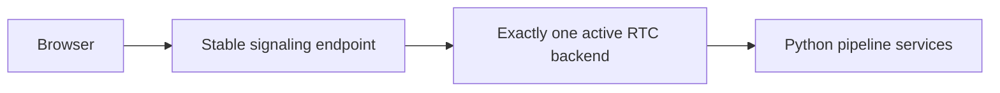
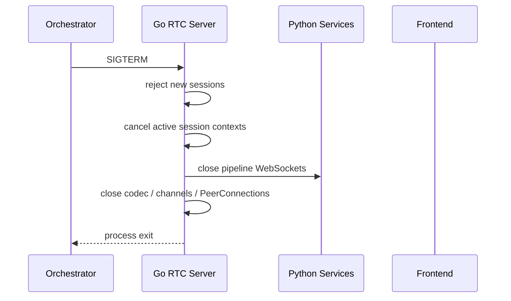

# 運用移行とforward-fix

## Summary

- aiortc版とPion版は開発・評価環境で個別に起動し、運用環境では同時稼働させない。
- Pion版は下流Python serviceへ直接接続し、Python RTC adapterを運用componentとして追加しない。
- 運用切替はメンテナンス時間にserviceを停止して行い、active sessionの継続を保証しない。Pion切替後の障害はforward-fixする。
- Pionは1 instance、固定UDP mux port、明示的なpublic IPv4、UDP4 / Full ICEから開始する。TURNは設定時点で拒否する。

## 排他的なbackend配置



運用環境ではstable endpointとport mappingの接続先を1つだけ起動する。aiortcとPionを同時に公開するrouter、割合routing、backend間session registryは実装しない。評価時はcompose profile、別project名、または別hostで一方ずつ起動し、同じtest suiteを逐次実行する。

Pion版の経路には追加adapterを挟まない。aiortcのimageと設定は移行中の診断用に保存しても、Pion稼働中はserviceを停止する。

### 判断のメリット・デメリット

| 判断                        | メリット                                                             | デメリット                                           |
| --------------------------- | -------------------------------------------------------------------- | ---------------------------------------------------- |
| 運用環境は1 backendだけ起動 | stickiness router、共有registry、backend固有session ID routingが不要 | 切替とPion修正deployで停止時間が発生する             |
| active sessionを移送しない  | session state移送と二重処理を排除できる                              | 切替時の通話は切断され、利用者が再接続する必要がある |
| 評価は逐次実行              | composeと自動testを共用できる                                        | 同時canaryによる実traffic比較はできない              |

## WebRTC media network

初期運用のmedia networkは次へ固定する。

- Pionは1 instanceだけ起動する。
- session別UDP port rangeではなく、全PeerConnectionで1つの固定UDP mux portを共有する。
- Dockerはhost側とcontainer側で同じUDP portを1:1 mappingする。割り当てるport番号はcompose / env / firewallで1つの値を正本化する。
- signalingは現行どおりTCP endpointを公開し、media用UDP portを別に公開する。
- SDPへ載せるpublic IPv4を `--public-ipv4` で明示し、Pionの`SetNAT1To1IPs`によるhost candidate置換でcontainer / private IPをadvertiseしない。NAT配下ではpublic IPv4と`--media-udp-port`のUDP portをPion hostへ静的forwardする。
- network typeはUDP4へ限定し、interface filterはcontainer内の実通信interfaceをallow-listし、loopbackや意図しないhost virtual interfaceを除外する。STUNはpublic IP rewriteと併用し、実際のserver-reflexive経路を診断できるようにする。
- ICE agentはFull ICEとする。ICE LiteとIPv6は初期移行の対象外とする。
- TURN relayはaiortc版と同様に初期移行の対応対象外とする。`turn:` / `turns:` URLは黙って無視せず、設定errorとしてstartupを失敗させる。
- 直接接続ではPion hostのmedia UDP portへのinboundとreturn trafficを許可する。
- single-port ICE-TCPはPoCで接続改善が実測できた場合だけ追加する。採用しない場合は初期運用へTCP media portを公開しない。
- 複数Pion instanceは初期運用で禁止する。将来追加する場合はinstanceごとに異なるUDP mux portとadvertised mappingを割り当て、L4で同一portを負荷分散しない。

### 判断のメリット・デメリット

| 判断             | メリット                                                            | デメリット                                               |
| ---------------- | ------------------------------------------------------------------- | -------------------------------------------------------- |
| 固定UDP mux port | firewallとDocker mappingが1 portで済み、session増加でportを開けない | 1 instance内でportを共有し、instance追加時は別portが必要 |
| 明示public IPv4  | container / NAT配下でも到達可能なcandidateを一意に生成できる        | public IP変更時に設定更新が必要                          |
| Full ICE         | browserとSTUNを含む通常のICE negotiationを維持できる                | ICE Liteより状態と通信量が増える                         |
| IPv4のみ         | 検証matrixと運用設定を小さくできる                                  | IPv6-only環境をサポートしない                            |
| TURN非対応       | TURN service、credential、relay試験を移行scopeから外せる            | restrictive NAT / firewall環境では接続できない場合がある |

## 設定

Pion PoCのnetwork設定は次の起動引数を正本とする。

- `--media-udp-port`: 指定interfaceの唯一の非-unspecified IPv4へbindする固定 UDP4 mux port（1〜65535）
- `--public-ipv4`: SDP host candidateへ広告する非unspecified IPv4
- `--interface`: UPかつcandidate収集を許可するnetwork interface
- `--consul-agent-host` / `--consul-agent-port`: pipeline discovery と Pion service registration に使う Consul HTTP endpoint（両方指定または両方未指定）
- `--service-bind-host`: Consul registration checkから到達可能なIPv4へ単一解決できる host。Pion の public IPv4とは別に扱う
- `--fallback-host` / `--fallback-port`: Consul未指定またはlookup失敗時に4下流service共通で使う既存 Caddy endpoint（両方指定または両方未指定）

Pionはlistener bind後、readyを公開する前に `RTCSignalingServer` としてConsulへ登録する。service IDは
`RTCSignalingServer_<service-bind-host>_<resolved-ip>:<http-port>`、addressは解決済みregistration IPv4、
checkは `/health/ready` の10秒間隔・5秒timeout・critical後10分deregisterである。SIGTERMではdraining開始直後に
2秒上限でderegisterを並行開始する。

次は後続の設定対象である。

- Pion `v4.2.17` のdependency pin
- STUN URL
- session上限
- 下流serviceのConsul名とfallback
- input / output / DataChannel / candidate queue上限
- HTTP body / SDP / candidate byte上限とrevision当たりcandidate件数
- candidate収集、pre-connect、ICE / DTLS、media readiness、HTTP、pipeline client、close timeout
- reconnect backoff
- codec実装とcodec固有設定

compose配線時はこの3引数を環境変数へ対応付け、`examples/compose.env`、`compose/`、`compose.yml`、設定実装、[Compose設計](../../design/infrastructure/compose.md)を同時に更新する。

`sincro-rtc-pion` はshared `sincromisor-net` 上でcontainer IPv4をDockerへ動的割当させる。後続serviceの起動時は
`--media-udp-port ${SINCRO_PION_MEDIA_UDP_PORT}`、`--interface ${SINCRO_PION_INTERFACE}`、
`--service-bind-host ${SINCRO_PION_SERVICE_BIND_HOST}` を配線する。local composeではservice bind hostは
service名へ解決され、別host ConsulではPion hostのVPN addressを登録する。container IPv4とConsul service addressは、
SDPへ広告するpublic IPv4とは別値である。

composeではaiortc版を`full` / `rtc` profile、Pion版を`pion` profileで選択する。Pionは
aiortcと同じstable TCP 8001を、`SINCRO_PION_MEDIA_UDP_PORT` をhost/container同値の
UDP portとして公開する。`SINCRO_PION_PUBLIC_IPV4`、`SINCRO_PION_STUN`、
`SINCRO_RTC_MAX_SESSIONS`、`SINCRO_PION_FFMPEG_PATH`はPion commandへ渡す。Pionは直接使う`sincro-consul-server`がhealthyになってから起動する。`pion` とaiortc profileを同じprojectで併用すると
stable TCP port競合で後から起動したbackendが失敗する。

設定の形式と組み合わせはnetwork socketやHTTP listenerを公開する前に検証する。public IPv4のparse失敗、UDP mux bind失敗、port不一致、空のinterface選択、TURN URL、上限やtimeoutの0 / 負値はreadiness falseのまま待機せずprocessをfail-fastさせる。外部NAT / firewallの到達性はstartupだけでは保証できないため、production相当リハーサルのsmoke testで検証する。

## Healthとmetrics

- `/health/live`はHTTP event loopがrequestを処理できる間200を返す。
- `/health/ready`はstartup dependency検証完了後かつ非drainingの間だけ200を返す。
  下流Python serviceの一時障害はsession pipelineがreset/reconnectするためprocess readinessへ混ぜない。
- 後続のPion compose serviceはruntime imageが提供する`curl`で、次をhealthcheck commandとして使う。
  `/health/ready`がHTTP 200のときだけ`--fail`が成功する。

    ```sh
    CMD curl --fail --silent --show-error http://127.0.0.1:8001/health/ready
    ```

- `/metrics`はprocess専用Prometheus registryを公開し、default global registryを使わない。
- metric prefixは`sincro_rtc_`とし、sessions、signaling、ICE/deadline、audio/RTP/RTCP、
  pacing/codec、pipeline reconnect、queue/DataChannel、close durationを集計する。
  duration、lag、RTTはseconds、queue depthはitemsである。
- labelはendpoint、status class、有限enumのreason/stage/outcomeだけを使う。session ID、SDP、
  candidate、chat、音声payloadはmetric labelまたは通常logへ記録しない（下記pipeline stage logの
  session ID相関は例外）。

Pion pipelineの正常系は、対象`session_id`で`recognizer_result_received`、`processor_request_sent`、
`processor_result_received`、`synthesizer_result_received`を順に確認する。各Info logはstage、session ID、
speech IDまたはsequence ID、confirmedだけを相関情報として持つ（Processor resultのみend_of_responseと
voice_text_presentを追加する）。認識・chat・VoiceText・音声・Raw payloadはlogまたはGit artifactへ転載しない。

Gate 3で固定する20 metric familyは次のとおり。counterは該当eventで1増加し、active sessionは
admissionからterminal closeまで、queue depthはaccepted enqueueからdequeue/purge/closeまでの
ownershipを表す。gaugeは所有権解放後に0へ戻す。

| metric                                      | type / unit         | labels / buckets                                                                                                                                                                                                                                                                                                                                       | increment / ownership                              |
| ------------------------------------------- | ------------------- | ------------------------------------------------------------------------------------------------------------------------------------------------------------------------------------------------------------------------------------------------------------------------------------------------------------------------------------------------------ | -------------------------------------------------- |
| `sincro_rtc_sessions_created_total`         | counter             | なし                                                                                                                                                                                                                                                                                                                                                   | session admissionで+1                              |
| `sincro_rtc_sessions_active`                | gauge / sessions    | なし                                                                                                                                                                                                                                                                                                                                                   | admissionで+1、terminal closeで-1                  |
| `sincro_rtc_sessions_closed_total`          | counter             | `outcome=closed\|failed`; `reason=normal\|process_shutdown\|offer_failed\|pre_connect_timeout\|media_readiness_timeout\|duplicate_media\|pipeline_start_error\|codec_error\|media_read_error\|media_write_error\|invalid_data_channel\|data_channel_error\|output_backpressure\|ice_failed\|ice_disconnected_timeout\|restart_timeout\|panic\|unknown` | terminal closeで+1                                 |
| `sincro_rtc_signaling_requests_total`       | counter             | `endpoint=config\|offer\|candidate\|statuses`; `status_class=2xx\|4xx\|5xx`                                                                                                                                                                                                                                                                            | signaling response確定時に+1                       |
| `sincro_rtc_signaling_duration_seconds`     | histogram / seconds | `endpoint`; buckets `.005,.01,.025,.05,.1,.25,.5,1,2.5,5`                                                                                                                                                                                                                                                                                              | signaling response確定時にobserve                  |
| `sincro_rtc_ice_transitions_total`          | counter             | `from`,`to`はPion ICE enum                                                                                                                                                                                                                                                                                                                             | ICE callbackのstate changeで+1                     |
| `sincro_rtc_deadlines_total`                | counter             | `stage=gather\|pre_connect\|media_readiness\|disconnect_grace\|restart\|close`                                                                                                                                                                                                                                                                         | 各deadline expiryで+1                              |
| `sincro_rtc_audio_frames_total`             | counter             | `direction=in\|out`; `outcome=accepted\|sent\|dropped`                                                                                                                                                                                                                                                                                                 | input受理、output送信、drop確定時に+1              |
| `sincro_rtc_rtp_drops_total`                | counter             | `reason=duplicate\|late\|missing\|reorder_flush`                                                                                                                                                                                                                                                                                                       | RTP ordering decisionで+1                          |
| `sincro_rtc_rtcp_feedback_total`            | counter             | `type=sr\|rr\|nack\|other`                                                                                                                                                                                                                                                                                                                             | RTCP packet分類時に+1                              |
| `sincro_rtc_rtcp_loss_ratio`                | histogram / ratio   | buckets `0,.001,.01,.05,.1,.25,.5,1`                                                                                                                                                                                                                                                                                                                   | Receiver Report blockごとにobserve                 |
| `sincro_rtc_rtcp_rtt_seconds`               | histogram / seconds | buckets `.001,.005,.01,.025,.05,.1,.25,.5,1,2.5,5`                                                                                                                                                                                                                                                                                                     | timing情報を持つReceiver Report blockごとにobserve |
| `sincro_rtc_pacing_lag_seconds`             | histogram / seconds | buckets `.001,.005,.01,.02,.05,.1,.25,.5,1`                                                                                                                                                                                                                                                                                                            | positive pacing delayごとにobserve                 |
| `sincro_rtc_pacing_aborts_total`            | counter             | `reason=lag\|generation\|codec`                                                                                                                                                                                                                                                                                                                        | pending output破棄確定時に+1                       |
| `sincro_rtc_codec_errors_total`             | counter             | `direction=decode_in\|decode_synth\|encode_out`                                                                                                                                                                                                                                                                                                        | codec boundary failureで+1                         |
| `sincro_rtc_pipeline_reconnects_total`      | counter             | `service=extractor\|recognizer\|processor\|synthesizer`; `result=start\|success\|failure`                                                                                                                                                                                                                                                              | reconnect lifecycle eventで+1                      |
| `sincro_rtc_queue_depth`                    | gauge / items       | `queue=input\|speech\|text\|telop`                                                                                                                                                                                                                                                                                                                     | accepted enqueueで+1、dequeue/purge/closeで-1      |
| `sincro_rtc_queue_overflows_total`          | counter             | `queue`; `action=drop_oldest\|reject_close`                                                                                                                                                                                                                                                                                                            | capacity policy適用時に+1                          |
| `sincro_rtc_datachannel_send_errors_total`  | counter             | `channel=text\|telop`                                                                                                                                                                                                                                                                                                                                  | DataChannel send failureで+1                       |
| `sincro_rtc_session_close_duration_seconds` | histogram / seconds | `outcome=success\|timeout`; buckets `.005,.01,.025,.05,.1,.25,.5,1,2.5,5`                                                                                                                                                                                                                                                                              | resource join完了またはclose deadlineでobserve     |

## Service discovery

- Go RTC serverはfrontend-facing endpointとしてConsulへ登録する。
- Go pipeline clientsが下流4サービスをConsulから解決する。
- 現行AudioBrokerと同じfallback semanticsを初期統合で維持する。
- Pion経路のためだけのadapter service名を追加しない。

## Connection budget

初期統合では現行と同様、active sessionごとに下流serviceへのWebSocketを所有する。接続未成立sessionでは作成せず、ICE / DTLSとmedia readiness完了後に遅延作成する。次をmetric化する。

- session当たりWebSocket数
- reconnect中connection数
- serviceごとの接続時間
- idle connection memory
- close完了時間

同時session数でconnection数が問題になった場合に限り、multiplexまたはconnection poolを別設計として検討する。最初から複数sessionを1接続へ混在させない。

## Shutdown



切替時は利用停止を告知してからsignalを送り、`ready=false`と`draining=true`を先に公開する。
signal受信後もHTTP listenerを1秒間維持し、この受付拒否観測窓では新規initial Offerを503で拒否する。
同時にprocess contextをcancelし、Offer ownerとactive sessionのpipeline client、codec、DataChannel、
PeerConnectionをclose-once guard経由で共通5秒の期限内に並行して収束させる。観測窓とcleanupの
両方が終わってからHTTP listenerを独立した1秒の期限で停止するため、signal受信からprocess終了までの
上限は6秒である。deadline超過時または各終了処理のerrorは結合して返し、未join resourceを正常終了として扱わない。

## Rollout段階

Phase 4の停止切替とPion問題時の対応は、[切替リハーサルrunbook](phase-4-cutover-runbook.md)を正本とする。
実測結果は同runbookからリンクするGate 4 artifactへ記録する。

### 開発環境

- Pion backendを明示選択した開発者だけが利用する。
- 接続、音質、pipeline互換、resource profileを収集する。

### integration評価

- 同じ環境でaiortcとPionを一方ずつ起動する。
- Gate 3で成立済みのChromeで1 turnのsmoke testを両backendへ逐次実行する。
- 同じPython下流serviceへ接続して結果を比較する。

### production相当リハーサル

- 運用と同じNAT、firewall、public IP設定でPionだけを起動する。
- stop、Pion起動、smoke testを一連の手順として測る。aiortc起動は必要時の診断に留める。
- 接続、会話、音声、DataChannel、session終了後のresource収束を確認する。

### 運用切り替え

- メンテナンス時間にaiortcを停止し、Pionを同じstable endpointで起動する。
- aiortcのimageと設定は移行中の診断用に残しても、serviceは起動しない。
- 観測期間後にPython RTC stackを削除する。
- Pipeline契約のIDL化は自動的に開始せず、必要なら別initiativeで判断する。

## Pion問題時の対応

smoke testまたは運用中に次を観測した場合は、証拠を保存してPionをforward-fixする。

- signalingまたはICE接続成功率の重大な低下
- 音声欠落、速度異常、無音などのcritical media failure
- session終了後も増え続けるgoroutine、socket、codec state
- pipeline clientの再接続loop
- MessagePack互換error
- queue overflowの継続
- 運用対象browserで会話不能

## Forward-fix手順

1. 必要ならPion版への新規Offerを停止し、active sessionをclose timeout後に終了する。
2. RTC server、pipeline client、codec、network metricsとlogを保存する。
3. Pionの原因と再開条件を対応taskへ記録し、Pionを修正・再deployする。
4. Pionのsmoke testで接続、音声、DataChannelを確認する。

forward-fixでfrontend buildや下流Python serviceのdeployを必要としない構成を維持する。ただし、切替中の接続とsession stateは失われる。

## 運用文書への反映

全面切り替え時に次を更新する。

- [Architecture Overview](../../design/architecture/overview.md)
- [Runtime Flow](../../design/architecture/runtime-flow.md)
- [Frontend RTC契約](../../design/contracts/frontend-rtc.md)
- [Audio Pipeline WebSocket契約](../../design/contracts/audio-pipeline-websocket.md)
- [sincro-rtcサービス設計](../../design/backend/services/sincro-rtc.md)
- [AudioBrokerサービス設計](../../design/backend/services/audio-broker.md)
- [Compose設計](../../design/infrastructure/compose.md)
- [Consul設計](../../design/infrastructure/consul.md)
- [設計文書index](../../design/index.md)

Python AudioBroker削除後はサービス設計をGo pipeline coordinatorの現在仕様へ置き換え、旧Python実装の説明を通常導線へ残さない。
