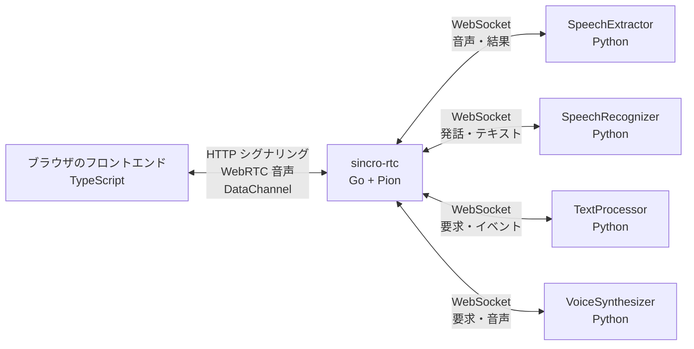
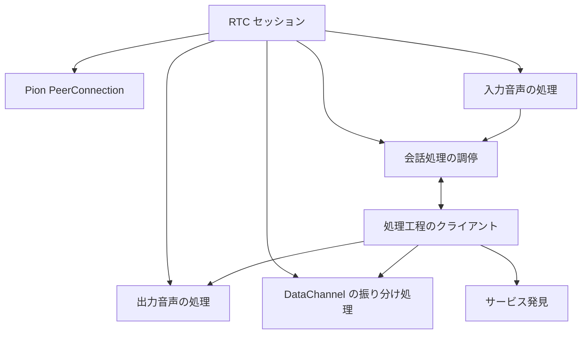
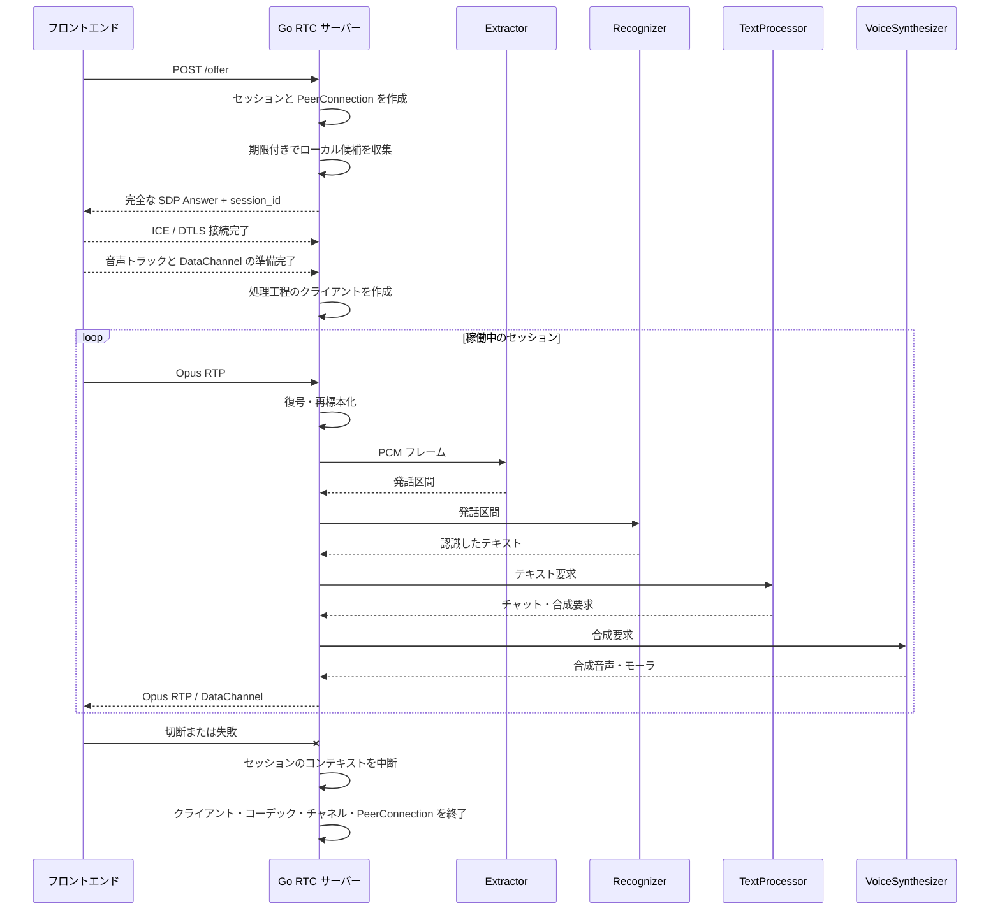
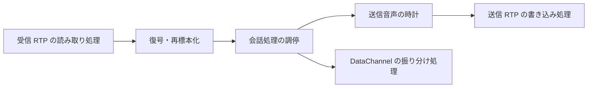
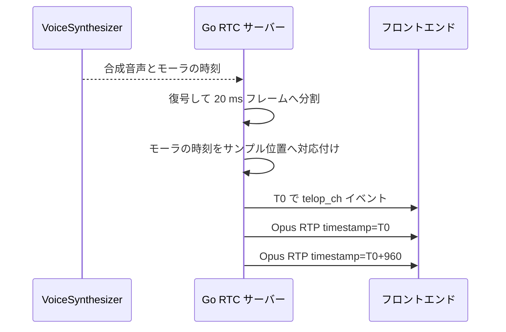

# 目標アーキテクチャ

## 要約

- Go RTC サーバーがブラウザ向けのシグナリング、WebRTC 転送、コーデック、セッション処理の組み立てを所有する。
- 現行 `VoiceTransformTrack` は対応クラスを移植せず、入力、処理工程、出力、DataChannelの独立ループへ分解する。
- 現行 `AudioBroker` の接続、キュー、全体系再接続、サービス発見はGoのパイプライン調停器と下流クライアントへ再構成する。
- セッション確立期限、RTCP ループ、RTP 並べ替え / 送信間隔制御をセッションの生存期間へ含め、通信断やコールバック異常でも同じ終了経路へ収束させる。
- PythonにはSpeechExtractor、SpeechRecognizer、TextProcessor、VoiceSynthesizerなど、Python エコシステムを利用する処理を残す。

## 最終コンポーネント構成

最終構成にはPython RTC アダプターとPython AudioBroker サービスを置かない。コーデック PoCで一時アダプターを使う場合も、本番経路へ昇格させず削除条件をタスクに明記する。

## 責務

### Browser フロントエンド

- `config.json` からエンドポイントとICE サーバー設定を取得する。
- OfferとICE 候補を送信する。
- マイク音声を配信し、サーバー音声を再生する。
- `text_ch` と `telop_ch` のJSONを解釈する。
- ICE 再接続付き更新Offerで同じPeerConnectionとセッション IDを維持して再接続する。

移行初期には現行実装を変更しない。契約差が見つかった場合だけ、[フロントエンドのRTC契約](../../design/contracts/frontend-rtc.md)と同時に変更する。

### Go RTC サーバー

- HTTP シグナリングエンドポイントを提供する。
- セッション ID、PeerConnection、コーデック状態、DataChannelを所有する。
- Opus RTPを復号 / 再サンプリングし、下流処理工程へ16 kHz モノラル PCMを渡す。
- 合成音声を復号 / 再サンプリング / Opus 符号化し、ブラウザへ送信間隔制御して送る。
- 下流4サービスへのWebSocket、キュー、一括再初期化 / 再接続、時間切れを管理する。
- Consulによるサービス発見と代替処理を行う。
- チャット / テロップイベントをDataChannelへ転送する。
- 流量制御、終了処理、指標、リソース後始末を管理する。

GoはPythonのクラス構造を複製せず、通信契約に必要なモデルだけを持つ。

### Python下流サービス

- SpeechExtractorはPCMから発話区間を抽出する。
- SpeechRecognizerは発話音声をテキストへ変換する。
- TextProcessorは応答、チャット、テロップ情報を生成する。
- VoiceSynthesizerは応答テキストから音声とモーラ時刻情報を生成する。
- WebRTC、DataChannel、セッションプロセス、ブラウザ送信間隔制御を所有しない。

## Go内部構成

### 入力音声処理

- 相手側トラックからRTPを継続して読む。
- シーケンス番号を内部の単調増加値へ周回を補正し、上限付きの並べ替えウィンドウ内でパケット順序保証、パケットからのデータ抽出、Opus 復号を行う。
- 重複と並べ替えウィンドウより古いパケットを破棄し、シーケンス番号とRTP 時刻の周回を通常系として扱う。
- トラック終了またはSSRC変更を検知し、SSRC変更時は並べ替え / 復号器状態を新しいストリームとして再初期化する。
- 16 kHz モノラル s16leへ再サンプリングする。
- 上限付きのキューを介して会話調停処理へ渡す。

### 会話調停処理

- 現行AudioBrokerのセッション処理の組み立てを引き継ぐ。
- Extractor、Recognizer、TextProcessor、Synthesizerの処理順序を調停する。
- いずれかのクライアント障害時に処理工程全体を同一世代として再初期化し、再接続可否を決定する。
- 音声、チャット、テロップの用途別キューを管理する。

### パイプラインのクライアント

- 下流サービスごとにWebSocket接続とコーデックを所有する。
- 既存MessagePackを符号化 / 復号する。
- 接続、時間切れ、終了をセッションコンテキストと処理工程世代に従って実行する。個別クライアントだけを再接続しない。
- PythonのスレッドモデルやPydantic クラスへ依存しない。

## Pipeline障害時の妥協ライン

初期実装は現行AudioBrokerに近いセッション単位の一括復旧を採用し、サービス別の部分復旧を行わない。

1. 4つの処理工程クライアントのうち1つでも切断、時間切れ、復号エラーになった場合、現在の処理工程世代を失敗扱いにする。
2. 4 クライアントをすべて中断 / 終了し、入力、中間部、合成済みの音声、DataChannel イベントのキューを破棄する。
3. 処理中のもの要求は結果不明として再送しない。配信意味と挙動は世代を跨いで高々1回とする。
4. `pipeline_generation` を増加して4 クライアントをすべて新規接続する。旧世代から遅れて届いた結果は、`session_id` が一致していても破棄する。
5. 再接続中のブラウザ入力はバッファせず破棄する。4 クライアントの接続完了後に新しい発話から処理を再開する。
6. 暫定認識状態、処理中の発話、未送信TTS / テロップは復元しない。Coordinatorが確定済みチャット履歴だけをクライアントの外側で保持し、復旧後の新しい要求へ渡す。
7. 処理工程全体は1秒から開始して最大30秒で頭打ちになる指数再試行間隔に全待機範囲でのランダムな揺らぎを加え、セッションコンテキストが終了されるまで回数上限なく再接続する。

`speech_id` と `sequence_id` は世代内の相関に使い、世代を跨ぐ重複排除の代わりにはしない。すべての非同期コールバックとキュー要素に内部 `pipeline_generation` を付与し、Coordinatorが現在値との一致を確認してから副作用を発生させる。再接続中もWebRTC セッションと送信メディア時計は維持し、無音またはダミーフレームを返す。複数セッションの同時再接続を調停する全体共通の再試行調停器は初期実装に含めない。

### 出力音声処理

- 合成済みの音声を復号し、48 kHzの固定長PCMへ変換する。
- 独立した送信メディア時計を所有する。
- Opus 符号化、RTP シーケンス番号 / 時刻の周回、送信間隔制御を管理する。
- 実時間の時計の絶対期限を基準に送信し、周期タイマー遅延やGC 一時停止後も期限超過パケットを一括送信しない。無音は追いつくために破棄できるが、発話音声は実時間隔で再開し、許容遅延を超えた発話世代は中止する。
- 対応するモーラ / テロップイベントを音声時計へ同期する。

### DataChannel振り分け処理

- `text_ch` と `telop_ch` の開く / 終了を管理する。
- 適用 JSONを原則内容を解釈しない送受信データとして送る。
- 送信待ちデータ量とメッセージ大きさを監視する。

### RTCP / メディア制御

- Sender / 受信側報告を生成する通信への介在処理を明示的に登録し、Pionの既定設定へ暗黙依存しない。
- 送信 `RTPSender.ReadRTCP()` をセッションコンテキストに紐付く専用ループで継続して排出する。RTCP パケット種別と消失 / RTTは指標へ反映するが、未知のフィードバックパケットだけでセッションを終了しない。
- Opus RTPには上限付きのパケット履歴を持つNACK 生成処理 / 応答処理を初期候補として有効化し、段階 1でNACK有無とOpus PLCのパケット損失 / 遅延を比較する。Gate 1までに採用値を固定し、回復しない消失と並べ替えウィンドウ外の遅延パケットはPLCへ委ねる。
- RTP 受信処理、RTP 書き込み処理、RTCP ループ、トラックのいずれかが有効セッション中に予期せず終了した場合は、セッションエラーとして終了処理を一度だけ実行する経路へ通知する。PeerConnection 終了に伴う終了は正常終了として扱う。
- メディアループはセッション所有のgoroutine ラッパーから起動し、panicを復帰してセッションエラーへ変換する。コールバック内で新しい未管理goroutineを起動しない。

## ICE 再接続状態機械

- フロントエンドは `disconnected` で直ちに再接続せず猶予期間を開始する。猶予時間中に `connected` / `completed` へ戻ればタイマーを中断する。
- `failed` または猶予期間超過でICE 再接続を開始する。Offer生成から候補書き出しまでをPeerConnection単位の同時に1つだけの実行とし、再接続中の追加イベントは同じ試行へ集約する。
- 再接続失敗は[通信契約と型共有](contracts-and-types.md)のHTTP 意味と挙動に従う。再試行可能エラーは上限付きの要求再試行後に揺らぎ付き再接続再試行間隔へ戻し、404 / 410だけ新しいPeerConnection / セッションへ移行する。
- サーバーも `disconnected` を即終了せず有限猶予期間を持つ。猶予期間と再接続確立期限を超えた場合は片側だけ有効なセッションとして終了する。
- 猶予期間、HTTP 時間切れ、再接続再試行間隔、サーバー側再接続確立期限の既定値は段階 1のネットワーク障害試験で固定し、無期限待機を許可しない。

## 現行責務との対応

| 現行Python実装                                 | Go側の移行先                                      |
| ---------------------------------------------- | ------------------------------------------------- |
| `RTCSessionManager`                            | セッション登録簿 / 受け入れ制御                   |
| `RTCSessionProcess`                            | セッションコンテキスト / PeerConnection 所有者    |
| `VoiceTransformTrack.recv()`                   | 入力処理器 + 出力処理器                           |
| `AudioBroker`                                  | 会話調停器                                        |
| `ExtractorSenderThread` / `ReceiverThread`     | 音声区間抽出処理処理工程クライアント              |
| `RecognizerSenderThread` / `ReceiverThread`    | 音声認識処理処理工程クライアント                  |
| `TextProcessorSenderThread` / `ReceiverThread` | 処理器処理工程クライアント                        |
| `SynthesizerSenderThread` / `ReceiverThread`   | 音声合成処理処理工程クライアント + 音声出力処理器 |
| `voice_frame_queue`                            | 上限付きの合成済みの音声キュー                    |
| `text_channel_queue`                           | 上限付きの DataChannel イベントキュー             |

この表はクラスの1対1移植を指示するものではなく、削除漏れを防ぐための責務対応である。

## セッションの生存期間

Offer受付から有効セッションまでに、独立した有限期限を設ける。

- 候補収集完了までのAnswer生成期限
- Answer返却後のICE / DTLS確立期限
- ICE / DTLS確立後の音声トラックと必須DataChannel 準備状態期限
- `disconnected` 後の猶予期間とICE 再接続確立期限

期限超過、ブラウザ突然の終了、トラック / DataChannelの不成立はすべて同じ終了処理を一度だけ実行する経路へ通知し、PeerConnection、コーデック、キュー、タイマー、goroutineを破棄する。4つの処理工程クライアントはICE / DTLS接続とメディア準備状態の完了後に遅延作成し、接続未成立セッションが下流WebSocketを保持しないようにする。

## `VoiceTransformTrack` の再構成

`VoiceTransformTrack` はaiortcの取得要求に応じるモデルへ適応するための実装であり、Goへ同名クラスを移植しない。

入力、処理工程、出力、イベントを独立ループにすることで、ブラウザ入力が停止してもキューに入った合成済みの音声を送信できるようにする。

## 音声とテロップの同期

現行実装はブラウザから受信した音声フレームの `recv()` 実行頻度を使って合成音声を返している。移行後はGoが独立した送信メディア時計を所有する。

サーバー内部では実時間の時計ではなくサンプル位置を同期の正本とする。ただし、RTP パケットとDataChannel イベントを同時に送信してもブラウザのジッターバッファ後の実再生時刻は保証できない。初期移行のブラウザ向けの要件は現行同等の「テロップが対応音声より遅れない」とし、ブラウザでDataChannel コールバックと実再生の時刻差を測定する。RTP / 再生時計に合わせたフロントエンド実行時刻の調整は初期移行の対象外とする。送信キューが空の場合に無音フレームを送るか送信を休止するかはPoCで確定する。

## コーデック方針

PionはOpus コーデック接続交渉、RTP 読み取り / 書き込み、パケット化を提供する。PCMとの符号化 / 復号は別のコーデック実装を組み合わせる。

PoCでは次を比較する。

1. Goからlibopusを利用する接続
2. GStreamer 処理工程との接続

評価軸は、音質、遅延、メモリ、配布物、cgo依存、終了処理の確実性とする。コーデック実装はインターフェースで隔離し、セッションの生存期間からネイティブハンドルを直接操作する箇所を限定する。

## プロセスモデル

Go RTC サーバーは1 サービスプロセス内で複数セッションを管理する。セッションごとに次を持つ。

- 中断可能なコンテキスト
- PeerConnection
- コーデック状態
- 処理工程クライアント接続
- 上限付きの入力 / 出力 / イベントキュー
- カウンターと終了処理を一度だけ実行する検査

セッションが起動するすべてのgoroutineは共通ラッパーを通し、通常panicを復帰して当該セッションの終了処理へ移る。HTTP ミドルウェアは要求 panicを500へ変換し、セッション状態へ一部適用済みの場合は同じ終了経路を呼ぶ。ただし、復帰はGo 実行時の致命的なエラーやcgo / 標準のコーデックのセグメンテーション違反を隔離できない。panicを通常のエラー処理には使用せず、プロセス異常終了は全セッションを失う障害として扱う。

プロセス境界では監視プロセスによる再接続、起動 / 準備状態、終了時間切れ付き終了処理を設ける。1 インスタンス当たりのセッション上限はリソース予算だけでなく、プロセス停止時の影響範囲を基準に決める。標準のコーデックを採用する場合は異常検出ツールを含む標準の試験を行い、プロセス異常終了率または再現性が許容できない場合はコーデックの別プロセス隔離を再評価する。
