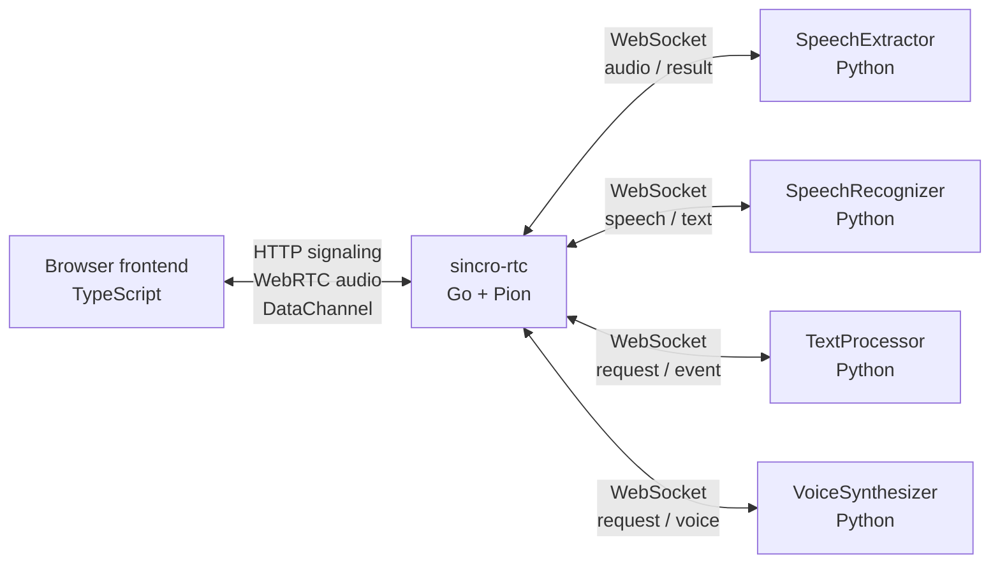
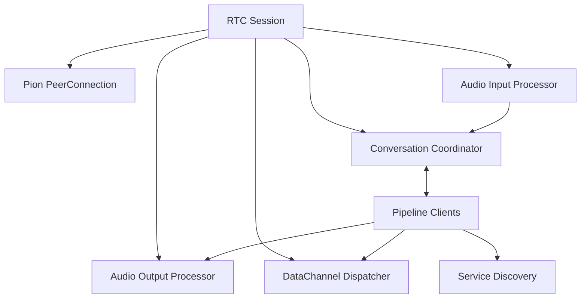
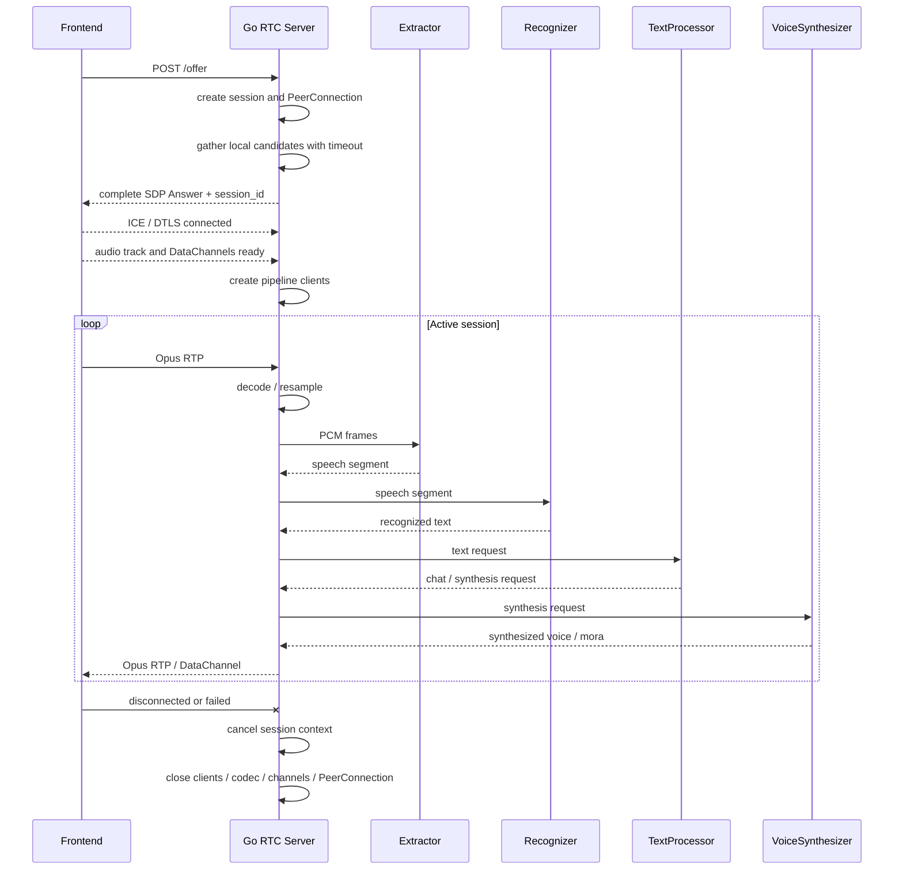
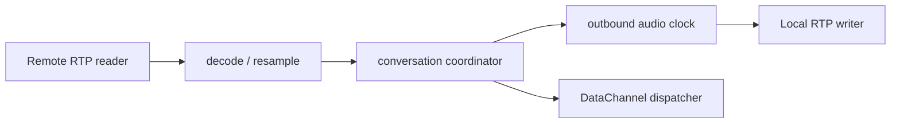
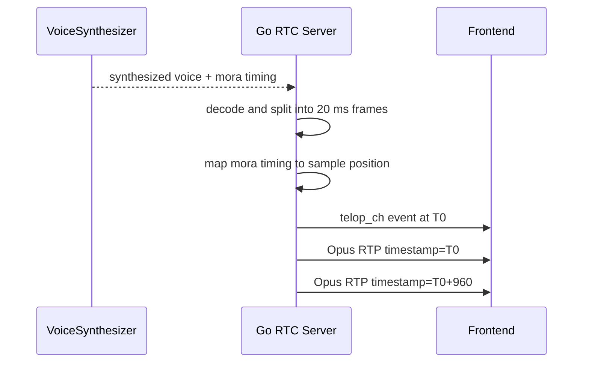

# 目標アーキテクチャ

## Summary

- Go RTC serverがbrowser-facing signaling、WebRTC transport、codec、session orchestrationを所有する。
- 現行 `VoiceTransformTrack` は対応classを移植せず、input、pipeline、output、DataChannelの独立loopへ分解する。
- 現行 `AudioBroker` の接続、queue、全体系再接続、service discoveryはGoのpipeline coordinatorと下流clientへ再構成する。
- session確立期限、RTCP loop、RTP reorder / pacingをsession lifecycleへ含め、通信断やcallback異常でも同じclose経路へ収束させる。
- PythonにはSpeechExtractor、SpeechRecognizer、TextProcessor、VoiceSynthesizerなど、Python ecosystemを利用する処理を残す。

## 最終コンポーネント構成

最終構成にはPython RTC adapterとPython AudioBroker serviceを置かない。codec PoCで一時adapterを使う場合も、本番経路へ昇格させず削除条件をtaskに明記する。

## 責務

### Browser frontend

- `config.json` からendpointとICE server設定を取得する。
- OfferとICE candidateを送信する。
- microphone audioをpublishし、server audioを再生する。
- `text_ch` と `telop_ch` のJSONを解釈する。
- ICE restart付きupdate Offerで同じPeerConnectionとsession IDを維持して再接続する。

移行初期には現行実装を変更しない。契約差が見つかった場合だけ、[Frontend RTC契約](../../design/contracts/frontend-rtc.md)と同時に変更する。

### Go RTC server

- HTTP signaling endpointを提供する。
- session ID、PeerConnection、codec state、DataChannelを所有する。
- Opus RTPをdecode / resampleし、下流pipelineへ16 kHz mono PCMを渡す。
- 合成音声をdecode / resample / Opus encodeし、browserへpacingして送る。
- 下流4サービスへのWebSocket、queue、一括reset / reconnect、timeoutを管理する。
- Consulによるservice discoveryとfallbackを行う。
- chat / telop eventをDataChannelへ転送する。
- backpressure、shutdown、metrics、resource cleanupを管理する。

GoはPythonのclass構造を複製せず、通信契約に必要なmodelだけを持つ。

### Python下流service

- SpeechExtractorはPCMから発話区間を抽出する。
- SpeechRecognizerは発話音声をテキストへ変換する。
- TextProcessorは応答、chat、telop情報を生成する。
- VoiceSynthesizerは応答テキストから音声とmora timingを生成する。
- WebRTC、DataChannel、session process、browser pacingを所有しない。

## Go内部構成

### Audio Input Processor

- remote trackからRTPを継続して読む。
- sequence numberを内部の単調増加値へunwrapし、bounded reorder window内でpacket ordering、depacketize、Opus decodeを行う。
- duplicateとreorder windowより古いpacketを破棄し、sequence numberとRTP timestampのwraparoundを通常系として扱う。
- track終了またはSSRC変更を検知し、SSRC変更時はreorder / decoder stateを新しいstreamとしてresetする。
- 16 kHz mono s16leへresampleする。
- bounded queueを介してConversation Coordinatorへ渡す。

### Conversation Coordinator

- 現行AudioBrokerのsession orchestrationを引き継ぐ。
- Extractor、Recognizer、TextProcessor、Synthesizerの処理順序を調停する。
- いずれかのclient障害時にpipeline全体を同一generationとしてresetし、再接続可否を決定する。
- audio、chat、telopの用途別queueを管理する。

### Pipeline Clients

- 下流serviceごとにWebSocket接続とcodecを所有する。
- 既存MessagePackをencode / decodeする。
- connect、timeout、closeをsession contextとpipeline generationに従って実行する。個別clientだけを再接続しない。
- Pythonのthread modelやPydantic classへ依存しない。

## Pipeline障害時の妥協ライン

初期実装は現行AudioBrokerに近いsession単位の一括復旧を採用し、service別の部分復旧を行わない。

1. 4つのpipeline clientのうち1つでも切断、timeout、decode errorになった場合、現在のpipeline generationを失敗扱いにする。
2. 4 clientをすべてcancel / closeし、input、intermediate、synthesized audio、DataChannel eventのqueueを破棄する。
3. in-flight requestは結果不明として再送しない。delivery semanticsはgenerationを跨いでat-most-onceとする。
4. `pipeline_generation` を増加して4 clientをすべて新規接続する。旧generationから遅れて届いたresultは、`session_id` が一致していても破棄する。
5. reconnect中のbrowser入力はbufferせず破棄する。4 clientの接続完了後に新しい発話から処理を再開する。
6. partial recognition state、処理中の発話、未送信TTS / telopは復元しない。Coordinatorが確定済みchat historyだけをclientの外側で保持し、復旧後の新しいrequestへ渡す。
7. pipeline全体は1秒から開始して最大30秒で頭打ちになる指数backoffにfull jitterを加え、session contextがcloseされるまで回数上限なく再接続する。

`speech_id` と `sequence_id` はgeneration内の相関に使い、generationを跨ぐ重複排除の代わりにはしない。すべての非同期callbackとqueue itemに内部 `pipeline_generation` を付与し、Coordinatorが現在値との一致を確認してから副作用を発生させる。再接続中もWebRTC sessionとoutbound media clockは維持し、silenceまたはdummy frameを返す。複数sessionの同時再接続を調停するglobal retry coordinatorは初期実装に含めない。

### Audio Output Processor

- synthesized voiceをdecodeし、48 kHzの固定長PCMへ変換する。
- 独立したoutbound media clockを所有する。
- Opus encode、RTP sequence number / timestampのwraparound、pacingを管理する。
- wall clockの絶対deadlineを基準に送信し、ticker遅延やGC pause後も期限超過packetをburst送信しない。silenceは追いつくために破棄できるが、発話音声は実時間隔で再開し、許容遅延を超えた発話generationは中止する。
- 対応するmora / telop eventをaudio clockへ同期する。

### DataChannel Dispatcher

- `text_ch` と `telop_ch` のopen / closeを管理する。
- application JSONを原則opaque payloadとして送る。
- buffered amountとmessage sizeを監視する。

### RTCP / media control

- Sender / Receiver Reportを生成するinterceptorを明示的に登録し、Pionのdefault設定へ暗黙依存しない。
- outbound `RTPSender.ReadRTCP()` をsession contextに紐付く専用loopで継続してdrainする。RTCP packet種別とloss / RTTはmetricへ反映するが、未知のfeedback packetだけでsessionを終了しない。
- Opus RTPにはbounded packet historyを持つNACK generator / responderを初期候補として有効化し、Phase 1でNACK有無とOpus PLCのpacket loss / latencyを比較する。Gate 1までに採用値を固定し、回復しないlossとreorder window外の遅延packetはPLCへ委ねる。
- RTP reader、RTP writer、RTCP loop、trackのいずれかがactive session中に予期せず終了した場合は、session errorとしてclose-once経路へ通知する。PeerConnection closeに伴う終了は正常終了として扱う。
- media loopはsession所有のgoroutine wrapperから起動し、panicをrecoverしてsession errorへ変換する。callback内で新しい未管理goroutineを起動しない。

## ICE restart state machine

- Frontendは `disconnected` で直ちにrestartせずgrace periodを開始する。grace中に `connected` / `completed` へ戻ればtimerをcancelする。
- `failed` またはgrace period超過でICE restartを開始する。Offer生成からcandidate flushまでをPeerConnection単位のsingle-flightとし、restart中の追加eventは同じ試行へ集約する。
- restart失敗は[通信契約と型共有](contracts-and-types.md)のHTTP semanticsに従う。retry可能errorはbounded request retry後にjitter付きreconnect backoffへ戻し、404 / 410だけ新しいPeerConnection / sessionへ移行する。
- serverも `disconnected` を即closeせず有限grace periodを持つ。grace periodとrestart確立期限を超えた場合はhalf-open sessionとしてcloseする。
- grace period、HTTP timeout、restart backoff、server側restart確立期限の既定値はPhase 1のnetwork impairment試験で固定し、無期限待機を許可しない。

## 現行責務との対応

| 現行Python実装                                 | Go側の移行先                                         |
| ---------------------------------------------- | ---------------------------------------------------- |
| `RTCSessionManager`                            | session registry / admission control                 |
| `RTCSessionProcess`                            | session context / PeerConnection owner               |
| `VoiceTransformTrack.recv()`                   | input processor + output processor                   |
| `AudioBroker`                                  | conversation coordinator                             |
| `ExtractorSenderThread` / `ReceiverThread`     | extractor pipeline client                            |
| `RecognizerSenderThread` / `ReceiverThread`    | recognizer pipeline client                           |
| `TextProcessorSenderThread` / `ReceiverThread` | processor pipeline client                            |
| `SynthesizerSenderThread` / `ReceiverThread`   | synthesizer pipeline client + audio output processor |
| `voice_frame_queue`                            | bounded synthesized audio queue                      |
| `text_channel_queue`                           | bounded DataChannel event queue                      |

この表はclassの1対1移植を指示するものではなく、削除漏れを防ぐための責務対応である。

## Session lifecycle

Offer受付からactive sessionまでに、独立した有限deadlineを設ける。

- candidate収集完了までのAnswer生成deadline
- Answer返却後のICE / DTLS確立deadline
- ICE / DTLS確立後のaudio trackと必須DataChannel readiness deadline
- `disconnected` 後のgrace periodとICE restart確立deadline

deadline超過、browser abrupt close、track / DataChannelの不成立はすべて同じclose-once経路へ通知し、PeerConnection、codec、queue、timer、goroutineを破棄する。4つのpipeline clientはICE / DTLS接続とmedia readinessの完了後に遅延作成し、接続未成立sessionが下流WebSocketを保持しないようにする。

## `VoiceTransformTrack` の再構成

`VoiceTransformTrack` はaiortcのpull modelへ適応するための実装であり、Goへ同名classを移植しない。

input、pipeline、output、eventを独立loopにすることで、browser入力が停止してもqueued synthesized audioを送信できるようにする。

## 音声とtelopの同期

現行実装はbrowserから受信したaudio frameの `recv()` cadenceを使って合成音声を返している。移行後はGoが独立したoutbound media clockを所有する。

server内部ではwall clockではなくsample位置を同期の正本とする。ただし、RTP packetとDataChannel eventを同時に送信してもbrowserのjitter buffer後の実再生時刻は保証できない。初期移行のbrowser-facing要件は現行同等の「telopが対応音声より遅れない」とし、browserでDataChannel callbackと実再生のskewを測定する。RTP / playout clockに合わせたfrontend schedulingは初期移行の対象外とする。outbound queueが空の場合にsilence frameを送るか送信を休止するかはPoCで確定する。

## Codec方針

PionはOpus codec negotiation、RTP read / write、packetizationを提供する。PCMとのencode / decodeは別のcodec実装を組み合わせる。

PoCでは次を比較する。

1. Goからlibopusを利用するbinding
2. GStreamer pipelineとの接続

評価軸は、音質、latency、memory、配布物、cgo依存、shutdownの確実性とする。codec実装はinterfaceで隔離し、session lifecycleからnative handleを直接操作する箇所を限定する。

## process model

Go RTC serverは1 service process内で複数sessionを管理する。sessionごとに次を持つ。

- cancel可能なcontext
- PeerConnection
- codec state
- pipeline client connections
- bounded input / output / event queue
- countersとclose-once guard

sessionが起動するすべてのgoroutineは共通wrapperを通し、通常panicをrecoverして当該sessionのclose処理へ移る。HTTP middlewareはrequest panicを500へ変換し、session stateへ一部適用済みの場合は同じclose経路を呼ぶ。ただし、recoverはGo runtimeのfatal errorやcgo / native codecのsegmentation faultを隔離できない。panicを通常のエラー処理には使用せず、process crashは全sessionを失う障害として扱う。

process境界ではsupervisorによるrestart、startup / readiness、close timeout付きshutdownを設ける。1 instance当たりのsession上限はresource budgetだけでなく、process停止時のblast radiusを基準に決める。native codecを採用する場合はsanitizerを含むnative試験を行い、process crash率または再現性が許容できない場合はcodecの別process隔離を再評価する。
