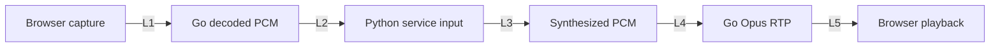

# 検証計画

## Summary

- 機能互換、音声品質、network互換、資源回収、障害復旧を別の観点として検証する。
- aiortc baselineとPion版を同一scenario、同一負荷、同一観測方法で比較する。
- 合否閾値はPoC taskでbaseline取得後に確定し、本書には測定対象とgateを定義する。

## Test matrix

| 分類          | 主な確認                                        | 必須phase    |
| ------------- | ----------------------------------------------- | ------------ |
| signaling     | half-trickle、冪等offer、revision、HTTP error   | PoC以降      |
| media         | Opus受信、PCM変換、合成音声返却                 | PoC以降      |
| DataChannel   | label、信頼性属性、open前queue、buffer pressure | 統合以降     |
| network       | UDP mux、public IPv4、STUN、packet loss         | PoC / 切替前 |
| lifecycle     | normal close、failed、timeout、下流切断         | 統合以降     |
| resource      | heap、RSS、goroutine、thread、fd、socket        | 全phase      |
| compatibility | Chrome、Firefox                                 | PoC / 切替前 |

## Functional test

- `config.json` が現行fieldを返す。
- initial Offerにcandidate収集完了済みのAnswer、`session_id`、`offer_revision` を返す。
- PionからFrontendへのcandidate通知APIなしでChrome / Firefoxが接続できる。
- candidate収集timeout時はsessionをcloseして504を返し、未完成Answerを冪等cacheへ保存しない。
- initial Offer response消失後に同じ `offer_request_id` / SDPを再送し、同じsession ID / Answerを返す。
- 同じ `offer_request_id` / SDPのinitial Offerを並行送信してもsession作成処理がsingle-flightになり、両requestへ同じ結果を返す。
- 同じ `offer_request_id` を異なるSDPへ再利用した場合は409、終了済みsessionのtombstone再送は410を返し、重複sessionを作らない。
- session IDがULIDであり、ICE restart後も同じ値を維持する。
- candidateとend-of-candidatesを処理する。
- 不明sessionとlate candidateを安全に拒否する。
- session上限で新規接続だけを429にする。
- active sessionへの単調増加する `offer_revision` 付きupdate Offerを受け付ける。
- 旧revision、未来revision、不明session IDのOffer / candidateを新規sessionへfallbackさせず拒否する。
- 同じrevision / SDPのOffer再送へ同じAnswerを返し、同じrevisionの異なるSDPをHTTP 409で拒否する。
- Offer適用とcandidate追加がsession単位で直列化され、並行update Offerを409で拒否する。
- update Offer失敗時にrevisionを進めず、そのrevisionのpending candidateを適用しない。
- request body、SDP、candidate文字列、candidate件数、pending queueの各上限を境界値と上限超過で確認する。
- malformed SDP / candidateをrequest単体で400にし、状態を一部適用済みで安全に継続できない場合だけsessionをcloseする。
- audio track以外を受けた場合の方針が現行契約と一致する。
- Frontendが `text_ch` / `telop_ch` を作成し、Pion側がin-band negotiationで受理する。
- `text_ch` がordered / reliableでJSONを送受信する。
- `telop_ch` がunordered / unreliableでJSONを送受信し、欠落や順序逆転があってもsessionを失敗させない。
- ICE restart付きupdate Offer後も同じsession IDと既存DataChannelを維持し、audioが復旧する。
- Frontendが `disconnected` のgrace中に自然復旧した場合はrestartせず、`failed` またはgrace超過時だけsingle-flightでrestartする。
- Offer / candidateのHTTP timeout、404、409、410、429、5xx、network errorが契約どおりretryまたはsession再作成へ分岐する。
- 下流service障害後に接続復旧または明示的session終了へ遷移する。

## Pipeline compatibility test

- Goが送るExtractor初期化requestを既存Python serviceがdecodeできる。
- 20 ms入力frameの連続送信とspeech segment返却が成立する。
- SpeechExtractor結果をRecognizer requestへ正しく変換する。
- partial / confirmed recognition resultの順序を維持する。
- `talk_mode` ごとのTextProcessor endpointとrequestを維持する。
- synthesizer responseの `audio_format`、voice、mora queueをGoでdecodeできる。
- 1 service切断時に4 clientを一括resetし、全queueとin-flight stateを破棄する。
- reset前のgenerationから遅延resultを注入しても、重複TTS、古い音声、DataChannel eventが出力されない。
- reset中の音声をbuffer / 再送せず、4 client復旧後の新しい発話だけを処理する。
- 確定済みchat historyを維持し、partial recognition stateと処理中発話を復元しないことを確認する。
- pipeline全体の再接続が1秒開始、最大30秒の指数backoff + full jitterで継続し、下流復旧後に試行回数に関係なく同じRTC sessionで処理を再開する。
- MessagePack fixtureで同じscenarioを双方向に実行する。

## Audio test

### format

- 48 kHz Opusから16 kHz mono PCMへの変換をgolden waveformで確認する。
- browser入力のRTP Opus decodeと、VoiceSynthesizer返却音声のcontainer demux / decodeを別のtest suiteで確認する。
- VoiceSynthesizer requestが許容する `audio/wav`、`audio/aac`、`audio/ogg`、`audio/ogg;codecs=opus` を入力matrixに含め、実際のresponse `audio_format` とdecode結果を確認する。
- synthesized voiceからbrowser再生までのsample rateとchannelを確認する。
- 各encoded voice形式について、正常入力、空入力、truncated / malformed入力、上限超過、decoder timeoutを確認する。
- encoded voiceの最大byte数、最大再生時間、decoder timeoutをPhase 1の測定結果から確定し、上限超過時にsession queueが滞留しないことを確認する。
- frame durationとRTP timestamp増分を確認する。
- sequence numberとRTP timestampのwraparound前後で音声が継続する。
- reorder window内の並べ替え、duplicate、window外のlate packet、SSRC変更を確認する。
- browser入力が停止してもqueued synthesized audioが正しいpacingで再生されることを確認する。
- ticker遅延とGC pause相当のscheduler停止後にpacketをburst送信せず、silence dropまたは実時間隔の音声再開になることを確認する。
- Sender / Receiver Reportが生成され、outgoing senderのRTCP loopがfeedbackを継続してdrainすることを確認する。
- NACK有無とOpus PLCをloss / RTT別に比較し、採用設定のpacket historyが上限内に収まることを確認する。
- mora / telop eventがbrowserの対応音声再生より遅れて表示されないことを確認する。
- silence frame、短い発話、長い発話、連続発話を確認する。

### 品質

- reference audioとdecode後audioのduration差を測定する。
- clipping、DC offset、channel反転、周期的欠落がないことを確認する。
- packet loss時のPLC挙動を確認する。
- jitter発生時にqueueが無制限増加しないことを確認する。
- audio frameを破棄した場合に対応する古いmora eventだけが後送されないことを確認する。

### latency

次の区間を別々に計測する。

end-to-end値だけでなく、L1からL5を分けて退行箇所を特定できるようにする。

telop同期の判定はserver送信時刻ではなく、browserで観測したDataChannel callback時刻と実再生時刻のskewを使う。初期移行では現行同等の「対応音声より遅れない」を保証対象とし、RTP / playout clockに合わせたfrontend schedulingは対象外とする。

## Network test

- local host candidateのみ
- 固定UDP mux portのDocker 1:1 mapping
- NAT配下のpublic IPv4 advertiseと静的port forward
- `SetICEAddressRewriteRules` のhost置換とcontainer / private candidate非広告
- public STUNとの併用
- UDP4 / interface filter
- invalid public IP、UDP mux bind失敗、TURN URL、0 / 負の上限とtimeoutのstartup拒否
- single-port ICE-TCPはPoCで採用候補になった場合だけUDP失敗条件で比較
- IPv4
- 1%、5%、10% packet loss
- latencyとjitter付与
- 一時的なnetwork断
- `disconnected` grace中の自然復旧
- ICE failedから同じsession IDのICE restart
- candidate順序の入れ替わり
- 連続ICE restartと旧revision candidateの意図的な遅延
- 終了済みsessionのcandidate遅延到着と安全な拒否
- empty candidateとend-of-candidates
- Answer返却後にbrowserを停止し、pre-connect deadlineでhalf-open sessionが回収されること

network impairmentは再現可能なscriptまたはcontainer設定としてtaskに保存する。

## Resource test

### 観測対象

#### Go RTC server

- process RSS
- Go heap in-use / allocated
- goroutine数
- file descriptor数
- UDP / TCP socket数
- active PeerConnection数
- codec instance数
- input / output queue depth
- DataChannel buffered amount
- GC pause

#### Python下流service

- process RSS
- Python heap
- thread数
- active WebSocket数
- request / response queue depth
- disconnect後に残るsession関連state

### Scenario

1. process起動後のidleを測る。
2. 1 sessionを接続して通話中を測る。
3. sessionを正常終了して収束を待つ。
4. 10、50、100回繰り返す。
5. abnormal closeとICE failedでも繰り返す。
6. ICE / DTLS、audio track、必須DataChannelをそれぞれ未成立にしてdeadline後の収束を確認する。
7. 複数同時sessionで同じ観測を行う。
8. 長時間soak testを行う。

### 判定

RSSはallocatorがOSへ即座に返却しない場合があるため、RSS単独でleak判定しない。active object、heap profile、goroutine、socket、queueがsession終了後に収束することを合わせて確認する。

## Failure injection

- Python下流service process停止
- 下流4サービスのうち1サービスだけを停止
- pipeline reset直後に旧generationの認識結果と合成結果を遅延注入
- codec error
- malformed MessagePack
- malformed / oversized HTTP JSON、SDP、candidateとcandidate flood
- oversized DataChannel payload
- DataChannel未open
- signaling response timeout
- candidate収集timeout、ICE / DTLS timeout、audio track / DataChannel readiness timeout
- browser abrupt close
- Go RTC server graceful shutdown中のactive session
- Go RTC server processの強制終了とsupervisorによる再起動
- session goroutine外の未回収panicを模擬したprocess crash
- 管理対象HTTP handler、Pion callback、media / pipeline goroutine内のpanic
- cgo / native codecを採用する場合のnative crashとsanitizer検査

各failureで、検知、ログ、client結果、resource解放、再接続可否を記録する。

## Observability

最低限、次のmetricを持つ。

- session created / active / closed / failed
- signaling request countとlatency
- ICE state transition
- candidate gathering / pre-connect / media readiness timeout
- received / sent audio frames
- dropped audio frames
- RTP reorder / duplicate / late drop
- RTCP Sender / Receiver Report、NACK、loss、RTT
- outbound pacing lag / generation abort
- codec error
- pipeline client reconnect
- queue depth / overflow
- DataChannel send error
- session close duration

session IDはlog correlationに使用するが、音声内容やchat本文を通常ログへ出さない。

## 検証成果物

各phaseの実測値、環境、コマンド、失敗内容は対応taskの `eval.md` に残す。本書には日付付き測定結果を追記しない。
